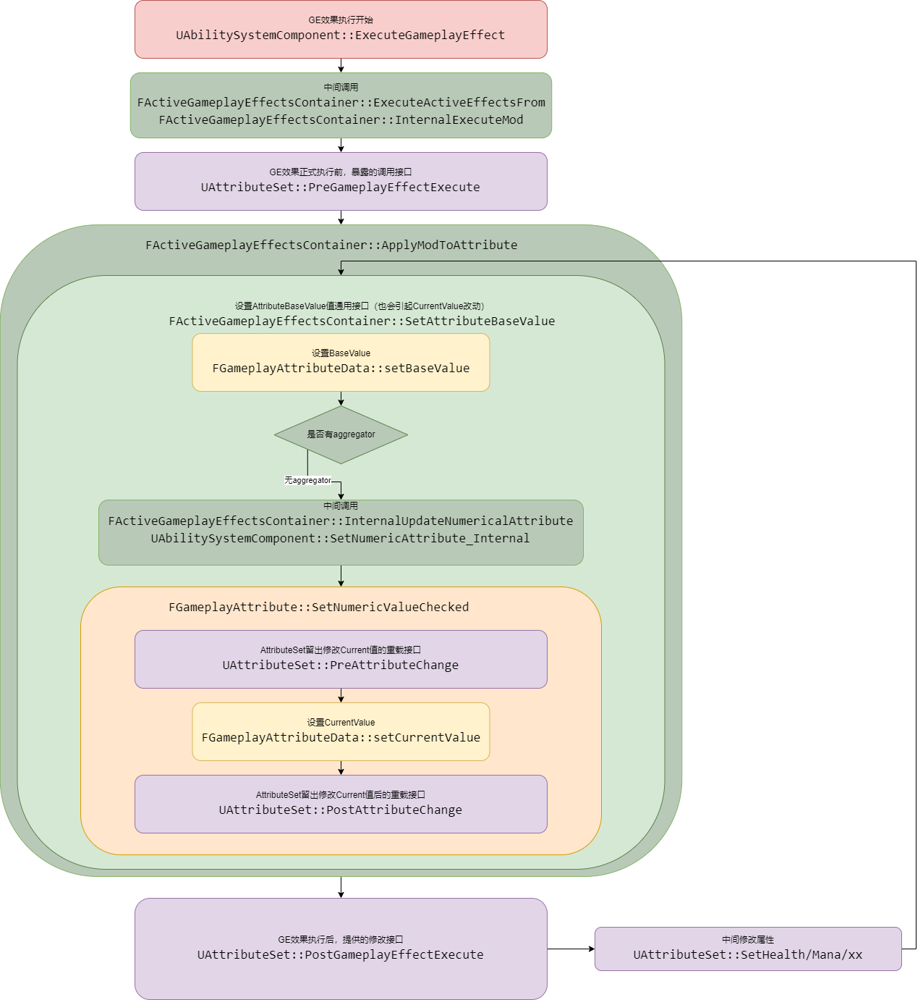

# 序言

这是个人在GAS学习过程中的笔记，主要为本人学习GAS时，产生的疑惑和查证过程。这份笔记没有经过系统性的整理，对于不同层次的问题也没做区分，涉及到的内容也并不全面。

我认为，只有产生了和我相似问题的人，在搜索网络上才会查到这篇笔记。

# GameplayAbility

## CommitAbility

在教程中会提到GameplayAbility开始要Commit Ability，但是没有提这个为什么。现在看一下这个内容。主要也就是三个部分。

### CommitCheck

主要检查技能的可用性。看起来

- 检查技能 SpecHandle是否可用
- 检查Actor上ASC是否可用
- 检查ASC中这个Handle是否能找到能力的实例
- 根据ASG(AbilitySystemGlobals)获取一个全局实例，由此判断是不是要进行冷却检测和消耗检测。

可以注意到，GAS中，对于GameplayAbility的冷却和消耗检查的开启与否是可以全局控制的。

### CooldownCheck

在实际操作上会发现，冷却时间的检测不是一开始以为的检测是否存在对应的CooldownGE，重点在于，需要有对应的**gameplayTag**，在**ue5.3**的GAS更新后，需要通过**component**中的 **TargetTagsGameplayEffectComponent**来cooldown为GE设定一些带有的Tag。

> 在大部分教程中都没提过granted Tag和其UE5.3的对应改动。导致会漏了这东西

### CostCheck

在判断costGE时会调用的**GameplayEffect**上的**CanApplyAttributeModifiers**，这里面写死了一个判断如果GE对属性的修改为Add类型时，修改后的值必须为非负数。

也就是说，这里自动检测消耗后数值不能小于零，对于扣血扣成负数这种效果就会进行限制。

> 好消息，这么别扭的判定只在costCheck中使用。做技能的时候得改一下这套GE。

### CommitExexucte

负责CoolDown和Cost的GE添加，在全局忽略时也不会添加GE

### NotifyAbilityCommit

通过ASC通知自己Commit了，发个广播。

## 感想

CommitAbility实际上做的就这些。所以在实际中感觉可以省略一部分内容。例如在动作游戏中可能根本不考虑CD和COST，而是以动作状态做判断时，就可以通过修改CommitAbility省去一部分。

提供了接口和事件提供手动施加CD和COST的能力。所以响应对应委托时会有区分。

处理各种CD冷却啊，中途开始CD，额外CD的话都需要中途调整GE，原有机制难以处理。

# AttributeSet

## FAttributeMetaData

老生常谈了，baseValue和CurrentValue不是当前和最大值的关系。单位都是float，实质上作为数值类型对象。

有MinValue和MaxValue，目前没有对应逻辑限制，**所以没用**

## 属性限制 PreAttributeChange和PostGameplayEffectExecute

在GAS基本介绍中，这两个都做属性限制，说一个是CurrentValue会调用，一个是BaseValue会调用。现在对具体的调用逻辑进行分析

在使用对BaseValue的GE修改（即Instant或者具有period的Has Duration或者Infinite）我们对GE的修改大体可以看成如此流程。

当我们做属性限制，比如生命值不超过最大值时，我们就有两个地方需要加入限制，**PreAttributeChanged **和 **PostGameplayEffectExecute**。

- GE开始修改，进行**BaseValue**的修改
- 根据新的**BaseValue**算得新的**CurrnetValue**，第一次调用 **PreAttributeChange**，对于**CurrentValue**进行限制
- GE修改完成 此时可能由于属性限制导致**CurrentValue**和 **BaseValue**不同
- GE修改完成调用 **PostGameplayEffectExecute**，此时在根据 **CurrentValue** 重新调用 **SetAttributeBaseValue** 重新设置 **BaseValue**

> 这一步主要是用getHealth和setHealth设置属性，所以会是用CurrentValue重新设置了BaseValue

- 重新设置 **BaseValue** 和 **CurrentValue**, 此时 **PreAttributeChange** 会被第二次调用




该图主要针对Instant持续类型的GE逻辑，其余类型会有不同

## 当AttributeSet定义多个相同属性时，该如何操作

如上所言，当一个角色存在多个AttributeSet时，或者多个AttributeSet中有多个同名时，会发生什么？

### 多个AttributeSet存在同名属性

这个问题并不严重，首先，无论是蓝图还是C++，在确定具体目标属性时都需要确定到AttributeSet中的。最终都是类似于AS1.hp和AS2.hp的形式，所以实际运用时会被区分开。

### 存在多个父类相同的AttributeSet

在执行属性更改时，我们会首先在ASC中获取到对应的AttributeSet，以这段代码举例。

```c++
// GameplayEffect.cpp:3502
bool FActiveGameplayEffectsContainer::InternalExecuteMod(FGameplayEffectSpec& Spec, FGameplayModifierEvaluatedData& ModEvalData)
{
	SCOPE_CYCLE_COUNTER(STAT_InternalExecuteMod);

	check(Owner);

	bool bExecuted = false;

	UAttributeSet* AttributeSet = nullptr;
    //获取到要修改属性所属的AttributeSet的class信息
	UClass* AttributeSetClass = ModEvalData.Attribute.GetAttributeSetClass();
	//判断是否是一个合法的AttributeSet子类，重点在于
	if (AttributeSetClass && AttributeSetClass->IsChildOf(UAttributeSet::StaticClass()))
	{
        //遍历ASC的组件中中，获取到第一个对应类型的AttributeSet
		AttributeSet = const_cast<UAttributeSet*>(Owner->GetAttributeSubobject(AttributeSetClass));
	}
    
    if (AttributeSet)
	{
        //...
    }
    return
}
// AbilitySystemComponent.cpp:119
const UAttributeSet* UAbilitySystemComponent::GetAttributeSubobject(const TSubclassOf<UAttributeSet> AttributeClass) const
{
	for (const UAttributeSet* Set : GetSpawnedAttributes())
	{
        // isA能够判断某个实例是否为某个类型的子类的实例，所以AttributeSet可以继承使用，通过重载了做对属性的一些其他方式
		if (Set && Set->IsA(AttributeClass))
		{
			return Set;
		}
	}
	return nullptr;
}
```

因此我们可以知道，通过GE修改属性时，对于AttributeSet重复、缺失等情况下，属性修改实际执行对象的逻辑。


# GameplayEffect

## 时间和持续类型

- Instant: 立即执行，对于Attribute的修改均为BaseValue修改

- Infinite: 长期存在，对于Attribute的修改一般为CurrentValue，在存在Period时会变成每次的独立BaseValue修改
- Has duration： 长期存在，可以视为带时间限制的Infinite

## Modify和Executions

Modify是作为一个数据的提供部分，而Execution是作为一个具体数据的修改部分。需要详细通过 **UGameplayModMagnitudeCalculation**和**UGameplayEffectExecutionCalculation**，两个自定义部分的来仔细梳理逻辑。这个回头再看看。

## MMC（UGameplayModMagnitudeCalculation)

在使用时，我们会简单的重写子类的 `CalculateBaseMagnitude_Implementation` 函数，它会根据GE传进的执行流程，对于要修改的属性进行处理。这个调用在不同种的GE执行流程中会有所不同，具体细节在 [GE在不同时序下的属性修改执行流程](#GE在不同时序下的属性修改执行流程) 中进行记录

## EEC（UGameplayEffectExecutionCalculation）

EEC的主要执行时间点在 `FActiveGameplayEffectsContainer::ExecuteActiveEffectsFrom`中，在**GE**的所有属性修改完成后执行**EEC**。在**AttributeSet**的 `PostGameplayEffectExecute` 后进行。

### FGameplayEffectCustomExecutionOutput

EEC的使用过程主要就是在GE执行时调用C++中重载的**execute_implement**函数，这个函数过程中，编写判断逻辑，随后通过 **FGameplayEffectCustomExecutionOutput** 这个结构保存下额外进行的属性更改需求。

这个函数调用时间点在 `FActiveGameplayEffectsContainer::ExecuteActiveEffectsFrom` 中。

随后在 GE 执行过程中，调用 `FActiveGameplayEffectsContainer::InternalExecuteMod` 进行属性更迭。也就是说，会回到AttributeSet的属性修改流程中，可以对照图判断时间节点。

## AGE（FActiveGameplayEffect） 

GE在实际使用过程中，并不会实例化。实际上实例化的为 **FActiveGameplayEffect ** 这个结构，这个结构用于网络复制，存储开始时间等额外信息。

因此可以说，AGE就是实际上处理角色身上具体一个个GE时的实例对象。

## GE在不同持续类型下的属性修改执行流程

### GE的初始进入调用流程 UAbilitySystemComponent::ApplyGameplayEffectSpecToSelf

GE初始的调用流程中，会到达ASC上的 `UAbilitySystemComponent::ApplyGameplayEffectSpecToSelf`，在此基础上，会进行逐步分化不同持续类型的流程。在此记录该函数的共有判断功能

#### 判断GE执行的条件是否满足

在这个流程中，会逐步判断以下情况以确定是否阻止GE执行

- 网络权限是否可以应用GE
- 是否有**ApplicationQuery** 可以阻止该GE执行
- Spec是否可以成功应用 `Spec.Def->CanApply(ActiveGameplayEffects, Spec)`
- 涉及到的的Modifiers均有效，所有Attribute均可以使用

> 这部分判断条件细节均不了解，只是按copilot和注释先判断一个作用，先略过

#### 是否为预测执行

判断是否为预测执行，如果使客户端本地预测执行的话，GE的Instant类型会被视为Infinite

```c++
// Clients should treat predicted instant effects as if they have infinite duration. The effects will be cleaned up later.
	bool bTreatAsInfiniteDuration = GetOwnerRole() != ROLE_Authority && PredictionKey.IsLocalClientKey() && Spec.Def->DurationPolicy == EGameplayEffectDurationType::Instant;

```

### InstantGE直接执行 UAbilitySystemComponent::ExecuteGameplayEffect

在进入调用流程后，确认该GE为Instant且不为预测执行，则直接执行GE效果

### 非InstantGE执行 FActiveGameplayEffectsContainer::ApplyGameplayEffectSpec

对于不会立即执行的GE，会调用 

#### AppliedActiveGE GE的实际对象

对于非Instant的GE，会存在堆叠增层的情况，因此如果会存在一个 **AppliedActiveGE**，用来确定这个流程中实际的 **AGE**。它可能是之前添加的需要被叠层的GE、

# AbilitySystemGlobals

### ShouldIgnoreCooldowns() 和 ShouldIgnoreCosts()

GA发动时是否要检测 CoolDownGE和 CostGE

