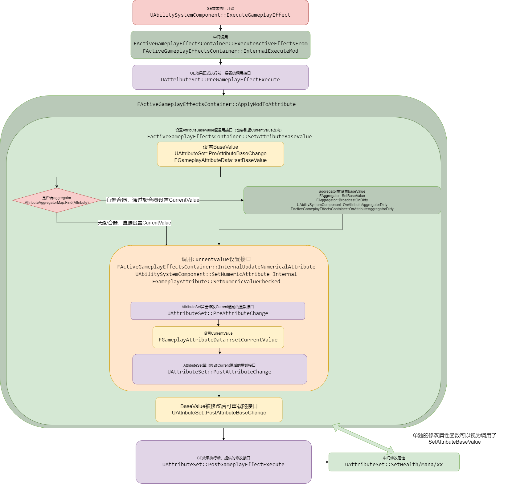

# 前言

这是个人在GAS学习过程中的笔记，主要为本人学习GAS时，产生的疑惑和查证过程。这份笔记没有经过系统性的整理，对于不同层次的问题也没做区分，涉及到的内容也并不全面。
<!-- more -->
**本文基于UE 5.3.2-release版本，不保证适用于其他版本！**

# GameplayAbility

## 技能实例类型 EGameplayAbilityInstancingPolicy

技能实例类型分为三种

1. **NonInstanced**：表示技能不会被实例化，即每个玩家共享相同的技能实例。一旦一个玩家使用了某个技能，其他玩家也将受到影响。

   > 非实例技能可以用于一些全局共享的机制，可以用于做某些全局玩家规则性增强。按理来说，也应该可以内部进行限制以实现队伍共享的效果。

2. **InstancedPerActor**：表示技能会被实例化，并且每个角色（Actor）都会拥有自己的技能实例。每个角色都可以独立使用和管理自己的技能。

   > 这种技能需要做打开retrigger配置才能在已经激活的情况下再次尝试激活，再次激活需要注意技能的相关清理逻辑。在重新激活前，会调用EndAbility来结束本次技能的释放流程

3. **InstancedPerExecution**：表示技能会被根据每次执行实例化，即每次执行技能都会创建一个新的实例。这样可以确保每次执行技能时都有独立的实例。

### UGameplayAbility::IsActive

由于技能支持三种不同的实例类型，因此判断是否处于激活也是有不同标准

- 存在 **bIsActive** 支持技能按角色实例化类型 **InstancedPerActor** 的激活判断，在角色身上技能区分激活和不激活
- 对于剩下两种，技能本身Valid就视为激活。但是根据注释，不建议在不实例化技能中用此进行判断

> this should not be called on NonInstanced warn about it, Should call IsActive on the ability spec instead


## CommitAbility

在教程中会提到GameplayAbility开始要Commit Ability，但是没有提这个为什么。现在看一下这个内容。主要也就是三个部分。

### CommitCheck

主要检查技能的可用性。看起来

- 检查技能 SpecHandle是否可用
- 检查Actor上ASC是否可用
- 检查ASC中这个Handle是否能找到能力的实例
- 根据ASG(AbilitySystemGlobals)获取一个全局实例，由此判断是不是要进行冷却检测和消耗检测。

可以注意到，GAS中，对于GameplayAbility的冷却和消耗检查的开启与否是可以全局控制的。

### CooldownCheck

在实际操作上会发现，冷却时间的检测不是一开始以为的检测是否存在对应的CooldownGE，重点在于，需要有对应的**gameplayTag**，在**ue5.3**的GAS更新后，需要通过**component**中的 **TargetTagsGameplayEffectComponent**来cooldown为GE设定一些带有的Tag。

> 在大部分教程中都没提过granted Tag和其UE5.3的对应改动。导致会漏了这东西

### CostCheck

在判断costGE时会调用的**GameplayEffect**上的**CanApplyAttributeModifiers**，这里面写死了一个判断如果GE对属性的修改为Add类型时，修改后的值必须为非负数。

也就是说，这里自动检测消耗后数值不能小于零，对于扣血扣成负数这种效果就会进行限制。

> 好消息，这么别扭的判定只在costCheck中使用。做技能的时候得改一下这套GE。

### CommitExexucte

负责CoolDown和Cost的GE添加，在全局忽略时也不会添加GE

### NotifyAbilityCommit

通过ASC通知自己Commit了，发 `AbilityCommittedCallbacks` 个广播。

这个事件目前看只在 **UAbilityTask_WaitAbilityCommit** 一个直接相关AT、和 **AbilitySystemComponentTestSuite** 中注册一个信息显示的回调使用。某种程度上来说基本不必要。

### 感想

CommitAbility实际上做的就这些。所以在实际中感觉可以省略一部分内容。

例如在动作游戏中可能根本不考虑CD和COST，而是以动作状态做判断时，就可以通过修改CommitAbility省去一部分，感觉上甚至可以删除对应机制。

提供了接口和事件提供手动施加CD和COST的能力。所以响应对应委托时会有区分。

处理各种CD冷却啊，中途开始CD，额外CD的话都需要中途调整GE，原有机制难以处理。在CD机制复杂的技能中，可能根本没法使用。

大量Cooldown和Cost的GE也会产生问题。


## EndAbility

用于结束技能的逻辑。

在判断**bIsActive**的技能激活状态会晚于调用**K2_OnEndAbility**蓝图事件，因此有可能多次触发调用。

### 步骤顺序

1. 调用蓝图K2_OnEndAbility事件
2. 对于Actor持有技能实例类**GA**检查是否已经停止激活，如已经未激活则结束步骤
3. 清除LantentAction和Timer
4. 广播技能结束事件
5. 结束gameplayTask
6. 移除gameplayTag相关内容

### 结束回调

**GA**结束时，会存在两个技能回调 **OnGameplayAbilityEnded** 和 **OnGameplayAbilityEndedWithData** 在这个过程中，**GA**的**bIsActive**仍然处于true的状态。但是对于不实例化**GA**会有一个 **bIsAbilityEnding**字段用来确认**GA**处于一个结束情况，

## Ability激活

技能的激活往往是出于 `UAbilitySystemComponent::TryActivateAbility` 这个函数，从客户端激活技能主要包含以下步骤。

1. 通过判断技能的Handle判断是否处于一个正在移除或者移除中状态

2. 判断技能、Actor信息是否可用

3. 判断网络权限是否正确

   - 网络权限为模拟 **ROLE_SimulatedProxy** 归属权在其他客户端的一律不能执行
   - 此时不为本地控制**LocalControllered**(基本为服务器上看客户端主控的情况)，但能力要在客户端本地执行 **LocalOnly** 的或者本地预测 **LocalPredicted** 的GA、会向客户端发起**RPC**、让客户端激活能力，
   - 当前不是服务器 **ROLE_Authority**，但是能力要在在服务器执行 **ServerOnly** 或者在客户端同步执行 **ServerInitiated** 的，尝试向服务器请求激活能力
   - 都不是的情况下就直接尝试直接激活技能 **InternalTryActivateAbility**

4. 上述的几种一旦成功都会调用到 `UAbilitySystemComponent::InternalServerTryActivateAbility` 这个入口函数中，此时最终激活方已经确定了，开始正式激活

   > 4 这一步和前面3步可能完全不是同一个机子上执行了

5. 重新检测涉及到的Handle、Spec、Ability的可用性

6. 锁定能力列表，避免激活流程中能力列表发生变化

7. 检测Actor的可用性

8. 重新判断网络权限，即3对于远程调用的在这一步验证是否正确

9. 检测技能是否满足激活条件，即 **CanActivateAbility**，包括ASC上的可用性检测，冷却、消耗、Tag满足、以及蓝图重载的判断方法情况

10. 如果当前是权威 **ROLE_Authority**且权限为服务器激活的，则创建或复用一个服务器激活预测键。如果是本地执行的，不创建预测键。

    - 但是都创建一个预测窗口，并通知客户端已经成功激活了
    - 根据实例化策略激活能力

11. 如果是本地预测的话，则生成预测窗口、并且绑定预测键的捕获委托，根据实例化策略激活能力 

    > 10 和 11这里已经调用到了ActivateAbility这样的实际激活入口了。
    >
    > 在实际激活前，会存在一个preActivate阶段，这个阶段先赋予角色一层OwnerTag，然后将要取消的能力取消、并且可以阻止掉组织能力标签的后续GA触发了。
    >
    > 然后才是技能的正式激活Activate

12. 记录技能激活的一些后续情况，例如技能Spec已经产生变化，还有记录技能最新的激活时间

## Tags

这里记录一下**GameplayAbility**一些**Tag**的配置项使用说明

- **取消能力标签 (CancelAbilitiesWithTag)**: 当此能力执行时，具有这些标签的其他能力将被取消。

- **阻止能力标签 (BlockAbilitiesWithTag)**: 当此能力处于激活状态时，具有这些标签的其他能力将被阻止。

- **激活拥有者标签 (ActivationOwnedTags)**: 当此能力激活时，会将这些标签应用于激活的拥有者。

  > 如果在 **AbilitySystemGlobals** 中启用了 **ReplicateActivationOwnedTags**，这些标签将被同步。这主要描述一个和网络同步相关的内容，目前不重要

- **激活所需标签 (ActivationRequiredTags)**: 只有在激活的角色/组件具有所有这些标签时，此能力才能被激活。

- **激活阻止标签 (ActivationBlockedTags)**: 只要激活的角色/组件具有任何这些标签，此能力将被阻止激活。

- **来源所需标签 (SourceRequiredTags)**: 只有在来源角色/组件具有所有这些标签时，此能力才能被激活。

- **来源阻止标签 (SourceBlockedTags)**: 只要来源角色/组件具有任何这些标签，此能力将被阻止激活。

- **目标所需标签 (TargetRequiredTags)**: 只有在目标角色/组件具有所有这些标签时，此能力才能被激活。

- **目标阻止标签 (TargetBlockedTags)**: 只要目标角色/组件具有任何这些标签，此能力将被阻止激活。

# AbilityTask

AbilityTask主要是一个用于管理能力使用过程的异步逻辑。主要是将瞬时执行的过程将其异步化。

## AbilityTask_PlayMontageAndWait

作为动作游戏常用的节点，`PlayMontageAndWait`是一个非常常用的AT。它提供了以下四种情况根据蒙太奇播放情况的回调

1. OnCompleted：蒙太奇动画正常播放结束
2. OnBlendOut: 蒙太奇动画被混出
3. OnInterrupted：蒙太奇动画被打断
4. OnCancelled：技能被取消，主要在播放蒙太奇失败的情况和为外部取消时调用的接口

在某种程度上，我们的逻辑可以认为1和2为一类、为蒙太奇成功播放完成。3和4为一类、即蒙太奇播放过程中失败了的情况。

> AnimMontageInstace本身结束会存在两种情况，完整结束end和被其他动画打断混合blendOut，这里是将blendOut根据是否interrupt来额外区分出Interrupted事件。
>
> 同时通过EndTask时的委托解绑来避免重复触发事件。

### 参数分析

- bStopWhenAbilityEnds：在**GA**结束销毁**AT**时，同步停止蒙太奇。注意在**GA**被取消时会直接停止蒙太奇。
- bAllowInterruptAfterBlendOut：在正常情况下，蒙太奇被BlendOut后，该AT会不再处理该蒙太奇的interrupt事件，该参数允许在blendOut后处理interrupt事件。

> ASC会保存一个通过技能使用的蒙太奇信息在 LocalAnimMontageInfo 中。在该AT使用的蒙太奇blendOut就会清空掉对应蒙太奇

## AbilityTask_WaitTargetData和TargetActor

- 通过 `UAbilityTask_WaitTargetData` 创建一个`AGameplayAbilityTargetActor`，并且等待相应事件。

- 通过`AGameplayAbilityTargetActor`封装碰撞、检测、指示显示等功能。回传锁定目标以选择对象。
- `UAbilityTask_WaitTargetData`会将它创建的 `AGameplayAbilityTargetActor` 全部挂接到 **ASC** 上。
- **TargetActor**主要通过重载 `AGameplayAbilityTargetActor::StartTargeting`和 `AGameplayAbilityTargetActor::ConfirmTargetingAndContinue`用于实现在创建和确认时进行内容的功能
- 在通过**TargetDataReadyDelegate**接受到，除非自行设置了 **EGameplayTargetingConfirmation：CustomMulti**

这两者基本是绑定的使用关系

### Confirm/Cancel 确认/取消寻找目标

**TargetActor**实际上有两个节点。

1. 开始确认，调用 `TargetActor:ConfirmTargeting`。主要会调用到 `AGameplayAbilityTargetActor:ConfirmTargetingAndContinue` 进行瞬间的筛选。然后会自行销毁掉。
2. 抛出有价值数据。调用**TargetDataReadyDelegate**委托，一般会在**ConfirmTargetingAndContinue**中抛出，但是也可以通过Tick等其他方式在满足条件后抛出。

**UAbilityTask_WaitTargetData** 存在以下几种确认机制，用枚举 **EGameplayTargetingConfirmation** 区分

- **Instant**：TargetActor生成立刻检测。检测完立即自动销毁。
- **UserConfirmed**：等待一个输入开始最终确认，这个选择会触发 **BindToConfirmCancelInputs** 。个人觉得意义不大
- **Custom**:  没有绑定也没有特殊处理。基本上来说反而是实质上最多的场景，等待其他方式触发（如**ASC **的 **TargetConfirm**） 或者自行决定触发
- **CustomMulti**: 用于在**TargetActor** 的 **TargetDataReadyDelegate** 触发后，概念上可以多次触发，所以不会**EndTask**。

#### AGameplayAbilityTargetActor::BindToConfirmCancelInputs

里面封装了一些基于**InputID**的确认和取消触发，但是在**EnhencedInput**的大背景下，个人认为使用价值不大。

#### UAbilitySystemComponent::TargetConfirm

ASC中，存在 `UAbilitySystemComponent::TargetConfirm` 和 `UAbilitySystemComponent::TargetCancel`，用于对身上的所有`TargetActor:ConfirmTargeting` 统一触发。

### 多次确认

综上所述，如果希望一个TargetActor能够多次触发Task的话。**AT**需要定义为 **CustomMulti**类型以避免触发后结束。**TargetActor**中不进行确认，而是通过Tick等方式多次抛出有效数据储备完成的 **TargetDataReadyDelegate** 委托。最后再通过其他方式**EndTask**并且销毁**TargetActor**。应该是属于一个比较进阶的功能设计

# AttributeSet

## FGameplayAttributeData

老生常谈了，baseValue和CurrentValue不是当前和最大值的关系。单位都是float，实质上作为数值类型对象。

## FAttributeMetaData

用于在编辑器显示的meta数据，有MinValue和MaxValue，目前没有对应逻辑限制，**所以没用**

## 属性限制 PreAttributeChange和PostGameplayEffectExecute

在GAS基本介绍中，这两个都做属性限制，说一个是CurrentValue会调用，一个是BaseValue会调用。现在对具体的调用逻辑进行分析

在使用对BaseValue的GE修改（即Instant或者具有period的Has Duration或者Infinite）我们对GE的修改大体可以看成如此流程。

当我们做属性限制，比如生命值不超过最大值时，我们就有两个地方需要加入限制，**PreAttributeChanged **和 **PostGameplayEffectExecute**。

- GE开始修改，进行**BaseValue**的修改
- 根据新的**BaseValue**算得新的**CurrnetValue**，第一次调用 **PreAttributeChange**，对于**CurrentValue**进行限制
- GE修改完成 此时可能由于属性限制导致**CurrentValue**和 **BaseValue**不同
- GE修改完成调用 **PostGameplayEffectExecute**，此时在根据 **CurrentValue** 重新调用 **SetAttributeBaseValue** 重新设置 **BaseValue**

> 这一步主要是用getHealth和setHealth设置属性，所以会是用CurrentValue重新设置了BaseValue

- 重新设置 **BaseValue** 和 **CurrentValue**, 此时 **PreAttributeChange** 会被第二次调用

### GE修改BaseValue流程



> UAttributeSet::Pre/PostAttributeBaseChange 并没有在那个知名GAS文档中提到，但是这并不代表这两个接口不能被正确使用

## 当AttributeSet定义多个相同属性时，该如何操作

如上所言，当一个角色存在多个AttributeSet时，或者多个AttributeSet中有多个同名时，会发生什么？

### 多个AttributeSet存在同名属性

这个问题并不严重，首先，无论是蓝图还是C++，在确定具体目标属性时都需要确定到AttributeSet中的。最终都是类似于AS1.hp和AS2.hp的形式，所以实际运用时会被区分开。

### 存在多个父类相同的AttributeSet

在执行属性更改时，我们会首先在ASC中获取到对应的AttributeSet，以这段代码举例。

```c++
// GameplayEffect.cpp:3502
bool FActiveGameplayEffectsContainer::InternalExecuteMod(FGameplayEffectSpec& Spec, FGameplayModifierEvaluatedData& ModEvalData)
{
	SCOPE_CYCLE_COUNTER(STAT_InternalExecuteMod);

	check(Owner);

	bool bExecuted = false;

	UAttributeSet* AttributeSet = nullptr;
    //获取到要修改属性所属的AttributeSet的class信息
	UClass* AttributeSetClass = ModEvalData.Attribute.GetAttributeSetClass();
	//判断是否是一个合法的AttributeSet子类，重点在于
	if (AttributeSetClass && AttributeSetClass->IsChildOf(UAttributeSet::StaticClass()))
	{
        //遍历ASC的组件中中，获取到第一个对应类型的AttributeSet
		AttributeSet = const_cast<UAttributeSet*>(Owner->GetAttributeSubobject(AttributeSetClass));
	}
    
    if (AttributeSet)
	{
        //...
    }
    return
}
// AbilitySystemComponent.cpp:119
const UAttributeSet* UAbilitySystemComponent::GetAttributeSubobject(const TSubclassOf<UAttributeSet> AttributeClass) const
{
	for (const UAttributeSet* Set : GetSpawnedAttributes())
	{
        // isA能够判断某个实例是否为某个类型的子类的实例，所以AttributeSet可以继承使用，通过重载了做对属性的一些其他方式
		if (Set && Set->IsA(AttributeClass))
		{
			return Set;
		}
	}
	return nullptr;
}
```

因此我们可以知道，通过GE修改属性时，对于AttributeSet重复、缺失等情况下，属性修改实际执行对象的逻辑。


# GameplayEffect

## 时间和持续类型

- Instant: 立即执行，对于Attribute的修改均为BaseValue修改

- Infinite: 长期存在，对于Attribute的修改一般为CurrentValue，在存在Period时会变成每次的独立BaseValue修改
- Has duration： 长期存在，可以视为带时间限制的Infinite

## GE通过Modify来修改属性

GE可以有多个Modify来修改属性，使用的Modify有如下四种：

- **Add**：在Attribute上直接加上计算结果
- **Multiply**：在Attribute上乘以计算结果
- **Divide**：在Attribute上除以计算结果
- **Override**：使用结果直接覆盖

处于Modify外，修改的另一种方式是使用**EEC**来讲属性变化分配，例如将伤害总量分配到生命和护盾上。

## Modify和Executions

Modify是作为一个数据的提供部分，而Execution是作为一个具体数据的修改部分。需要详细通过 **UGameplayModMagnitudeCalculation**和**UGameplayEffectExecutionCalculation**，两个自定义部分的来仔细梳理逻辑。这个回头再看看。

## MMC（UGameplayModMagnitudeCalculation)

在使用时，我们会简单的重写子类的 `CalculateBaseMagnitude_Implementation` 函数，它会根据GE传进的执行流程，对于要修改的属性进行处理。这个调用在不同种的GE执行流程中会有所不同，具体细节在 [GE在不同时序下的属性修改执行流程](#GE在不同时序下的Attribute修改执行流程) 中进行记录

## EEC（UGameplayEffectExecutionCalculation）

EEC的主要执行时间点在 `FActiveGameplayEffectsContainer::ExecuteActiveEffectsFrom`中，在**GE**的所有属性修改完成后执行**EEC**。在**AttributeSet**的 `PostGameplayEffectExecute` 后进行。

> 正因为EEC的执行阶段在GE的ExecuteActiveEffectsFrom中，所以对于period为0的hasDuration和Infinite形式GE，不会触发EEC的执行。
>
> 对于period不为0的非instantGE，会在每个周期执行中进行。
>
> 对于预测的instantGE，这里应该也不会执行EEC，但是GE预测可能本身受限制较大

### FGameplayEffectCustomExecutionOutput

EEC的使用过程主要就是在GE执行时调用C++中重载的**execute_implement**函数，这个函数过程中，编写判断逻辑，随后通过 **FGameplayEffectCustomExecutionOutput** 这个结构保存下额外进行的属性更改需求。

这个函数调用时间点在 `FActiveGameplayEffectsContainer::ExecuteActiveEffectsFrom` 中。

随后在 GE 执行过程中，调用 `FActiveGameplayEffectsContainer::InternalExecuteMod` 进行属性更迭。也就是说，会回到AttributeSet的属性修改流程中，可以对照图判断时间节点。

## 层数和等级

### 层数

层数通过`FGameplayEffectSpec::GetStackCount()`来获取目前GE的等级。

到达等级上线后，再次添加GE会导致溢出。**值得注意的是，目前只有层数已经到达上限后再添加会出现溢出的情况，如果没有到达等级上限时，一次添加多层只会到达上限，只有下一次才会溢出**

层数堆叠有三种选择：

- 每个GE附加的GE，都是单独的，不进行堆叠
- 按照施加者来进行堆叠，同一个施加者的GE能够堆叠
- 按照接受者来进行堆叠，接受者的GE都堆叠上去

### 等级

等级主要影响到GameplayEffect配置时，使用到CurveTable配置的数值属性。如果使用了CurveTable，本次属性更改就会根据等级取值。

## 数值来源

GameplayEffect的等级和层数会共同印象最终的数值改变量。Stack起到堆叠效果。会减去基本值，再乘以层数后加回基本值。

如果Stack = 2的情况。

+ 加法算法下：加10会变成加20
+ 乘法算法下：乘3会变成乘5，因为（3-1）* 2 + 1 = 5
+ 除法算法下：除2会变成除3，因为（2-1）* 2 + 1 = 3


## AGE（FActiveGameplayEffect） 

GE在实际使用过程中，并不会实例化。实际上实例化的为 **FActiveGameplayEffect ** 这个结构，这个结构用于网络复制，存储开始时间等额外信息。

因此可以说，AGE就是实际上处理角色身上具体一个个GE时的实例对象。

## FGameplayEffectSpec::CalculateModifierMagnitudes

对于一个GameplayEffectSpec，Modify的应用接口。各种GE执行都会调用这个接口进行属性计算

## FActiveGameplayEffectsContainer

目前理解为**ASC**上一个处理各类**GE**的中间层，用于处理 **FActiveGameplayEffect** 的创建和生命周期。**ASC**上只存在一个用作中控。

### FActiveGameplayEffectsContainer::GetAttributeBaseValue

GE修改属性时，BaseValue的来源

按顺序排列

1. 如果 **Attribute** 是一个 **FGameplayAttributeData** 时，直接取用里面的BaseValue
2. 如果存在**Aggregator**时，取**Aggregator**的**BaseValue**
3. 由1不满足得到，**Attribute**为**float**类型，直接取float值

## GE在不同时序下的Attribute修改执行流程


中间会提到Aggregator，在这个时候只需要了解到它是用于在BaseValue基础上更新CurrentValue的功能即可

### GE的初始进入调用流程 UAbilitySystemComponent::ApplyGameplayEffectSpecToSelf

GE初始的调用流程中，会到达ASC上的 `UAbilitySystemComponent::ApplyGameplayEffectSpecToSelf`，在此基础上，会进行逐步分化不同持续类型的流程。在此记录该函数的共有判断功能

#### 判断GE执行的条件是否满足

在这个流程中，会逐步判断以下情况以确定是否阻止GE执行

- 网络权限是否可以应用GE
- 是否有**ApplicationQuery** 可以阻止该GE执行
- Spec是否可以成功应用 `Spec.Def->CanApply(ActiveGameplayEffects, Spec)`。会调用到 **CAR** 进行判断
- 涉及到的的Modifiers均有效，所有Attribute均可以使用

> 这部分判断条件细节均不了解，只是按copilot和注释先判断一个作用，先略过

#### 是否为预测执行

判断是否为预测执行，如果使客户端本地预测执行的话，GE的Instant类型会被视为Infinite

```c++
// Clients should treat predicted instant effects as if they have infinite duration. The effects will be cleaned up later.
	bool bTreatAsInfiniteDuration = GetOwnerRole() != ROLE_Authority && PredictionKey.IsLocalClientKey() && Spec.Def->DurationPolicy == EGameplayEffectDurationType::Instant;

```


### InstantGE直接执行 UAbilitySystemComponent::ExecuteGameplayEffect

在进入调用流程后，确认该GE为Instant且不为预测执行，则直接执行GE效果应用，处理属性更改相关

InstantGE即为瞬间的属性修改

### 非InstantGE执行 FActiveGameplayEffectsContainer::ApplyGameplayEffectSpec

对于不会立即执行的GE，会调用该函数处理GE增加到ASC上的情况

#### 确定AppliedActiveGE

对于非Instant的GE，会存在堆叠增层的情况，因此如果会存在一个 **AppliedActiveGE**，用来确定这个GE添加中实际的 **AGE**。它可能是之前**ASC**已经存在了的AGE，进行叠层处理、或是一个新的AGE。

> 如果已经存在对应**AGE**，则预测时不会实际添加对象直接退回，即预测时不预测叠层情况。

```c++
// GameplayEffect.cpp:3612
if (ExistingStackableGE)
	{
		if (!IsNetAuthority())
		{
			// Don't allow prediction of stacking for now
			return nullptr;
		}
		// ...
	
}
```

##### 对于已经存在AGE处理GE层数累加

如果已经存在了可以被堆叠的GE，则处理GE最大层数限制、多少层后变化的问题

#### 计算属性修改 AppliedEffectSpec.CalculateModifierMagnitudes();

根据GE上的Modify计算GE要修改的属性

#### 重计算Duration

在这个函数中，尝试重新计算Duration，因为实际Duration存在根据目标重新计算的情况。

- 这种Duration调整只对本身Duration不为0的GE起效。
- 对于调整后Duration小于等于0的情况，不会将其处理成Instant，会将其默认设置为0.1秒

```c++
//GameplayEffect.cpp:3748
// Register Source and Target non snapshot capture delegates here
	AppliedEffectSpec.CapturedRelevantAttributes.RegisterLinkedAggregatorCallbacks(AppliedActiveGE->Handle);
	
	// Re-calculate the duration, as it could rely on target captured attributes
	float DefCalcDuration = 0.f;
	if (AppliedEffectSpec.AttemptCalculateDurationFromDef(DefCalcDuration))
	{
		AppliedEffectSpec.SetDuration(DefCalcDuration, false);
	}
	else if (AppliedEffectSpec.Def->DurationMagnitude.GetMagnitudeCalculationType() == EGameplayEffectMagnitudeCalculation::SetByCaller)
	{
		AppliedEffectSpec.Def->DurationMagnitude.AttemptCalculateMagnitude(AppliedEffectSpec, AppliedEffectSpec.Duration);
	}

	const float DurationBaseValue = AppliedEffectSpec.GetDuration();

	// Calculate Duration mods if we have a real duration
	if (DurationBaseValue > 0.f)
	{
		float FinalDuration = AppliedEffectSpec.CalculateModifiedDuration();

		// We cannot mod ourselves into an instant or infinite duration effect
		if (FinalDuration <= 0.f)
		{
			ABILITY_LOG(Error, TEXT("GameplayEffect %s Duration was modified to %.2f. Clamping to 0.1s duration."), *AppliedEffectSpec.Def->GetName(), FinalDuration);
			FinalDuration = 0.1f;
		}

		AppliedEffectSpec.SetDuration(FinalDuration, true);
		// ...
    }
```

#### 处理Period

这里会将Period和常数0比较，大于常数0的即视为存在周期性循环的功能。

通过指定GE在堆叠时的反应可以控制AGE堆叠时，是否重新调整周期

> UGameplayEffect::NO_PERIOD = FGameplayEffectConstants::NO_PERIOD = 0

#### 处理预测GE

代码检查InPredictionKey是否为本地客户端键并且不是网络授权。如果是，将调用MarkArrayDirty强制重建内部复制映射。一旦复制的状态赶上了这个预测键，我们必须删除这个Gameplay Effect。

如果InPredictionKey不是客户端本地键并且是网络授权的，则调用MarkItemDirty标记Active GE。然后，添加GE并输出详细信息，例如GE的名称、复制ID、复制键和预测键。

#### GE开始属性修改

已经存在的AGE调用AGE层数修改接口

新添加的AGE，调用AGE激活接口

### 总结

GE实际上分为两类逻辑。BaseValue逻辑和CurrentValue逻辑。

#### BaseValueGE

- instantGE、periodicGE使用
- 主要点在于会执行`UAbilitySystemComponent::ExecuteGameplayEffect`函数，具体细节流程 [GE的BaseValue修改流程](#GE修改BaseValue流程) 
- 由于会执行该函数，所以会处理**EEC**、**AttributeSet**的 `Pre/PostGameplayEffectExecute` 函数
- BaseValue的值会间接引起CurrentValue的改动，所以也会间接调用 **AttributeSet**的 `Pre/PostAttributeChange`

#### CurrentValueGE

- 只有period为0的 hasDurationGE、 infiniteGE使用
- 主要点在于会更改**Aggregator**的情况、用来修饰BaseValue、计算出最终的**CurrentValue**
- 没有 `UAbilitySystemComponent::ExecuteGameplayEffect`， 所以**无法**执行**EEC**和 **AttributeSet**的 `Pre/PostGameplayEffectExecute`
- 由于只调用到 `FActiveGameplayEffectsContainer::InternalUpdateNumericalAttribute` ，所以只会处理到 **AttributeSet**的 `Pre/PostAttributeChange`

### 推荐资料

对于GE修改属性中产生的其他细节、可以尝试看看以下材料

[GAS系统 ：GameplayEffect应用流程及Attribute修改](https://blog.csdn.net/qq_44687987/article/details/136189933)

[UE GAS进阶-深入GE](https://juejin.cn/post/7359086027581931556)

[GAS中的延迟与预测](https://mytechplayer.com/archives/yan-chi-he-yu-ce-hui-gun-gas)

[UE-GAS架构分析（三）（GameplayEffect）](https://zhuanlan.zhihu.com/p/464329488)

## FGameplayEffectModifierMagnitude::AttemptCalculateMagnitude

GE的数值计算，运行GE使用不同方式获取数值

```c++
//GameplayEffect.cpp:976
bool FGameplayEffectModifierMagnitude::AttemptCalculateMagnitude(const FGameplayEffectSpec& InRelevantSpec, OUT float& OutCalculatedMagnitude, bool WarnIfSetByCallerFail, float DefaultSetbyCaller) const
{
	//...
    switch (MagnitudeCalculationType)
		{
            case EGameplayEffectMagnitudeCalculation::ScalableFloat:
            case EGameplayEffectMagnitudeCalculation::AttributeBased:
            case EGameplayEffectMagnitudeCalculation::CustomCalculationClass:
            case EGameplayEffectMagnitudeCalculation::SetByCaller:
        	default:0;
    	}
    }
}
```

## CAR(UGameplayEffectCustomApplicationRequirement)和UCustomCanApplyGameplayEffectComponent

教程中提到的一个判断**GE**能否添加的内容，在 **UE5.3**中挪到 **UCustomCanApplyGameplayEffectComponent** 中。作为判断GE能否添加的条件判断。在 `UAbilitySystemComponent::ApplyGameplayEffectSpecToSelf`中调用。也就是GE添加第一部。

# Aggregator

Aggregator即可以理解为对于**FGameplayAttributeData**的**BaseValue**进行修饰计算得到**CurrentValue**。具体功能可参考 [Unreal GAS: Influence of the GameplayEffect aggregator on gameplay attribute values](https://stackoverflow.com/questions/52916274/unreal-gas-influence-of-the-gameplayeffect-aggregator-on-gameplay-attribute-val)。

在存在Aggregator后，对于属性的修改都要通过**Aggregator**来实现（具体来说会通过一个**FAggregatorRef**的结构体来持有对象）。

## Aggregator的创建和持有

主要依赖于 `FActiveGameplayEffectsContainer::FindOrCreateAttributeAggregator` 函数，通过**FActiveGameplayEffectsContainer**保证，一个ASC上对于一个**FGameplayAttribute**最多只有一个唯一的**Aggregator**。

创建本身是一种延迟生成，只有在用到时才会尝试为**FGameplayAttribute**创建对应的**Aggregator**。

一旦创建后就不会考虑的移除，哪怕并没有对于**BaseValue**的数据调整, 也会通过 **Aggregator** 来设置**CurrentValue**。

**FActiveGameplayEffectsContainer**会持有一个**AttributeAggregatorMap**来维护 **FGameplayAttribute** 和 **Aggregator**的关系。

## FAggregatorModChannel

可以理解为，一个channel即是一个基本的CurrentValue的修改流程。具体执行逻辑如下


此图来源于高贵纯合子

## FAggregatorModChannelContainer

一个**Aggregator**对应一个**FAggregatorModChannelContainer**。

如**FActiveGameplayEffectsContainer**一样，这是个唯一的中间管理器，用来存储和处理它具备的**FAggregatorModChannel**。

### EGameplayModEvaluationChannel

一组枚举，通过枚举用于和不同的 **FAggregatorModChannel** 对应上。存储为一个TMap **ModChannelsMap**

```c++
// GameplayEffectAggregatir.cpp:209
FAggregatorModChannel& FAggregatorModChannelContainer::FindOrAddModChannel(EGameplayModEvaluationChannel Channel)
{
	FAggregatorModChannel* FoundChannel = ModChannelsMap.Find(Channel);
	if (!FoundChannel)
	{
		// Adding a new channel, need to resort the map to preserve key order for evaluation
		ModChannelsMap.Add(Channel);
		ModChannelsMap.KeySort(TLess<EGameplayModEvaluationChannel>());
		FoundChannel = ModChannelsMap.Find(Channel);
	}
	check(FoundChannel);
	return *FoundChannel;
}
```


## FScopedAggregatorOnDirtyBatch

RALL机制下的通知锁。利用析构机制触发广播。用来处理Aggregator改动后的广播通知

## Aggregator和AttributeBased GE

除去最直接的计算 **Attribute** 的**CurrentValue**外，**Aggregator**中有一大部分代码则是为了允许**GE**使用**Attribute**而处理。

主要调用流程为`EGameplayEffectMagnitudeCalculation::AttributeBased`到`FAttributeBasedFloat::CalculateMagnitude`

在**GE**使用过程中，可以直接捕获**ASC**上的**Attribute**作为属性来源。

支持以下四种情况

- AttributeBaseValue: BaseValue
- AttributeMagnitude: CurrentValue
- AttributeBonusMagnitude:  CurrentValue - BaseValue
- AttributeMagnitudeEvaluatedUpToChannel：计算到指定channel的CurrentValue

> 个人认为，**Aggregator**的**channel**机制就是为了GE捕获的自由度而开发的。如果存在使用不同等级乘区的需求的话，还可以考虑channel区分应用。实用性对于明确的多层乘区属性关系来说还是很大的。
>
> 但是对于存在并列且需要挑选的乘区需求的话，channel机制就没有办法进行正常处理了。而且channel也不能根据Attribute区分，导致实用性更差

## 推荐材料

[Attribute的current value是如何实现的？](https://juejin.cn/post/7359086027581931556#heading-3) 很推荐高贵纯合子对于GE的研究文章

# AbilitySystemGlobals

### ShouldIgnoreCooldowns() 和 ShouldIgnoreCosts()

GA发动时是否要检测 CoolDownGE和 CostGE，全局设置，猜测为Debug方便的使用？

### 全局提供特定数据/管理器

通过静态函数提供自己的单例实例。再提供一些全局通用的功能。

- **GetGameplayCueManager**： 提供了GCManager的接口，用于游戏中触发GC。
- **GetGameplayTagResponseTable**：提供游戏标签响应表，这是一个可以指定游戏标签与特定的响应函数之间的关联。这样，当某个游戏标签被激活时，可以自动调用相应的响应函数进行处理，比如触发特定的事件、改变角色状态、执行特定的逻辑等。

提供了部分


# GameplayCue

GameplayCue(**GCue**)是用于作为和逻辑无关的纯视效表现，例如特效，音效，镜头效果等功能。

## InvokeGameplayCueEvent

Gameplay一个很特异的点在于，在使用时并不是指定一个具体的**GCue**类。而是通过**GameplayTag**来间接使用。

### UGameplayCueManager::HandleGameplayCue

这是调用GameplayCue的最终入口。

在**ASC**中往往通过GE添加、直接触发等方式最终到 `UAbilitySystemComponent::InvokeGameplayCueEvent` 函数。

然后再调用`UAbilitySystemGlobals::Get().GetGameplayCueManager()->HandleGameplayCue`使用。

这个函数最终会调用到 `UGameplayCueSet::HandleGameplayCueNotify_Internal` 中

### UGameplayCueSet::HandleGameplayCueNotify_Internal

```c++
// GameplayCueSet.cpp:259
bool UGameplayCueSet::HandleGameplayCueNotify_Internal(AActor* TargetActor, int32 DataIdx, EGameplayCueEvent::Type EventType, FGameplayCueParameters& Parameters)
{	
    // DataIdx 是外层调用用于找到对应GameplayCue的序号，其他效果无关
	bool bReturnVal = false;

	//...

	if (DataIdx != INDEX_NONE)
	{
		// 找到Tag对应的数据

		FGameplayCueNotifyData& CueData = GameplayCueData[DataIdx];

		Parameters.MatchedTagName = CueData.GameplayCueTag;

		const bool bDebugFailLoads = CVarGameplayCueFailLoads.GetValueOnGameThread();

		// 处理资源未加载的一些问题，不重要，略过
		if (CueData.LoadedGameplayCueClass == nullptr || bDebugFailLoads)
		{
			CueData.LoadedGameplayCueClass = Cast<UClass>(CueData.GameplayCueNotifyObj.ResolveObject());
			if (CueData.LoadedGameplayCueClass == nullptr || bDebugFailLoads)
			{
				if (!CueManager->HandleMissingGameplayCue(this, CueData, TargetActor, EventType, Parameters))
				{
					return false;
				}
			}
		}

		// 先尝试对应的是否为GameplayCueNotify_Static对象
		if (UGameplayCueNotify_Static* NonInstancedCue = Cast<UGameplayCueNotify_Static>(CueData.LoadedGameplayCueClass->ClassDefaultObject))
		{
			if (NonInstancedCue->HandlesEvent(EventType))
			{
                //处理GameplayCueEvent事件
				NonInstancedCue->HandleGameplayCue(TargetActor, EventType, Parameters);
				bReturnVal = true;
                // 未确认重载时调用父Tag层级处理
				if (!NonInstancedCue->IsOverride)
				{
					HandleGameplayCueNotify_Internal(TargetActor, CueData.ParentDataIdx, EventType, Parameters);
				}
			}
			else
			{
				//如果失败的话，尝试查找上一层的gameplayTag。即A.B.C中的 B
				HandleGameplayCueNotify_Internal(TargetActor, CueData.ParentDataIdx, EventType, Parameters);
			}
		}
        // 对应的是否为GameplayCueNotify_Actor对象
		else if (AGameplayCueNotify_Actor* InstancedCue = Cast<AGameplayCueNotify_Actor>(CueData.LoadedGameplayCueClass->ClassDefaultObject))
		{
			bool bShouldDestroy = false;
            // 如果Cue事件不是添加或激活，这个Cue未对应着一个Effect激活（即为Effect duration结束），且对应Notify_Actor有自动销毁配置。则说明Cue是需要销毁了
			if (EventType == EGameplayCueEvent::Executed && !Parameters.bGameplayEffectActive && InstancedCue->bAutoDestroyOnRemove)
			{
				bShouldDestroy = true;
			}

			if (InstancedCue->HandlesEvent(EventType))
			{
				if (TargetActor)
				{
					TSubclassOf<AGameplayCueNotify_Actor> InstancedClass = InstancedCue->GetClass();

					//确认TargetActor上是否有Cue的实例了，没有会在调用创建一个
					AGameplayCueNotify_Actor* SpawnedInstancedCue = CueManager->GetInstancedCueActor(TargetActor, InstancedClass, Parameters);
					
                    //处理GameplayCueEvent事件
                    SpawnedInstancedCue->HandleGameplayCue(TargetActor, EventType, Parameters);
                    bReturnVal = true;
                    
                    //同理，未确认重载时调用父Tag层级处理
                    if (!SpawnedInstancedCue->IsOverride)
                    {
                        HandleGameplayCueNotify_Internal(TargetActor, CueData.ParentDataIdx, EventType, Parameters);
                    }
					//如果满足自动销毁条件，就让其自动销毁
                    if (bShouldDestroy)
                    {
                        SpawnedInstancedCue->HandleGameplayCue(TargetActor, EGameplayCueEvent::Removed, Parameters);
                    }
				}
			}
			else
			{
				//这个Tag根本没有任何数据时，会尝试用父类处理
				HandleGameplayCueNotify_Internal(TargetActor, CueData.ParentDataIdx, EventType, Parameters);
			}
		}
	}

	return bReturnVal;
}
```

可以注意到。在存在对应Tag的时。会通过Override这个字段尝试是否尝试执行父类Tag。这个初次看可能觉得逻辑比较混乱，有时判断，有时不判断。实际上这个功能很好理解。

> /** Does this Cue override other cues, or is it called in addition to them? E.g., If this is Damage.Physical.Slash, we wont call Damage.Physical afer we run this cue. */
>
> UPROPERTY(EditDefaultsOnly, Category = GameplayCue)
> bool IsOverride;

- 如果对应的Notify成功应用了。如果确定是Override，就不会再尝试应用父类Tag
- 如果根本没应用成功，会尝试按照父类Tag处理

## EGameplayCueEvent

gameplayCue总计有四种类型

```c++
namespace EGameplayCueEvent
{
	/** 指示特定游戏界面提示标签发生了哪种类型的操作。有时您会同时收到多个事件 */
	enum Type : int
	{
		/** 当一个具有持续时间的GameplayCue首次激活时调用，仅在客户端激活时才会调用此方法 */
		OnActive,

		/** 当一个具有持续时间的GameplayCue首次被视为处于活动状态时调用，即使它实际上没有被应用（加入进行中等情况）也会是如此 */
		WhileActive,

        /** 当执行GameplayCue时调用，这用于即时效果或定期周期性执行的效果，即BaseValue修改时使用 */
		Executed,

		/** 当移除具有持续时间的GameplayCue时调用 */
		Removed
	};
}

```

可以从中理解到，**Cue**完全是为了和**GE**联动使用的。

而结合上一步的触发分析，可以确认，只有**CurrentValue**类型**GE**会由**GE**辅助**Cue**的生命周期管理。对于**BaseValue**类型的瞬时效果，都需要**Cue**自行管理。

这部分的调用来自于技术宅阿棍儿

### 各类GE-CUE事件调用链

- **持续GE的施加**

```c++
UAbilitySystemComponent::ApplyGameplayEffectSpecToSelf(...)
  //施加持续GE
->InvokeGameplayCueEvent(...) // OnActive和WhileActive
  ->UGameplayCueManager::HandleGameplayCues(...)
    ->UGameplayCueManager::HandleGameplayCue(...)
      ->UGameplayCueManager::RouteGameplayCue(...)
        ->UGameplayCueSet::HandleGameplayCue(...) // 必经之路
          ->UGameplayCueSet::HandleGameplayCueNotify_Internal(...)
            ->AGameplayCueNotify_Actor/UGameplayCueNotify_Static
              ::OnActive/WhileActive(...)
```

- **持续GE的移除**

```c++
FActiveGameplayEffectsContainer::InternalRemoveActiveGameplayEffect(...)
    ->InternalOnActiveGameplayEffectRemoved(...)
      ->RemoveActiveGameplayEffectGrantedTagsAndModifiers(...)
        ->UAbilitySystemComponent::InvokeGameplayCueEvent(...)
          // 同上
            ->AGameplayCueNotify_Actor/UGameplayCueNotify_Static::OnRemove(...)
```

- **持续GE的标签变化**

```c++
FActiveGameplayEffectsContainer::OnOwnerTagChange(...)
->FActiveGameplayEffect::CheckOngoingTagRequirements(bInvokeGameplayCueEvents = true)
  // 如果OngoingTagRequirements满足
  ->FActiveGameplayEffectsContainer::AddActiveGameplayEffectGrantedTagsAndModifiers(...)
    ->UAbilitySystemComponent::InvokeGameplayCueEvent(...)  // OnActive和WhileActive
      // 与前文重复，略
  // 如果OngoingTagRequirements【不】满足
  ->FActiveGameplayEffectsContainer::RemoveActiveGameplayEffectGrantedTagsAndModifiers(...)
    ->UAbilitySystemComponent::InvokeGameplayCueEvent(...)  //Removed
      // 与前文重复，略
```

- **Instant GE的施加**

```c++
UAbilitySystemComponent::ApplyGameplayEffectSpecToSelf(...)
->ExecuteGameplayEffect(...)
 ->FActiveGameplayEffectsContainer::ExecuteActiveEffectsFrom(...)
  ->UGameplayCueManager::InvokeGameplayCueExecuted_FromSpec(...)
   ->AddPendingCueExecuteInternal(...)
    ->FlushPendingCues()
     ->IAbilitySystemReplicationProxyInterface::Call_InvokeGameplayCueExecuted_FromSpec(...)
      ->UAbilitySystemComponent::NetMulticast_InvokeGameplayCueExecuted_FromSpec(...)
       ->NetMulticast_InvokeGameplayCueExecuted_FromSpec_Implementation(...)
        ->InvokeGameplayCueEvent(...) //Executed     
         // 与前文类似，略       
```

该整理来源于知乎：[技术宅阿棍儿](https://zhuanlan.zhihu.com/p/430239761)

## GameplayCue的类多态特性

这部分内容转移到[GameplayCueTranslator](https://obsidian-zero.github.io/2024/07/24/GameplayCueTranslatorUse/#more)这篇文章了

## GameplayCueManager

一个全局的GameplayCue的管理器，所有**GameplayCue**的管理功能均从这里开始

通过 **AbilitySystemGlobals** 来获取全局单例

### FGameplayCueTranslationManager

- 实现上文所提到的**GameplayTag**转换都在这个Manger中完成。
- Manager本身绑定在**GameplayCueManager(GCM)**中，而**GCM**本身是单例式的，可以视为它也是单例
- 存在 **TranslationNameToIndexMap** 用于存储了的**GameplayTag**到**FGameplayCueTranslatorNode**关系。

- 存在**TranslationLUT**一个TArray存储了所有的**FGameplayCueTranslatorNode**。**FGameplayCueTranslatorNode**是一个主要使用的结构体，用来存储GameplayCue转换逻辑的。

### UGameplayCueSet

- 用于保存**gameplayTag**到实际实现**Cue**的**Actor**间的相关联系
- 全局唯一，保存在**RuntimeGameplayCueObjectLibrary**中
- 引擎开始时自动生成
- 使用**FGameplayCueNotifyData**结构体，来存储`GameplayCueTag`到 `GameplayCueNotifyObj`的之间联系

## 参考材料

[【UE】记录GameplayCue执行流程](https://zhuanlan.zhihu.com/p/693591783)

[虚幻插件GAS分析05 GameplayCue的使用](https://zhuanlan.zhihu.com/p/430239761)，