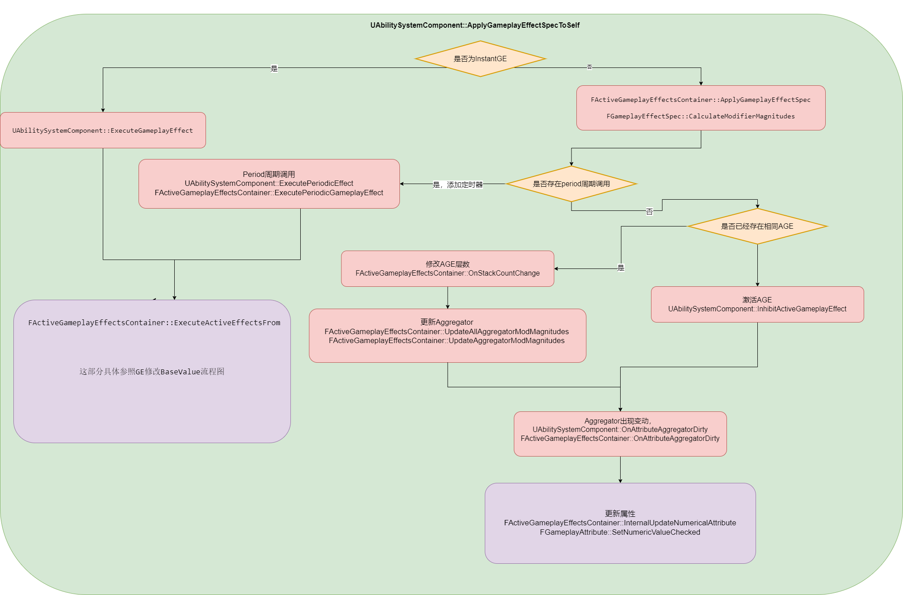

# 序言

这是个人在GAS学习过程中的笔记，主要为本人学习GAS时，产生的疑惑和查证过程。这份笔记没有经过系统性的整理，对于不同层次的问题也没做区分，涉及到的内容也并不全面。

**本文基于UE 5.3.2-release版本，不保证适用于其他版本！**

# GameplayAbility

## CommitAbility

在教程中会提到GameplayAbility开始要Commit Ability，但是没有提这个为什么。现在看一下这个内容。主要也就是三个部分。

### CommitCheck

主要检查技能的可用性。看起来

- 检查技能 SpecHandle是否可用
- 检查Actor上ASC是否可用
- 检查ASC中这个Handle是否能找到能力的实例
- 根据ASG(AbilitySystemGlobals)获取一个全局实例，由此判断是不是要进行冷却检测和消耗检测。

可以注意到，GAS中，对于GameplayAbility的冷却和消耗检查的开启与否是可以全局控制的。

### CooldownCheck

在实际操作上会发现，冷却时间的检测不是一开始以为的检测是否存在对应的CooldownGE，重点在于，需要有对应的**gameplayTag**，在**ue5.3**的GAS更新后，需要通过**component**中的 **TargetTagsGameplayEffectComponent**来cooldown为GE设定一些带有的Tag。

> 在大部分教程中都没提过granted Tag和其UE5.3的对应改动。导致会漏了这东西

### CostCheck

在判断costGE时会调用的**GameplayEffect**上的**CanApplyAttributeModifiers**，这里面写死了一个判断如果GE对属性的修改为Add类型时，修改后的值必须为非负数。

也就是说，这里自动检测消耗后数值不能小于零，对于扣血扣成负数这种效果就会进行限制。

> 好消息，这么别扭的判定只在costCheck中使用。做技能的时候得改一下这套GE。

### CommitExexucte

负责CoolDown和Cost的GE添加，在全局忽略时也不会添加GE

### NotifyAbilityCommit

通过ASC通知自己Commit了，发个广播。

### 感想

CommitAbility实际上做的就这些。所以在实际中感觉可以省略一部分内容。例如在动作游戏中可能根本不考虑CD和COST，而是以动作状态做判断时，就可以通过修改CommitAbility省去一部分。

提供了接口和事件提供手动施加CD和COST的能力。所以响应对应委托时会有区分。

处理各种CD冷却啊，中途开始CD，额外CD的话都需要中途调整GE，原有机制难以处理。

# AttributeSet

## FGameplayAttributeData

老生常谈了，baseValue和CurrentValue不是当前和最大值的关系。单位都是float，实质上作为数值类型对象。

## FAttributeMetaData

用于在编辑器显示的meta数据，有MinValue和MaxValue，目前没有对应逻辑限制，**所以没用**

## 属性限制 PreAttributeChange和PostGameplayEffectExecute

在GAS基本介绍中，这两个都做属性限制，说一个是CurrentValue会调用，一个是BaseValue会调用。现在对具体的调用逻辑进行分析

在使用对BaseValue的GE修改（即Instant或者具有period的Has Duration或者Infinite）我们对GE的修改大体可以看成如此流程。

当我们做属性限制，比如生命值不超过最大值时，我们就有两个地方需要加入限制，**PreAttributeChanged**和 **PostGameplayEffectExecute**。

- GE开始修改，进行**BaseValue**的修改
- 根据新的**BaseValue**算得新的**CurrnetValue**，第一次调用 **PreAttributeChange**，对于**CurrentValue**进行限制
- GE修改完成 此时可能由于属性限制导致**CurrentValue**和 **BaseValue**不同
- GE修改完成调用 **PostGameplayEffectExecute**，此时在根据 **CurrentValue** 重新调用 **SetAttributeBaseValue** 重新设置 **BaseValue**

> 这一步主要是用getHealth和setHealth设置属性，所以会是用CurrentValue重新设置了BaseValue

- 重新设置 **BaseValue** 和 **CurrentValue**, 此时 **PreAttributeChange** 会被第二次调用

### GE修改BaseValue流程


> UAttributeSet::Pre/PostAttributeBaseChange 并没有在那个知名GAS文档中提到，但是这并不代表这两个接口不能被正确使用
>

## 当AttributeSet定义多个相同属性时，该如何操作

如上所言，当一个角色存在多个AttributeSet时，或者多个AttributeSet中有多个同名时，会发生什么？

### 多个AttributeSet存在同名属性

这个问题并不严重，首先，无论是蓝图还是C++，在确定具体目标属性时都需要确定到AttributeSet中的。最终都是类似于AS1.hp和AS2.hp的形式，所以实际运用时会被区分开。

### 存在多个父类相同的AttributeSet

在执行属性更改时，我们会首先在ASC中获取到对应的AttributeSet，以这段代码举例。

```c++
// GameplayEffect.cpp:3502
bool FActiveGameplayEffectsContainer::InternalExecuteMod(FGameplayEffectSpec& Spec, FGameplayModifierEvaluatedData& ModEvalData)
{
	SCOPE_CYCLE_COUNTER(STAT_InternalExecuteMod);

	check(Owner);

	bool bExecuted = false;

	UAttributeSet* AttributeSet = nullptr;
    //获取到要修改属性所属的AttributeSet的class信息
	UClass* AttributeSetClass = ModEvalData.Attribute.GetAttributeSetClass();
	//判断是否是一个合法的AttributeSet子类，重点在于
	if (AttributeSetClass && AttributeSetClass->IsChildOf(UAttributeSet::StaticClass()))
	{
        //遍历ASC的组件中中，获取到第一个对应类型的AttributeSet
		AttributeSet = const_cast<UAttributeSet*>(Owner->GetAttributeSubobject(AttributeSetClass));
	}
    
    if (AttributeSet)
	{
        //...
    }
    return
}
// AbilitySystemComponent.cpp:119
const UAttributeSet* UAbilitySystemComponent::GetAttributeSubobject(const TSubclassOf<UAttributeSet> AttributeClass) const
{
	for (const UAttributeSet* Set : GetSpawnedAttributes())
	{
        // isA能够判断某个实例是否为某个类型的子类的实例，所以AttributeSet可以继承使用，通过重载了做对属性的一些其他方式
		if (Set && Set->IsA(AttributeClass))
		{
			return Set;
		}
	}
	return nullptr;
}
```

因此我们可以知道，通过GE修改属性时，对于AttributeSet重复、缺失等情况下，属性修改实际执行对象的逻辑。


# GameplayEffect

## 时间和持续类型

- Instant: 立即执行，对于Attribute的修改均为BaseValue修改

- Infinite: 长期存在，对于Attribute的修改一般为CurrentValue，在存在Period时会变成每次的独立BaseValue修改
- Has duration： 长期存在，可以视为带时间限制的Infinite

## Modify和Executions

Modify是作为一个数据的提供部分，而Execution是作为一个具体数据的修改部分。需要详细通过 **UGameplayModMagnitudeCalculation**和**UGameplayEffectExecutionCalculation**，两个自定义部分的来仔细梳理逻辑。这个回头再看看。

## MMC（UGameplayModMagnitudeCalculation)

在使用时，我们会简单的重写子类的 `CalculateBaseMagnitude_Implementation` 函数，它会根据GE传进的执行流程，对于要修改的属性进行处理。这个调用在不同种的GE执行流程中会有所不同，具体细节在 [GE在不同时序下的属性修改执行流程](#GE在不同时序下的Attribute修改执行流程) 中进行记录

## EEC（UGameplayEffectExecutionCalculation）

EEC的主要执行时间点在 `FActiveGameplayEffectsContainer::ExecuteActiveEffectsFrom`中，在**GE**的所有属性修改完成后执行**EEC**。在**AttributeSet**的 `PostGameplayEffectExecute` 后进行。

> 正因为EEC的执行阶段在GE的ExecuteActiveEffectsFrom中，所以对于period为0的hasDuration和Infinite形式GE，不会触发EEC的执行。
>
> 对于period不为0的非instantGE，会在每个周期执行中进行。
>
> 对于预测的instantGE，这里应该也不会执行EEC，但是GE预测可能本身受限制较大

### FGameplayEffectCustomExecutionOutput

EEC的使用过程主要就是在GE执行时调用C++中重载的**execute_implement**函数，这个函数过程中，编写判断逻辑，随后通过 **FGameplayEffectCustomExecutionOutput** 这个结构保存下额外进行的属性更改需求。

这个函数调用时间点在 `FActiveGameplayEffectsContainer::ExecuteActiveEffectsFrom` 中。

随后在 GE 执行过程中，调用 `FActiveGameplayEffectsContainer::InternalExecuteMod` 进行属性更迭。也就是说，会回到AttributeSet的属性修改流程中，可以对照图判断时间节点。

## AGE（FActiveGameplayEffect） 

GE在实际使用过程中，并不会实例化。实际上实例化的为 **FActiveGameplayEffect ** 这个结构，这个结构用于网络复制，存储开始时间等额外信息。

因此可以说，AGE就是实际上处理角色身上具体一个个GE时的实例对象。

## FGameplayEffectSpec::CalculateModifierMagnitudes

对于一个GameplayEffectSpec，Modify的应用接口。各种GE执行都会调用这个接口进行属性计算

## FActiveGameplayEffectsContainer

目前理解为**ASC**上一个处理各类**GE**的中间层，用于处理 **FActiveGameplayEffect** 的创建和生命周期。**ASC**上只存在一个用作中控。

### FActiveGameplayEffectsContainer::GetAttributeBaseValue

GE修改属性时，BaseValue的来源

按顺序排列

1. 如果 **Attribute** 是一个 **FGameplayAttributeData** 时，直接取用里面的BaseValue
2. 如果存在**Aggregator**时，取**Aggregator**的**BaseValue**
3. 由1不满足得到，**Attribute**为**float**类型，直接取float值

## GE在不同时序下的Attribute修改执行流程



中间会提到Aggregator，在这个时候只需要了解到它是用于在BaseValue基础上更新CurrentValue的功能即可

### GE的初始进入调用流程 UAbilitySystemComponent::ApplyGameplayEffectSpecToSelf

GE初始的调用流程中，会到达ASC上的 `UAbilitySystemComponent::ApplyGameplayEffectSpecToSelf`，在此基础上，会进行逐步分化不同持续类型的流程。在此记录该函数的共有判断功能

#### 判断GE执行的条件是否满足

在这个流程中，会逐步判断以下情况以确定是否阻止GE执行

- 网络权限是否可以应用GE
- 是否有**ApplicationQuery** 可以阻止该GE执行
- Spec是否可以成功应用 `Spec.Def->CanApply(ActiveGameplayEffects, Spec)`
- 涉及到的的Modifiers均有效，所有Attribute均可以使用

> 这部分判断条件细节均不了解，只是按copilot和注释先判断一个作用，先略过

#### 是否为预测执行

判断是否为预测执行，如果使客户端本地预测执行的话，GE的Instant类型会被视为Infinite

```c++
// Clients should treat predicted instant effects as if they have infinite duration. The effects will be cleaned up later.
	bool bTreatAsInfiniteDuration = GetOwnerRole() != ROLE_Authority && PredictionKey.IsLocalClientKey() && Spec.Def->DurationPolicy == EGameplayEffectDurationType::Instant;

```


### InstantGE直接执行 UAbilitySystemComponent::ExecuteGameplayEffect

在进入调用流程后，确认该GE为Instant且不为预测执行，则直接执行GE效果应用，处理属性更改相关

InstantGE即为瞬间的属性修改

### 非InstantGE执行 FActiveGameplayEffectsContainer::ApplyGameplayEffectSpec

对于不会立即执行的GE，会调用该函数处理GE增加到ASC上的情况

#### 确定AppliedActiveGE

对于非Instant的GE，会存在堆叠增层的情况，因此如果会存在一个 **AppliedActiveGE**，用来确定这个GE添加中实际的 **AGE**。它可能是之前**ASC**已经存在了的AGE，进行叠层处理、或是一个新的AGE。

> 如果已经存在对应**AGE**，则预测时不会实际添加对象直接退回，即预测时不预测叠层情况。

```c++
// GameplayEffect.cpp:3612
if (ExistingStackableGE)
	{
		if (!IsNetAuthority())
		{
			// Don't allow prediction of stacking for now
			return nullptr;
		}
		// ...
	
}
```

##### 对于已经存在AGE处理GE层数累加

如果已经存在了可以被堆叠的GE，则处理GE最大层数限制、多少层后变化的问题

#### 计算属性修改 AppliedEffectSpec.CalculateModifierMagnitudes();

根据GE上的Modify计算GE要修改的属性

#### 重计算Duration

在这个函数中，尝试重新计算Duration，因为实际Duration存在根据目标重新计算的情况。

- 这种Duration调整只对本身Duration不为0的GE起效。
- 对于调整后Duration小于等于0的情况，不会将其处理成Instant，会将其默认设置为0.1秒

```c++
//GameplayEffect.cpp:3748
// Register Source and Target non snapshot capture delegates here
	AppliedEffectSpec.CapturedRelevantAttributes.RegisterLinkedAggregatorCallbacks(AppliedActiveGE->Handle);
	
	// Re-calculate the duration, as it could rely on target captured attributes
	float DefCalcDuration = 0.f;
	if (AppliedEffectSpec.AttemptCalculateDurationFromDef(DefCalcDuration))
	{
		AppliedEffectSpec.SetDuration(DefCalcDuration, false);
	}
	else if (AppliedEffectSpec.Def->DurationMagnitude.GetMagnitudeCalculationType() == EGameplayEffectMagnitudeCalculation::SetByCaller)
	{
		AppliedEffectSpec.Def->DurationMagnitude.AttemptCalculateMagnitude(AppliedEffectSpec, AppliedEffectSpec.Duration);
	}

	const float DurationBaseValue = AppliedEffectSpec.GetDuration();

	// Calculate Duration mods if we have a real duration
	if (DurationBaseValue > 0.f)
	{
		float FinalDuration = AppliedEffectSpec.CalculateModifiedDuration();

		// We cannot mod ourselves into an instant or infinite duration effect
		if (FinalDuration <= 0.f)
		{
			ABILITY_LOG(Error, TEXT("GameplayEffect %s Duration was modified to %.2f. Clamping to 0.1s duration."), *AppliedEffectSpec.Def->GetName(), FinalDuration);
			FinalDuration = 0.1f;
		}

		AppliedEffectSpec.SetDuration(FinalDuration, true);
		// ...
    }
```

#### 处理Period

这里会将Period和常数0比较，大于常数0的即视为存在周期性循环的功能。

通过指定GE在堆叠时的反应可以控制AGE堆叠时，是否重新调整周期

> UGameplayEffect::NO_PERIOD = FGameplayEffectConstants::NO_PERIOD = 0

#### 处理预测GE

代码检查InPredictionKey是否为本地客户端键并且不是网络授权。如果是，将调用MarkArrayDirty强制重建内部复制映射。一旦复制的状态赶上了这个预测键，我们必须删除这个Gameplay Effect。

如果InPredictionKey不是客户端本地键并且是网络授权的，则调用MarkItemDirty标记Active GE。然后，添加GE并输出详细信息，例如GE的名称、复制ID、复制键和预测键。

#### GE开始属性修改

已经存在的AGE调用AGE层数修改接口

新添加的AGE，调用AGE激活接口

### 总结

GE实际上分为两类逻辑。BaseValue逻辑和CurrentValue逻辑。

#### BaseValueGE

- instantGE、periodicGE使用
- 主要点在于会执行`UAbilitySystemComponent::ExecuteGameplayEffect`函数，具体细节流程 [GE的BaseValue修改流程](#GE修改BaseValue流程) 
- 由于会执行该函数，所以会处理**EEC**、**AttributeSet**的 `Pre/PostGameplayEffectExecute` 函数
- BaseValue的值会间接引起CurrentValue的改动，所以也会间接调用 **AttributeSet**的 `Pre/PostAttributeChange`

#### CurrentValueGE

- 只有period为0的 hasDurationGE、 infiniteGE使用
- 主要点在于会更改**Aggregator**的情况、用来修饰BaseValue、计算出最终的**CurrentValue**
- 没有 `UAbilitySystemComponent::ExecuteGameplayEffect`， 所以**无法**执行**EEC**和 **AttributeSet**的 `Pre/PostGameplayEffectExecute`
- 由于只调用到 `FActiveGameplayEffectsContainer::InternalUpdateNumericalAttribute` ，所以只会处理到 **AttributeSet**的 `Pre/PostAttributeChange`

### 推荐资料

对于GE修改属性中产生的其他细节、可以尝试看看以下材料

[GAS系统 ：GameplayEffect应用流程及Attribute修改](https://blog.csdn.net/qq_44687987/article/details/136189933)

[UE GAS进阶-深入GE](https://juejin.cn/post/7359086027581931556)

[GAS中的延迟与预测](https://mytechplayer.com/archives/yan-chi-he-yu-ce-hui-gun-gas)

[UE-GAS架构分析（三）（GameplayEffect）](https://zhuanlan.zhihu.com/p/464329488)

## FGameplayEffectModifierMagnitude::AttemptCalculateMagnitude

GE的数值计算，运行GE使用不同方式获取数值

```c++
//GameplayEffect.cpp:976
bool FGameplayEffectModifierMagnitude::AttemptCalculateMagnitude(const FGameplayEffectSpec& InRelevantSpec, OUT float& OutCalculatedMagnitude, bool WarnIfSetByCallerFail, float DefaultSetbyCaller) const
{
	//...
    switch (MagnitudeCalculationType)
		{
            case EGameplayEffectMagnitudeCalculation::ScalableFloat:
            case EGameplayEffectMagnitudeCalculation::AttributeBased:
            case EGameplayEffectMagnitudeCalculation::CustomCalculationClass:
            case EGameplayEffectMagnitudeCalculation::SetByCaller:
        	default:0;
    	}
    }
}
```


# Aggregator

Aggregator即可以理解为对于**FGameplayAttributeData**的**BaseValue**进行修饰计算得到**CurrentValue**。具体功能可参考 [Unreal GAS: Influence of the GameplayEffect aggregator on gameplay attribute values](https://stackoverflow.com/questions/52916274/unreal-gas-influence-of-the-gameplayeffect-aggregator-on-gameplay-attribute-val)。

在存在Aggregator后，对于属性的修改都要通过**Aggregator**来实现（具体来说会通过一个**FAggregatorRef**的结构体来持有对象）。

## Aggregator的创建和持有

主要依赖于 `FActiveGameplayEffectsContainer::FindOrCreateAttributeAggregator` 函数，通过**FActiveGameplayEffectsContainer**保证，一个ASC上对于一个**FGameplayAttribute**最多只有一个唯一的**Aggregator**。

创建本身是一种延迟生成，只有在用到时才会尝试为**FGameplayAttribute**创建对应的**Aggregator**。

一旦创建后就不会考虑的移除，哪怕并没有对于**BaseValue**的数据调整, 也会通过 **Aggregator** 来设置**CurrentValue**。

**FActiveGameplayEffectsContainer**会持有一个**AttributeAggregatorMap**来维护 **FGameplayAttribute** 和 **Aggregator**的关系。

## FAggregatorModChannel

可以理解为，一个channel即是一个基本的CurrentValue的修改流程。具体执行逻辑如下


此图来源于高贵纯合子

## FAggregatorModChannelContainer

一个**Aggregator**对应一个**FAggregatorModChannelContainer**。

如**FActiveGameplayEffectsContainer**一样，这是个唯一的中间管理器，用来存储和处理它具备的**FAggregatorModChannel**。

## FScopedAggregatorOnDirtyBatch

RALL机制下的通知锁。利用析构机制触发广播。用来处理Aggregator改动后的广播通知

## Aggregator和AttributeBased GE

除去最直接的计算 **Attribute** 的**CurrentValue**外，**Aggregator**中有一大部分代码则是为了允许**GE**使用**Attribute**而处理。

主要调用流程为`EGameplayEffectMagnitudeCalculation::AttributeBased`到`FAttributeBasedFloat::CalculateMagnitude`

在**GE**使用过程中，可以直接捕获**ASC**上的**Attribute**作为属性来源。

支持以下四种情况

- AttributeBaseValue: BaseValue
- AttributeMagnitude: CurrentValue
- AttributeBonusMagnitude:  CurrentValue - BaseValue
- AttributeMagnitudeEvaluatedUpToChannel：计算到指定channel的CurrentValue

> 个人认为，**Aggregator**的**channel**机制就是为了GE捕获的自由度而开发的。如果存在使用不同等级乘区的需求的话，还可以考虑channel区分应用。实用性对于明确的多层乘区属性关系来说还是很大的。
>
> 但是对于存在并列且需要挑选的乘区需求的话，channel机制就没有办法进行正常处理了。而且channel也不能根据Attribute区分，导致实用性更差

## 推荐材料

[Attribute的current value是如何实现的？](https://juejin.cn/post/7359086027581931556#heading-3) 很推荐高贵纯合子对于GE的研究文章

# AbilitySystemGlobals

### ShouldIgnoreCooldowns() 和 ShouldIgnoreCosts()

GA发动时是否要检测 CoolDownGE和 CostGE

