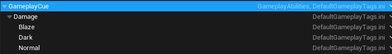
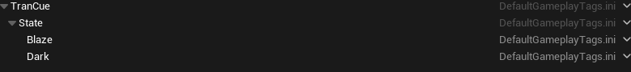
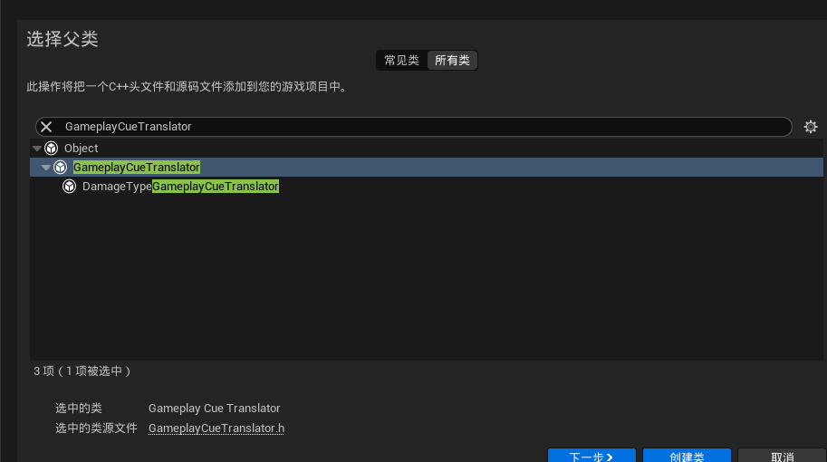
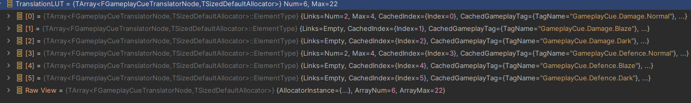
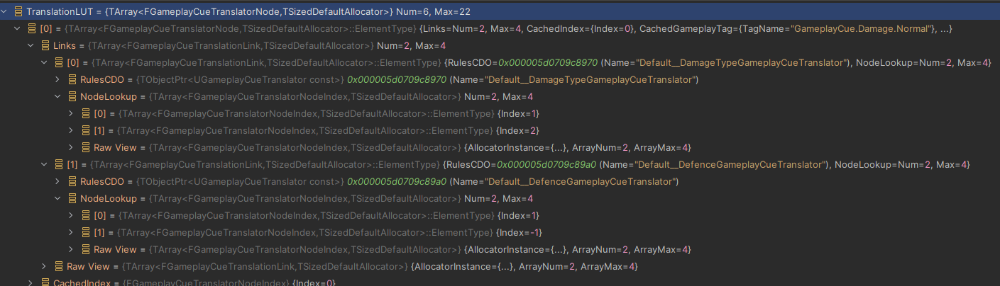

# 前言

这是个人使用**GameplayCueTranslator**的经验总结。

如果不会使用**GameplayCue**的话，建议先学习对应内容。这里假定已经基本了解了**GAS**系统的相关能力。

我们都知道，可以通过GameplayCue以制作各种表现。但是试想一下，攻击到一个怪物身上，做一个流血是一个很正常的事情，但是同样的攻击如果打到树木上，似乎流血就不太合适了。

但是**GameplayCue**又是通过**GE**上配置的Tag来的，难道要根据Actor类型在GA中指定不同的**GE**以实现不同的**GameplayCue**？还是**GameplayCue**中再检测对应的Actor实现不同表现？

**GameplayCueTranslator**就是UE中的解决方案。它提供了一个对于指定**Actor**类型，将CueTag进行转换的功能。

这就是UE中**GameplayCueTranslator**的使用情景，虽然简单，但是这个功能在网络上缺乏相应教程。因此写下这篇文章。

<!-- more -->

> **GameplayCueTranslator**实际上在源码中写下了整个系统使用的说明。这里在此附上**ChatGpt**翻译的版本。
>
> 虽然源码写清楚注释很好。但是这种功能真的不应该专门出个教程和文档么……

```c++
//GameplayCueTranslator.h:17
/**
 *	GameplayCueTranslator 系统概述
 *
 *	该系统在运行时将 GameplayCue 事件从一个标签翻译为另一个标签。这对于希望以不同方式或在不同上下文中处理 GameplayCues 的定制或覆盖类型系统非常有用。
 *
 *	一些示例用法：
 *		1. 你的游戏发出通用事件：GameplayCue.Hero.Victory（播放胜利声音/动画的事件）。根据播放此事件的英雄，你可能希望播放不同的声音。此系统可用于将通用的 GameplayCue.Hero.Victory 翻译为 GameplayCue.<YourHeroName>.Victory。
 *
 *		2. 你的游戏希望将 GameplayCue.Impact.Material 翻译为 GameplayCue.Impact.<Stone/Wood/Water/Etc>，基于被击中表面的物理材质。
 *
 *	尽管有其他方法可以实现这些示例，但使用翻译器方法的主要优点是你可以维护单一的、原子的 GC 通知，而不是 A) 拥有知道如何处理每种可能变体的整体 GC 通知/处理器（现在必须处理加载/卸载所需的那些）
 *	或 B) 在角色蓝图/数据资产上存储覆盖资产，GC 通知/处理器将从中提取（这会妨碍工作流程，因为现在你需要在某处为每个希望使用此功能的 GameplayCue 事件添加覆盖属性。你不能再有一个“只播放声音和特效”的简单 GC 通知类）。
 *
 *	使用方法：
 *
 *	C++:
 *	实现你自己的 UGameplayCueTranslator。参见 UGameplayCueTranslator_Test 作为示例。你基本上需要实现两个函数：
 *	1. GetTranslationNameSpawns：返回可能的标签翻译列表（在启动时调用一次以收集信息）
 *	2. GameplayCueToTranslationIndex：返回在步骤1中返回的列表中的索引，以应用于给定标签/上下文的翻译。
 *
 *	编辑器：
 *	使用 GameplayCue 编辑器添加新标签和通知。GC 编辑器内置了使这一过程更容易的功能。它可以为你自动创建标签和新的 GC 通知资产，这些资产派生自基础标签/通知。
 *
 *
 *	有用的命令：
 *	Log LogGameplayCueTranslator Verbose				[启用标签翻译的日志记录]
 *	
 *	GameplayCue.PrintGameplayCueTranslator				[打印翻译查找表]
 *	GameplayCue.BuildGameplayCueTranslator				[重建翻译查找表，对调试很有用]
 */

```

# 实际操作

## GameplayTag准备



首先准备GameplayCue的Tag，这里简单分出Normal和Dark、Blaze两种类型。



随后再准备一些用于标注Actor的Tag。这只是为了使用GameplayTag用于区分Actor，可以使用其他方式来判断Tag。

## 创建GameplayCueTranslator子类



父类选择GameplayCueTranslator类即可。

创建完类后，重载如下两个函数 `GetTranslationNameSpawns` 和 `GameplayCueToTranslationIndex`。

```c++
//DamageTypeGameplayCueTranslator.h

#include "CoreMinimal.h"
#include "GameplayCueTranslator.h"
#include "DamageTypeGameplayCueTranslator.generated.h"

UCLASS()
class GASLEARN_API UDamageTypeGameplayCueTranslator : public UGameplayCueTranslator
{
	GENERATED_BODY()

	
public:

	// 预先存在哪些Tag间的转换关系以生成转换表。需要将可能的转换都写出来
	virtual void GetTranslationNameSpawns(TArray<FGameplayCueTranslationNameSwap>& SwapList) const override;

	// 实际运行时，对于指定的Actor和Tag,来确认是否真的发生了转换
	virtual int32 GameplayCueToTranslationIndex(const FName& TagName, AActor* TargetActor, const FGameplayCueParameters& Parameters) const override;

};
```

### 相关了解

大部分情况下，不需要手动配置有哪些GameplayCueTranslator，也不必关注他们的启用情况。

如果好奇的话，可以参考GameplayCueTranslatorManager中的相关代码。这里会自动遍历所有的子类并进行排序。

```c++
//gameplayCueTranslator.cpp
void FGameplayCueTranslationManager::RefreshNameSwaps()
{
	AllNameSwaps.Reset();
	TArray<UGameplayCueTranslator*> CDOList;

	// 自动遍历所有Uclass，以找到可用的UGameplayCueTranslator
	for( TObjectIterator<UClass> It ; It ; ++It )
	{
		UClass* Class = *It;
        if(Class->IsChildOf(UGameplayCueTranslator::StaticClass()))
        {
            UGameplayCueTranslator* CDO = Class->GetDefaultObject<UGameplayCueTranslator>();
            if (CDO->IsEnabled())
            {
                CDOList.Add(CDO);
            }
        }
	}
    // 根据优先级排序
	CDOList.Sort([](const UGameplayCueTranslator& A, const UGameplayCueTranslator& B) { return (A.GetPriority() > B.GetPriority()); });

	// ...
}

```

## 声明可能存在的转换关系

在Translator类中，需要先声明可能发生的转换关系。声明相关代码如图所示。

```c++
void UDamageTypeGameplayCueTranslator::GetTranslationNameSpawns(TArray<FGameplayCueTranslationNameSwap>& SwapList) const
{
	{
		FGameplayCueTranslationNameSwap Temp;
		Temp.FromName = FName(TEXT("Normal"));
		Temp.ToNames.Add( FName(TEXT("Blaze")) );
		SwapList.Add(Temp);
        
	}
	// 正确：声明了一条正常的转换逻辑
	//可以添加多条FGameplayCueTranslationNameSwap，每一条对应了一种Tag转换关系
    
	{
		FGameplayCueTranslationNameSwap Temp;
		Temp.FromName = FName(TEXT("Normal"));
		Temp.ToNames.Add( FName(TEXT("Light")) );
		SwapList.Add(Temp);
	}
	// 错误：toName不能是一个不存在的Tag
	
	{
		FGameplayCueTranslationNameSwap Temp;
		Temp.FromName = FName(TEXT("Damage.Normal"));
		Temp.ToNames.Add( FName(TEXT("Damage.Blaze")) );
		SwapList.Add(Temp);
	}
	// 错误：对比时会按照层级分割GameplayTag，这种方式并无法做到Tag对应
    
    {
		FGameplayCueTranslationNameSwap Temp;
		Temp.FromName = FName(TEXT("Damage.Normal"));
		Temp.ToNames.Add( FName(TEXT("Damage")));
        Temp.ToNames.Add( FName(TEXT("Dark")));
		SwapList.Add(Temp);
	}
	// 正确：对比时会按照层级分割GameplayTag，按顺序插入的ToNames会被按顺序和层次GameplayTag比较
}
```

- 声明转换关系需要通过`FGameplayCueTranslationNameSwap`这个结构体来声明。不需要过于关注具体内容，只需要理解要添加`FromName`和`ToNames`即可

- `ToNames`整体相当于一个gameplayTag的部分。它必须是一个存在的gameplayTag部分

- 一条`FGameplayCueTranslationNameSwap`只针对一种Tag转换情况，如果会发生多个的话，需要写多条

- 这个转换只会检测以**GameplayCue**为开头的**GameplayTag**

  > `GameplayCueTranslator.cpp:197` 
  >
  > `FGameplayTagContainer AllGameplayCueTags = TagManager->RequestGameplayTagChildren(UGameplayCueSet::BaseGameplayCueTag());`

### 相关了解

这里是转换关系的生成逻辑

```c++
// GameplayCueTranslator.cpp:266
// 将一个GameplayTag按层级分割，一个splitNames整体对应一个gameplayTag
// [gameplayCue][Damage][Blaze] <==> GameplayCue.Damage.Blaze
for (int32 TagIdx=0; TagIdx < SplitNames.Num(); ++TagIdx)
{
    for (int32 ToNameIdx=0; ToNameIdx < SwapRule.ToNames.Num() && TagIdx < SplitNames.Num(); ++ToNameIdx)
    {
        // 如果ToNames中的一层能够对应上Tag的一部分
        if (SwapRule.ToNames[ToNameIdx] == SplitNames[TagIdx])
        {
            // 如果这是ToNames的最后一个，说明对比完成，这是一个可以被转换出的GameplayTag
            if (ToNameIdx == SwapRule.ToNames.Num()-1)
            {
                
                SwappedNames = SplitNames;

                // 生成转换的来源gameplayTag
                int32 NumRemoves = SwapRule.ToNames.Num(); // We are going to remove as many tags 
                int32 RemoveAtIdx = TagIdx - (SwapRule.ToNames.Num() - 1);
                check(SwappedNames.IsValidIndex(RemoveAtIdx));

                SwappedNames.RemoveAt(RemoveAtIdx, NumRemoves, false);
                SwappedNames.Insert(SwapRule.FromName, RemoveAtIdx);

                FString ComposedString = SwappedNames[0].ToString();							
                for (int32 ComposeIdx=1; ComposeIdx < SwappedNames.Num(); ++ ComposeIdx)
                {
                    ComposedString += FString::Printf(TEXT(".%s"), *SwappedNames[ComposeIdx].ToString());
                }

                FName ComposedName = FName(*ComposedString);


                {
                    FGameplayTag ComposedTag = TagManager->RequestGameplayTag(ComposedName, false);
                    if (ComposedTag.IsValid() == false)
                    {
                        //检测来源Tag，如果不存在话会尝试添加
                        UE_LOG(LogGameplayCueTranslator, Log, TEXT("   No tag match found, recursing..."));

                        FGameplayCueTranslatorNodeIndex ParentIdx = GetTranslationIndexForName( ComposedName, false );
                        if (ParentIdx.IsValid() == false)
                        {
                            ParentIdx = GetTranslationIndexForName( ComposedName, true );
                            check(ParentIdx.IsValid());
                            TranslationLUT[ParentIdx].UsedTranslators.Add( NameSwapData.ClassCDO );

                            HasValidRootTag |= BuildTagTranslationTable_r(ComposedName, SwappedNames);
                        }
                    }
                    else
                    {
                        HasValidRootTag = true;
                    }
                }

                if (HasValidRootTag)
                {
                    // 在转换链中生成fromName到toName的转换链
                    FGameplayCueTranslatorNodeIndex ParentIdx = GetTranslationIndexForName(ComposedName, true);
                 
                    FGameplayCueTranslatorNodeIndex ChildIdx = GetTranslationIndexForName(TagName, true);

                    FGameplayCueTranslatorNode& ParentNode = TranslationLUT[ParentIdx];

                    FGameplayCueTranslationLink& NewLink = ParentNode.FindOrCreateLink(NameSwapData.ClassCDO, NameSwapData.NameSwaps.Num());

                    NewLink.NodeLookup[SwapRuleIdx] = ChildIdx;

                    FGameplayCueTranslatorNode& ChildNode = TranslationLUT[ChildIdx];
                    ChildNode.UsedTranslators.Append( ParentNode.UsedTranslators );
                    ChildNode.UsedTranslators.Add( NameSwapData.ClassCDO );
                }
                else
                {
                    UE_LOG(LogGameplayCueTranslator, Log, TEXT("   No tag match found after recursing. Dead end."));
                }

                //防止重复的from到to转换
                break;
            }
            else
            {
                // 这里对应的为ToNames为复数，即转换时有层级的情况
                // 对应SplitName的TagIndex手动加一
                // 对应ToNames的ToNameIdx在continue中自动加一
                // 两方同时加一，即匹配一个字段后，会再匹配下一个字段, 用来检测存在层级关系的转换关系
                TagIdx++;
                continue;
            }
        }
        else
        {
            // 没匹配上
            break;
        }
    }
}
```

## 实现转换的具体逻辑

这一步需要实现 `GameplayCueToTranslationIndex`函数，用于根据Actor来判断是否需要进行GameplayTag的转换。

这个函数需要返回对应的序号，如果不转换的话，返回`INDEX_NONE`即可。

```c++
//#include "AbilitySystemComponent.h"
//#include "GameplayTagContainer.h"

int32 UDamageTypeGameplayCueTranslator::GameplayCueToTranslationIndex(const FName& TagName, AActor* TargetActor, const FGameplayCueParameters& Parameters) const
{
	if (!TargetActor)
	{
		return INDEX_NONE;
	}

	// 尝试获取 AbilitySystemComponent
	UAbilitySystemComponent* ASC = TargetActor->FindComponentByClass<UAbilitySystemComponent>();
	if (!ASC)
	{
		return INDEX_NONE;
	}

	// 根据Actor身上的GamePlayTag进行匹配，这里可以换任意实现思路
	FGameplayTag BlazeTag = FGameplayTag::RequestGameplayTag(FName("TranCue.State.Blaze"));
	if (ASC->HasMatchingGameplayTag(BlazeTag))
	{
        //返回声明时FGameplayCueTranslationNameSwap在SwapList中的序号
		return 0;
	}
	FGameplayTag DarkTag = FGameplayTag::RequestGameplayTag(FName("TranCue.State.Dark"));
	if (ASC->HasMatchingGameplayTag(DarkTag))
	{
        //返回声明时FGameplayCueTranslationNameSwap在SwapList中的序号
		return 1;
	}
	
	return INDEX_NONE;
}
```

这样子就实现了一个完整的GameplayTranslator逻辑

# 深入分析

在完成了实际操作后，就相当于了解了GameplayTranslator的使用方式了。

以下的部分，就是对相关代码的进一步分析。对于简单的应用使用来说，已经足够了。鉴于这个设计的完善性，可以说按照直觉来用的话应该都不会出问题。

这里的深入分析主要出于回答以下几个问题：

- 定义多个不一样的 `UGameplayCueTranslator` 对于相同CueTag的转换会发生什么？如何保证的正确性？
- 转换关系是一个树状结构？那么这些节点具体如何记录的消息？

## FGameplayCueTranslationManager.TranslationLUT

这个数据结构记录了所有参与了转换的GameplayCueTag节点，每个节点对应着一个GameplayCueTag, 节点为一个**FGameplayCueTranslatorNode**的结构体。





简单用断点就可以看出来具体的转换信息存储的方式。

- **TranslatorNode**对应着每一个参加转换的**GameplayCueTag**
- **TranslatorNode**记录下的**Links**为**FGameplayCueTranslationLink**结构体,  实际是代表着所以会对这个**CueTag**进行转换的**Translator**
- 每一条**Link**通过**NodeLookup**将自己在**Swaplist**中的顺序和**TranslationLUT**中的序号关联起来，以达成和和**GueTag**的关联
- **Link**是对应着**Translator**的，在不同**TranslatorNode**中会存在相同的**Link**

在得到上述结论之后，就可以更清晰地了解具体转换时的发生逻辑了


## FGameplayCueTranslationManager::TranslateTag_Internal

这个函数就是转换的具体逻辑了，代码如下

```c++
// GameplayCueTranslator.cpp:509
bool FGameplayCueTranslationManager::TranslateTag_Internal(FGameplayCueTranslatorNode& Node, FGameplayTag& OutTag, const FName& TagName, AActor* TargetActor, const FGameplayCueParameters& Parameters)
{
    for (FGameplayCueTranslationLink& Link : Node.Links)
    {
       // Have CDO give us TranslationIndex. This is 0 - (number of name swaps this class gave us)
       int32 TranslationIndex = Link.RulesCDO->GameplayCueToTranslationIndex(TagName, TargetActor, Parameters);
       if (TranslationIndex != INDEX_NONE)
       {
          if (Link.NodeLookup.IsValidIndex(TranslationIndex) == false)
          {
             UE_LOG(LogGameplayCueTranslator, Error, TEXT("FGameplayCueTranslationManager::TranslateTag_Internal %s invalid index %d was returned from GameplayCueToTranslationIndex. NodeLookup.Num=%d. Tag %s"), *GetNameSafe(Link.RulesCDO), TranslationIndex, Link.NodeLookup.Num(), *TagName.ToString());
             continue;
          }

          // Use the link's NodeLookup to get the real NodeIndex
          FGameplayCueTranslatorNodeIndex NodeIndex = Link.NodeLookup[TranslationIndex];
          if (NodeIndex.IsValid())
          {
             if (TranslationLUT.IsValidIndex(NodeIndex) == false)
             {
                UE_LOG(LogGameplayCueTranslator, Error, TEXT("FGameplayCueTranslationManager::TranslateTag_Internal %s invalid index %d was returned from NodeLookup. NodeLookup.Num=%d. Tag %s"), *GetNameSafe(Link.RulesCDO), NodeIndex.Index, TranslationLUT.Num(), *TagName.ToString());
                continue;
             }

             // Warn if more links?
             FGameplayCueTranslatorNode& InnerNode = TranslationLUT[NodeIndex];

             UE_LOG(LogGameplayCueTranslator, Verbose, TEXT("Translating %s --> %s (via %s)"), *TagName.ToString(), *InnerNode.CachedGameplayTagName.ToString(), *GetNameSafe(Link.RulesCDO));

             OutTag = InnerNode.CachedGameplayTag;
             
             TranslateTag_Internal(InnerNode, OutTag, InnerNode.CachedGameplayTagName, TargetActor, Parameters);
             return true;
          }
       }
    }

    return false;
}
```
