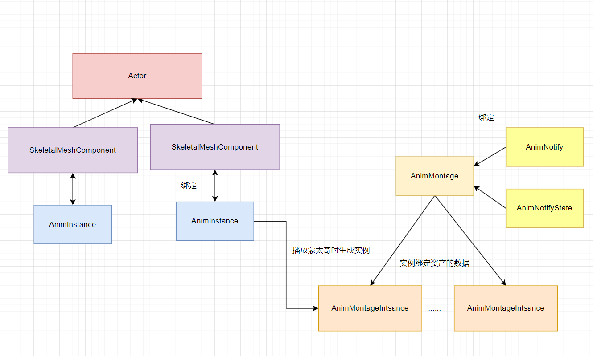

# 前言

一些对于AnimMontage的相关研究和分析。
<!-- more -->

# 基本架构

可以将动画蒙太奇相关设计的架构大体上如此表示



大体上可以总结出如下四点：

1. **AnimInstance**是和**SkeletalMeshComponent**一一绑定的，用来控制对应**SkeletalMeshComponent**的动画情况
2. **AnimMontage**是编辑器中蓝图资产的基类，用来编辑相关动画的
3. **AnimMontageInstance**是实际播放蒙太奇时由**AnimInstance**创建的实例，它会绑定到对应的资产**AnimMontage**，从而获得在里面编辑出的数据
4. **AnimNotify**和**AnimNotifyState**都是对应**AnimMontage**，同一个**Montage**中会多个**Notify**是不同的实例，但是播放时不同**MontageInstance**的实例是同一个，因此不能在**Notify**中储存和**Actor**相关的状态

# 播放蒙太奇

每次在尝试播放蒙太奇时，都会调用到`UAnimInstance::Montage_PlayInternal()` 这个函数作为最终的入口。

```c++
//AnimInstance::2127
float UAnimInstance::Montage_PlayInternal(UAnimMontage* MontageToPlay, const FMontageBlendSettings& BlendInSettings, float InPlayRate /*= 1.f*/, EMontagePlayReturnType ReturnValueType /*= EMontagePlayReturnType::MontageLength*/, float InTimeToStartMontageAt /*= 0.f*/, bool bStopAllMontages /*= true*/)
{
	//只播放具备长度的蒙太奇
	if (MontageToPlay && (MontageToPlay->GetPlayLength() > 0.f) && MontageToPlay->HasValidSlotSetup())
	{
        //验证是否都有骨骼网格体信息
		if (CurrentSkeleton && MontageToPlay->GetSkeleton())
		{
            // 停止所有同组的动画蒙太奇
			const FName NewMontageGroupName = MontageToPlay->GetGroupName();
			if (bStopAllMontages)
			{
				StopAllMontagesByGroupName(NewMontageGroupName, BlendInSettings);
			}

			// 如果动画蒙太奇具备根运动的话，准备停止现在的根运动蒙太奇，避免出现多个根运动蒙太奇
			if (MontageToPlay->bEnableRootMotionTranslation || MontageToPlay->bEnableRootMotionRotation)
			{
				FAnimMontageInstance* ActiveRootMotionMontageInstance = GetRootMotionMontageInstance();
				if (ActiveRootMotionMontageInstance)
				{
					ActiveRootMotionMontageInstance->Stop(BlendInSettings);
				}
			}
			// 创建一个空白的蒙太奇实例，并将对应资产数据绑定并调整具体情况
			FAnimMontageInstance* NewInstance = new FAnimMontageInstance(this);

			const float MontageLength = MontageToPlay->GetPlayLength();
            
			NewInstance->Initialize(MontageToPlay);
			NewInstance->Play(InPlayRate, BlendInSettings);
			NewInstance->SetPosition(FMath::Clamp(InTimeToStartMontageAt, 0.f, MontageLength));
			MontageInstances.Add(NewInstance); //保存所有还在使用的蒙太奇
			ActiveMontagesMap.Add(MontageToPlay, NewInstance); //只保留活跃的蒙太奇，即混出时的蒙泰

			// 如果根运动的话，将其设为唯一的根运动蒙太奇，避免有多个根运动蒙太奇导致的冲突
			if (MontageToPlay->HasRootMotion())
			{
				RootMotionMontageInstance = NewInstance;
			}

            // 广播蒙太奇开始播放的委托
			OnMontageStarted.Broadcast(MontageToPlay);

            // 返回值可以选蒙太奇的总长或者蒙太奇的具体播放时长
			return (ReturnValueType == EMontagePlayReturnType::MontageLength) ? MontageLength : (MontageLength / (InPlayRate*MontageToPlay->RateScale));
		}
	}

	return 0.f;
}
```


# 蒙太奇更新

蒙太奇的每次更新都是由AnimInstance推动所有**MontageInstances**更新。

## 混合权重更新

首先会更新**MontageInstance**上的**FAlphaBlend**，这个结构用于实现该**MontageInstance**的混合信息。

```c++
// AnimMontage.cpp:1912
void FAnimMontageInstance::UpdateWeight(float DeltaTime)
{
	
		PreviousWeight = Blend.GetBlendedValue();

		// 通知Blend更新，会根据时间
		Blend.Update(DeltaTime);

		if (Blend.GetBlendTimeRemaining() < 0.0001f)
		{
			ActiveBlendProfile = nullptr;
		}

		// 保存一个蒙太奇混合的权重，这个权重只会增大不会缩小
		NotifyWeight = FMath::Max(PreviousWeight, Blend.GetBlendedValue());

}

```

> 在**Blend**更新后，**MontageInstance**会保存一个混合权重到角色身上。
>
> 这个权重用在蒙太奇实例将动画通知事件（**AnimNotify**/**AnimNotifyState**）添加到**AnimInstance**时，此时会做一个检测，如果权重过小就会被抛弃。

## 蒙太奇步进

由**AnimInstance**驱动的的步进，主要分为四个阶段，从Gameplay角度来分析的话，主要逻辑在**Advanced**阶段

- MontageSync_PreUpdate：准备蒙太奇的同步组状态，确保在推进动画之前，一些必要的状态或数据是一致的。
- **Advance：更新蒙太奇的播放状态，处理动画事件和根运动的应用。**
- check: 验证可用性，避免上一步中因为动画事件导致蒙太奇或Actor的销毁导致的异常。
- MontageSync_PostUpdate：确保在蒙太奇更新后，状态保持一致，处理完必要的后续逻辑。

### 蒙太奇Advanced

蒙太奇的**Advanced**主要依靠 **MontageSubStepper** 来将一次步进拆分成多次以实现更细致地逐步推进的。

每次步进时都会尝试处理这段时间内所有可能被触发的动画事件。

```c++
// AnimMontage.cpp:2598
void FAnimMontageInstance::HandleEvents(float PreviousTrackPos, float CurrentTrackPos, const FBranchingPointMarker* BranchingPointMarker)
{
    if (bInterrupted)
	{
		return;
	}
    
    FAnimNotifyContext NotifyContext(TickRecord);
    
    { // 处理蒙太奇上非分支点的AnimNotify和AnimNotifyState
        
        //获取两个时间点间的所有动画通知事件
        Montage->GetAnimNotifiesFromDeltaPositions(PreviousTrackPos, CurrentTrackPos, NotifyContext);

        //将被标记为分支点的动画通知事件移除
        Montage->FilterOutNotifyBranchingPoints(NotifyContext.ActiveNotifies);

        //发送给动画实例以处理动画通知事件
        AnimInstance->NotifyQueue.AddAnimNotifies(NotifyContext.ActiveNotifies, NotifyWeight);
    }
    
    { // 处理蒙太奇动画插槽上的动画通知，即会将会有动画中的动画通知提取出来
        
        TMap<FName, TArray<FAnimNotifyEventReference>> NotifyMap;
			
        for (auto SlotTrack = Montage->SlotAnimTracks.CreateIterator(); SlotTrack; ++SlotTrack)
        {
            TArray<FAnimNotifyEventReference>& CurrentSlotNotifies = NotifyMap.FindOrAdd(SlotTrack->SlotName);
            NotifyContext.ActiveNotifies.Reset();
            SlotTrack->AnimTrack.GetAnimNotifiesFromTrackPositions(PreviousTrackPos, CurrentTrackPos, NotifyContext);
            Swap(CurrentSlotNotifies, NotifyContext.ActiveNotifies);
        }

        // 发送给动画实例以处理动画通知事件
        AnimInstance->NotifyQueue.AddAnimNotifies(NotifyMap, NotifyWeight);	
    }
    
}
```


# 结束蒙太奇

蒙太奇的结束存在两个重要的概念节点，**BlendOut**和**Ended**，**BlendOut**代表着蒙太奇实例开始混出，**Ended**则代表着蒙太奇实例的彻底销毁。

区分这两种的缘故是因为，为了更好的衔接动画表现。在从一个蒙太奇切换到另一个动画时，通过两个动画的权重配合避免动作的直接转换过于突兀。这个阶段对于蒙太奇来说叫做**BlendOut混出**，在这个阶段下，逻辑上该蒙太奇已经结束了，但是对应的功能表现上还仍需要使用，因此区分了两种情况。

## BlendOut

触发混出调用的即是 `FAnimMontageInstance::Stop(const FMontageBlendSettings& InBlendOutSettings, bool bInterrupt)` 这个函数。

再上一层则往往在**AnimInstance**中的对应功能了。比较常见的情况是播放新蒙太奇时，自动打断了同组的所有蒙太奇而触发的蒙太奇混出。

在混出开始时会将自身在动画实例的活跃情况清空，并且在**AnimInstance**上加入**Blendingout**的通知事件。

```c++
// AnimMontage.cpp:1521
AnimInstance->OnMontageInstanceStopped(*this); // 实际上这里只是包了一层后调用到 AnimInstance::ClearMontageInstanceReferences 不清楚为啥分开
AnimInstance->QueueMontageBlendingOutEvent(FQueuedMontageBlendingOutEvent(Montage, bInterrupted, OnMontageBlendingOutStarted));
```

蒙太奇提供一个对于状态的检测，判断依据是蒙太奇的**Blend**的目标值已经被置为0。即蒙太奇一旦被通知混出后，逻辑上已经是停止状态了。

```c++
bool IsStopped() const { return Blend.GetDesiredValue() == 0.f; }
```

## Ended

结束即是在蒙太奇更新的步进**Advanced**阶段中。如果已经停止状态且混出完成后，直接**Terminate**并发送**Endded**的事件。

# GAS联动

GAS和蒙太奇的本身的联动就是**AbilityTask_playMontageAndWait**这个**AT**

该**AT**允许**GA**中播放蒙太奇并处理**BlendOut**和**Complete**的回调。并根据实际情况拆分出**Interrupt**情况下的回调

在**GAS**使用时，会调用ASC上的接口，以便在**ASC**中也维护住对于蒙太奇接口的使用情况**LocalAnimMontageInfo** 

# 参考材料

[UE4/UE5 动画蒙太奇Animation Montage 源码解析](https://zhuanlan.zhihu.com/p/664971350)

[【UE5】对GAS的一点小改进——任意Mesh任意数量蒙太奇播放](https://zhuanlan.zhihu.com/p/718524837)

[UE5 一文读懂动画蒙太奇](https://zhuanlan.zhihu.com/p/692301053)