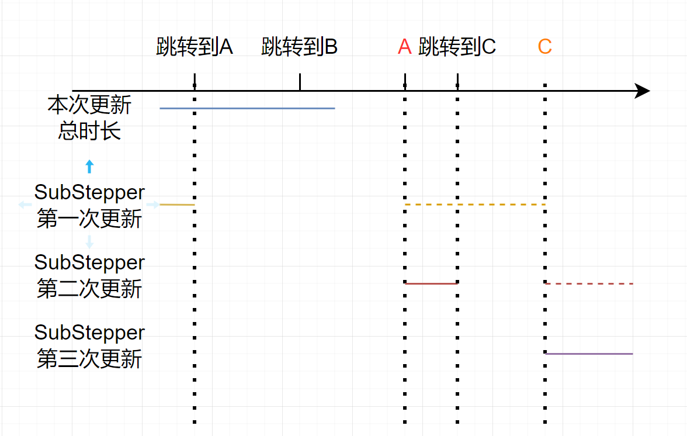

# 前言

一些对于AnimMontage的相关研究和分析。
<!-- more -->

# 基本架构

可以将动画蒙太奇相关设计的几个类大体上如此表示


大体上可以总结出如下四点：

1. **AnimInstance**是和**SkeletalMeshComponent**一一绑定的，用来控制对应**SkeletalMeshComponent**的动画情况
2. **AnimMontage**是编辑器中蓝图资产的基类，用来编辑相关动画的
3. **AnimMontageInstance**是实际播放蒙太奇时由**AnimInstance**创建的实例，它会绑定到对应的资产**AnimMontage**，从而获得在里面编辑出的数据
4. **AnimNotify**和**AnimNotifyState**都是对应**AnimMontage**，同一个**Montage**中会多个**Notify**是不同的实例，但是播放时不同**MontageInstance**的实例是同一个，因此不能在**Notify**中储存和**Actor**相关的状态

# 动画蒙太奇

## 播放蒙太奇

每次在尝试播放蒙太奇时，都会调用到`UAnimInstance::Montage_PlayInternal()` 这个函数作为最终的入口。

```c++
//AnimInstance::2127
float UAnimInstance::Montage_PlayInternal(UAnimMontage* MontageToPlay, const FMontageBlendSettings& BlendInSettings, float InPlayRate /*= 1.f*/, EMontagePlayReturnType ReturnValueType /*= EMontagePlayReturnType::MontageLength*/, float InTimeToStartMontageAt /*= 0.f*/, bool bStopAllMontages /*= true*/)
{
	//只播放具备长度的蒙太奇
	if (MontageToPlay && (MontageToPlay->GetPlayLength() > 0.f) && MontageToPlay->HasValidSlotSetup())
	{
        //验证是否都有骨骼网格体信息
		if (CurrentSkeleton && MontageToPlay->GetSkeleton())
		{
            // 停止所有同组的动画蒙太奇
			const FName NewMontageGroupName = MontageToPlay->GetGroupName();
			if (bStopAllMontages)
			{
				StopAllMontagesByGroupName(NewMontageGroupName, BlendInSettings);
			}

			// 如果动画蒙太奇具备根运动的话，准备停止现在的根运动蒙太奇，避免出现多个根运动蒙太奇
			if (MontageToPlay->bEnableRootMotionTranslation || MontageToPlay->bEnableRootMotionRotation)
			{
				FAnimMontageInstance* ActiveRootMotionMontageInstance = GetRootMotionMontageInstance();
				if (ActiveRootMotionMontageInstance)
				{
					ActiveRootMotionMontageInstance->Stop(BlendInSettings);
				}
			}
			// 创建一个空白的蒙太奇实例，并将对应资产数据绑定并调整具体情况
			FAnimMontageInstance* NewInstance = new FAnimMontageInstance(this);

			const float MontageLength = MontageToPlay->GetPlayLength();
            
			NewInstance->Initialize(MontageToPlay);
			NewInstance->Play(InPlayRate, BlendInSettings);
			NewInstance->SetPosition(FMath::Clamp(InTimeToStartMontageAt, 0.f, MontageLength));
			MontageInstances.Add(NewInstance); //保存所有还在使用的蒙太奇
			ActiveMontagesMap.Add(MontageToPlay, NewInstance); //只保留活跃的蒙太奇，即混出时的蒙泰

			// 如果根运动的话，将其设为唯一的根运动蒙太奇，避免有多个根运动蒙太奇导致的冲突
			if (MontageToPlay->HasRootMotion())
			{
				RootMotionMontageInstance = NewInstance;
			}

            // 广播蒙太奇开始播放的委托
			OnMontageStarted.Broadcast(MontageToPlay);

            // 返回值可以选蒙太奇的总长或者蒙太奇的具体播放时长
			return (ReturnValueType == EMontagePlayReturnType::MontageLength) ? MontageLength : (MontageLength / (InPlayRate*MontageToPlay->RateScale));
		}
	}

	return 0.f;
}
```


## 蒙太奇更新

蒙太奇的每次更新都是由AnimInstance推动所有**MontageInstances**更新。

### 混合权重更新

首先会更新**MontageInstance**上的**FAlphaBlend**，这个结构用于实现该**MontageInstance**的混合信息。

```c++
// AnimMontage.cpp:1912
void FAnimMontageInstance::UpdateWeight(float DeltaTime)
{
	
		PreviousWeight = Blend.GetBlendedValue();

		// 通知Blend更新，会根据时间
		Blend.Update(DeltaTime);

		if (Blend.GetBlendTimeRemaining() < 0.0001f)
		{
			ActiveBlendProfile = nullptr;
		}

		// 保存一个蒙太奇混合的权重，这个权重只会增大不会缩小
		NotifyWeight = FMath::Max(PreviousWeight, Blend.GetBlendedValue());

}

```

> 在**Blend**更新后，**MontageInstance**会保存一个混合权重到角色身上。
>
> 这个权重用在蒙太奇实例将动画通知事件（**AnimNotify**/**AnimNotifyState**）添加到**AnimInstance**时，此时会做一个检测，如果权重过小就会被抛弃。

### 蒙太奇步进

由**AnimInstance**驱动的的步进，主要分为四个阶段，从Gameplay角度来分析的话，主要逻辑在**Advanced**阶段

- MontageSync_PreUpdate：准备蒙太奇的同步组状态，确保在推进动画之前，一些必要的状态或数据是一致的。
- **Advance：更新蒙太奇的播放状态，处理动画事件和根运动的应用。**
- check: 验证可用性，避免上一步中因为动画事件导致蒙太奇或Actor的销毁导致的异常。
- MontageSync_PostUpdate：确保在蒙太奇更新后，状态保持一致，处理完必要的后续逻辑。

#### MontageSubStepper步进

这是蒙太奇步进的辅助类，目的是为了将这一段时间的更新进行准确地触发。

因为蒙太奇存在如片段**section**跳转和动画通知**animNotfiy**的触发影响到蒙太奇播放的速率、片段等问题，一旦步进过大导致中间可能触发的事件后没能正常触发后，就会导致播放结果错误。

> 举个例子，某次更新经过的时间中会触发两个跳转到A和B。但是实际上，应该先执行跳转到A，然后在A后面重新播放剩下的时间。如果这个中途中还有跳转到C，那就还得再跳转到C。而时间中的B跳转就因为已经跳转走了所以不会触发。



所以会尝试进行多次的精准更新。每次更新中一旦出现跳转后，就要根据跳转的情况重新尝试更新后续时间。

目前最大更新限制在10次，所以步长太多跳转多次的情况下仍然存在有BUG的可能

```c++
//AnimMontage.cpp:2006
EMontageSubStepResult FMontageSubStepper::Advance(float& InOut_P_Original, const FBranchingPointMarker** OutBranchingPointMarkerPtr)
{
	// 一些不能更新的判断条件，省略掉
    // ...
    
	if (MontageInstance->ForcedNextToPosition.IsSet())
	{
        // 如果存在蒙太奇片段要求的跳转，获取到片段的目标时间等来计算播放情况
		const float NewPosition = MontageInstance->ForcedNextToPosition.GetValue();
		if (MontageInstance->ForcedNextFromPosition.IsSet())
		{
			InOut_P_Original = MontageInstance->ForcedNextFromPosition.GetValue();
		}
		DeltaMove = NewPosition - InOut_P_Original;
		PlayRate = DeltaMove / TimeRemaining;
		bPlayingForward = (DeltaMove >= 0.f);
		TimeStretchMarkerIndex = INDEX_NONE;
	}
	else 
	{
        // 不需要进行片段跳转时
		PlayRate = MontageInstance->PlayRate * Montage->RateScale;

		// 判断是否存在使用曲线来播放并计算效果
		const bool bAttemptTimeStretchCurve = Montage->TimeStretchCurve.IsValid() && !FMath::IsNearlyEqual(PlayRate, 1.f);
		if (bAttemptTimeStretchCurve)
		{
			ConditionallyUpdateTimeStretchCurveCachedData();
		}
		
		if (!bAttemptTimeStretchCurve || !bHasValidTimeStretchCurveData)
		{ // 不使用曲线时，可以直接计算实际要移动的时间
			bPlayingForward = (PlayRate > 0.f);
			DeltaMove = TimeRemaining * PlayRate;
			TimeStretchMarkerIndex = INDEX_NONE;
		}
		else
		{
			// 使用曲线的信息计算要移动的时间和播放速率
			float P_Target = FindMontagePosition_Target(InOut_P_Original);

			P_Target += bPlayingForward ? TimeRemaining : -TimeRemaining;
			P_Target = TimeStretchCurveInstance.Clamp_P_Target(P_Target);

			const float NewP_Original = FindMontagePosition_Original(P_Target);

			DeltaMove = NewP_Original - InOut_P_Original;
			PlayRate = DeltaMove / TimeRemaining;
		}
	}

	// 尝试查找这段时间内的分支点时，每次步进都只处理第一个分支点
	if (OutBranchingPointMarkerPtr)
	{
		*OutBranchingPointMarkerPtr = Montage->FindFirstBranchingPointMarker(InOut_P_Original, InOut_P_Original + DeltaMove);
        // 如果存在分支点，就需要根据跳转开始的时间收缩本次更新的实际移动时间
		if (*OutBranchingPointMarkerPtr)
		{
			DeltaMove = (*OutBranchingPointMarkerPtr)->TriggerTime - InOut_P_Original;
		}
	}

	// 存在片段跳转时，也需要根据本次片段剩下的时间收缩本次更新的实际移动时间
	{
		const float OldDeltaMove = DeltaMove;

		
		if (bPlayingForward)
		{ // 正向播放时最多只能移动到播到这个片段结束
			const float MaxSectionMove = CurrentSectionLength - PositionInSection;
			if (DeltaMove >= MaxSectionMove)
			{
				DeltaMove = MaxSectionMove;
				bReachedEndOfSection = true;
			}
		}
		else
		{ // 同理，反向播放时也只能到这个播放开始
			const float MinSectionMove = /* 0.f */ - PositionInSection;
			if (DeltaMove <= MinSectionMove)
			{
				DeltaMove = MinSectionMove;
				bReachedEndOfSection = true;
			}
		}

		if (OutBranchingPointMarkerPtr && *OutBranchingPointMarkerPtr && (OldDeltaMove != DeltaMove))
		{
			// 如果因为片段导致的实际移动时间更改后，将分支点的标记清空
			*OutBranchingPointMarkerPtr = nullptr;
		}
	}

	if (FMath::Abs(DeltaMove) > 0.f)
	{
		// 根据实际移动的时间计算最后的时间
		InOut_P_Original += DeltaMove;

		// TimeRemain中减少本次实际移动的时间，如果还有剩余移动的时间的话还会重新Advance
		const float TimeStep = DeltaMove / PlayRate;
		TimeRemaining = FMath::Max(TimeRemaining - TimeStep, 0.f);

		return EMontageSubStepResult::Moved;
	}
	else
	{
		return EMontageSubStepResult::NotMoved;
	}
}
```


#### 蒙太奇Advanced

蒙太奇的**Advanced**主要依靠 **MontageSubStepper** 来将一次步进拆分成多次以实现更细致地逐步推进的。这里主要关注Advance事如何触发的动画通知。

每次**MontageSubStepper**步进时都会尝试处理这段时间内的根运动情况、动画通知并自动判断是否结束。

```c++
// AnimMontage.cpp:2413
// 每次MontageSubStepper::advance的相关逻辑
while (bPlaying && MontageSubStepper.HasTimeRemaining() && (++NumIterations < MaxIterations)){

    const float PreviousSubStepPosition = Position;
    const FBranchingPointMarker* BranchingPointMarker = nullptr;
    // 调用Substepper获得一段准确地更新时间
    EMontageSubStepResult SubStepResult = MontageSubStepper.Advance(Position, &BranchingPointMarker);

    // 一些失败的处理，略掉
    const bool bPlayingForward = MontageSubStepper.GetbPlayingForward();

    // 获取准确地更新量
    const float SubStepDeltaMove = MontageSubStepper.GetDeltaMove();
    DeltaTimeRecord.Delta += SubStepDeltaMove;
    const bool bPlayingForward = MontageSubStepper.GetbPlayingForward();

    // 如果本蒙太奇还没有自动混出且开启了自动混出时，会在没有下一个蒙太奇片段后自动混出
    if (!IsStopped() && bEnableAutoBlendOut)
    {
        const int32 CurrentSectionIndex = MontageSubStepper.GetCurrentSectionIndex();
        const int32 NextSectionIndex = bPlayingForward ? NextSections[CurrentSectionIndex] : PrevSections[CurrentSectionIndex];
        if (NextSectionIndex == INDEX_NONE)
        {
            // 具体略掉
        }
    }

    // 如果本次蒙太奇成功推进后，使用根运动情况
    const bool bHaveMoved = (SubStepResult == EMontageSubStepResult::Moved);
    if (bHaveMoved)
    {
        
        if (bExtractRootMotion && AnimInstance.IsValid() && !IsRootMotionDisabled())
        {
            const FTransform RootMotion = Montage->ExtractRootMotionFromTrackRange(PreviousSubStepPosition, Position);
            if (bBlendRootMotion)
            {
                const float Weight = Blend.GetBlendedValue();
                AnimInstance.Get()->QueueRootMotionBlend(RootMotion, Montage->SlotAnimTracks[0].SlotName, Weight);
            }
            else
            {
                OutRootMotionParams->Accumulate(RootMotion);
            }
        }
    }

    // 触发这段更新时间内存在的动画通知事件
    const float PositionBeforeFiringEvents = Position;

    if(bHaveMoved)
    {
        if (!bInterrupted)
        {
            TWeakObjectPtr<UAnimInstance> AnimInstanceLocal = AnimInstance;

            // 触发动画通知事件，下一段详解
            HandleEvents(PreviousSubStepPosition, Position, BranchingPointMarker);

            if (AnimInstanceLocal.IsValid() && AnimInstanceLocal->MontageInstances.Num() == 0)
            {
                return;
            }
        }
    }

    // 如果MontageSubStepper还存在时间或者确定了蒙太奇片段结束时不需要剩余时间也要结束时
    if (MontageCVars::bEndSectionRequiresTimeRemaining == false || MontageSubStepper.HasTimeRemaining())
    {
        // 已经到片段结束了同时不存在分支点，也确定没有触发任何动画通知（有可能会干扰蒙太奇播放情况）
        if (MontageSubStepper.HasReachedEndOfSection() && !BranchingPointMarker && (PositionBeforeFiringEvents == Position))
        {
            /
            const int32 CurrentSectionIndex = MontageSubStepper.GetCurrentSectionIndex();
            const int32 RecentNextSectionIndex = bPlayingForward ? NextSections[CurrentSectionIndex] : PrevSections[CurrentSectionIndex];
            if (RecentNextSectionIndex != INDEX_NONE)
            {
                float LatestNextSectionStartTime, LatestNextSectionEndTime;
                Montage->GetSectionStartAndEndTime(RecentNextSectionIndex, LatestNextSectionStartTime, LatestNextSectionEndTime);

                const float EndOffset = UE_KINDA_SMALL_NUMBER / 2.f; 
                // 获得下一个片段的时间信息以更新目前的位置
                Position = bPlayingForward ? LatestNextSectionStartTime : (LatestNextSectionEndTime - EndOffset);
                SubStepResult = EMontageSubStepResult::Moved;
            }
            else
            {
                // 没有下一个时间了，退出步进循环
                break;
            }
        }
    }

    if (SubStepResult == EMontageSubStepResult::NotMoved)
    {
        // 步进没有移动，退出步进循环
        break;
    }
}
		
```

#### 蒙太奇更新时处理动画通知事件

动画通知事件会分成两种类型触发时间类型：

1. **队列**：这些动画通知会在蒙太奇更新时触发插入队列中，这一轮动画更新完成后再运行逻辑。
2. **分支点**：会在蒙太奇更新时直接触发对应逻辑。所以可用来做蒙太奇跳转播放的逻辑，在蒙太奇播放中可以正确的执行蒙太奇跳转。

但是这个分支点的命名方式真的很怪，其实它只是标注个动画通知能够瞬时触发，触发时可能会导致蒙太奇播放跳转。

```c++
// AnimMontage.cpp:2598
void FAnimMontageInstance::HandleEvents(float PreviousTrackPos, float CurrentTrackPos, const FBranchingPointMarker* BranchingPointMarker)
{
    if (bInterrupted)
	{
		return;
	}
    
    FAnimNotifyContext NotifyContext(TickRecord);
    
    { // 处理蒙太奇上非分支点的AnimNotify和AnimNotifyState
        
        //获取两个时间点间的所有动画通知事件
        Montage->GetAnimNotifiesFromDeltaPositions(PreviousTrackPos, CurrentTrackPos, NotifyContext);

        //将被标记为分支点的动画通知事件移除
        Montage->FilterOutNotifyBranchingPoints(NotifyContext.ActiveNotifies);

        //发送给动画实例以处理动画通知事件
        AnimInstance->NotifyQueue.AddAnimNotifies(NotifyContext.ActiveNotifies, NotifyWeight);
    }
    
    { // 处理蒙太奇动画插槽上的动画通知，即会将会有动画中的动画通知提取出来
        
        TMap<FName, TArray<FAnimNotifyEventReference>> NotifyMap;
			
        for (auto SlotTrack = Montage->SlotAnimTracks.CreateIterator(); SlotTrack; ++SlotTrack)
        {
            TArray<FAnimNotifyEventReference>& CurrentSlotNotifies = NotifyMap.FindOrAdd(SlotTrack->SlotName);
            NotifyContext.ActiveNotifies.Reset();
            SlotTrack->AnimTrack.GetAnimNotifiesFromTrackPositions(PreviousTrackPos, CurrentTrackPos, NotifyContext);
            Swap(CurrentSlotNotifies, NotifyContext.ActiveNotifies);
        }

        // 发送给动画实例以处理动画通知事件
        AnimInstance->NotifyQueue.AddAnimNotifies(NotifyMap, NotifyWeight);	
    }
    
    // 根据动画蒙太奇现在的时间点，更新所有标记为分支点的AnimNotifyState列表
    // 触发分支点结束的End事件
	if (!UpdateActiveStateBranchingPoints(CurrentTrackPos))
	{
		return;
	}

	// 尝试触发在MontageSubstepper步进时获取到要出发的动画通知事件的开始事件
	if (BranchingPointMarker)
	{
		BranchingPointEventHandler(BranchingPointMarker);
	}
    
    // 额外说一句，Tick事件会在Substepper的advance这个环节完全结束后，直到motageInstance的advance最后才统一触发
}
```


## 结束蒙太奇

蒙太奇的结束存在两个重要的概念节点，**BlendOut**和**Ended**，**BlendOut**代表着蒙太奇实例开始混出，**Ended**则代表着蒙太奇实例的彻底销毁。

区分这两种的缘故是因为，为了更好的衔接动画表现。在从一个蒙太奇切换到另一个动画时，通过两个动画的权重配合避免动作的直接转换过于突兀。这个阶段对于蒙太奇来说叫做**BlendOut混出**，在这个阶段下，逻辑上该蒙太奇已经结束了，但是对应的功能表现上还仍需要使用，因此区分了两种情况。

#### BlendOut

触发混出调用的即是 `FAnimMontageInstance::Stop(const FMontageBlendSettings& InBlendOutSettings, bool bInterrupt)` 这个函数。

再上一层则往往在**AnimInstance**中的对应功能了。比较常见的情况是播放新蒙太奇时，自动打断了同组的所有蒙太奇而触发的蒙太奇混出。

在混出开始时会将自身在动画实例的活跃情况清空，并且在**AnimInstance**上加入**Blendingout**的通知事件。

```c++
// AnimMontage.cpp:1521
AnimInstance->OnMontageInstanceStopped(*this); // 实际上这里只是包了一层后调用到 AnimInstance::ClearMontageInstanceReferences 不清楚为啥分开
AnimInstance->QueueMontageBlendingOutEvent(FQueuedMontageBlendingOutEvent(Montage, bInterrupted, OnMontageBlendingOutStarted));
```

蒙太奇提供一个对于状态的检测，判断依据是蒙太奇的**Blend**的目标值已经被置为0。即蒙太奇一旦被通知混出后，逻辑上已经是停止状态了。

```c++
bool IsStopped() const { return Blend.GetDesiredValue() == 0.f; }
```

#### Ended

结束即是在蒙太奇更新的步进**Advanced**阶段中。如果已经停止状态且混出完成后，直接**Terminate**并发送**Endded**的事件。

# 动画通知

动画通知有如下两个分类方式，共四种组合

1. AnimNotify / AnimNotifyState
   - **AnimNotify**：固定在特定帧上的一次触发，多用于粒子、音效等瞬时触发，只有Notify事件
   - **AnimNotifyState**：具备begin、end以及Tick事件，用来执行某段固定时间内的逻辑，如打击判定等
2. Queue/ BranchPoint
   - **Queue**：在每一次蒙太奇**Advance**时存入队列，直到本次动画更新完成后统一触发逻辑，大部分动画通知事件都是这一类
   - **BranchPoint**：在蒙太奇**Advance**时直接触发，每次`MontageSubStepper::Advance`时只触发一个，往往用于蒙太奇中要调整播放的情况下，性能高

## AnimNotifyState

**AnimNofityState**是UE中，为动画或蒙太奇播放过程中触发特定逻辑的一种机制。

相较于**AnimNotify**只会在固定时间轴上触发的离散机制，**AnimNotifyState**提供了完整的开始、结束、Tick功能，因此在游戏开发中，更容易用**AnimNotifyState**来作为动画相关逻辑机制的载体。

### AnimNotifyState实例绑定于动画

在开发中可以发现，在一个动画中，添加多个相同的**ANS**时，会产生不同的实例。

但是对于一个动画，由不同的Actor进行播放时，会发现实例的地址都是相同的，即是多个不同的Actor会触发同样的实例。

这就导致了使用**ANS**时，不应该在内部存储状态。

> 这里个人采取的做法时将相关数据直接绑定到通过**MeshComponent**获得的**Actor**上。**ANS**只进行逻辑调整，不存储信息。
>

## Queue的触发逻辑 UAnimInstance::TriggerAnimNotifies

```C++
// AnimInstance.cpp:1473
USkeletalMeshComponent* SkelMeshComp = GetSkelMeshComponent();

// 定义新激活的ANS列表
TArray<FAnimNotifyEvent> NewActiveAnimNotifyState;
NewActiveAnimNotifyState.Reserve(NotifyQueue.AnimNotifies.Num());

TArray<FAnimNotifyEventReference> NewActiveAnimNotifyEventReference;
NewActiveAnimNotifyEventReference.Reserve(NotifyQueue.AnimNotifies.Num());


// 定义要触发开始事件的ANE
TArray<const FAnimNotifyEvent *> NotifyStateBeginEvent;
TArray<const FAnimNotifyEventReference *> NotifyStateBeginEventReference;

// 遍历所有被填充进要触发的动画通知见
for (int32 Index=0; Index<NotifyQueue.AnimNotifies.Num(); Index++)
{
    if(const FAnimNotifyEvent* AnimNotifyEvent = NotifyQueue.AnimNotifies[Index].GetNotify())
    {
        // 如果AnimNoftiyEvent对应的是AnimNotifyState类型
        if (AnimNotifyEvent->NotifyStateClass)
        {
            int32 ExistingItemIndex = INDEX_NONE;

            if (ActiveAnimNotifyState.Find(*AnimNotifyEvent, ExistingItemIndex))
            {
                //如果在已经激活的列表内，将其移除
                check(ActiveAnimNotifyState.Num() == ActiveAnimNotifyEventReference.Num());
                ActiveAnimNotifyState.RemoveAtSwap(ExistingItemIndex, 1, false); 
                ActiveAnimNotifyEventReference.RemoveAtSwap(ExistingItemIndex, 1, false);
            }
            else
            {
                //未激活的ANS添加到BeginEvent列表中，后续对这个列表触发开始事件
                NotifyStateBeginEvent.Add(AnimNotifyEvent);
                NotifyStateBeginEventReference.Add(&NotifyQueue.AnimNotifies[Index]);
            }
            // 这时还存在的所有ANS单独保存一个成一个列表
            NewActiveAnimNotifyState.Add(*AnimNotifyEvent);
            FAnimNotifyEventReference& EventRef = NewActiveAnimNotifyEventReference.Add_GetRef(NotifyQueue.AnimNotifies[Index]);
            EventRef.SetNotify(&NewActiveAnimNotifyState.Top());
            continue;
        }

        // AnimNotify直接触发
        TriggerSingleAnimNotify(NotifyQueue.AnimNotifies[Index]);
    }
}
```

- 遍历目前的所有**ANE**，对于**AN**类型直接触发事件
- 对于**ANS**类型，根据现有的已激活**ANS**，分成新激活和已激活的两类

```c++
// 遍历之前激活的动画列表，上一步中，已经将所有还存在的ANS移除了，因此实质上这里筛选的是所有已经结束了的ANS
	for (int32 Index = 0; Index < ActiveAnimNotifyState.Num(); ++Index)
	{
		const FAnimNotifyEvent& AnimNotifyEvent = ActiveAnimNotifyState[Index];
		const FAnimNotifyEventReference& EventReference = ActiveAnimNotifyEventReference[Index];
		if (AnimNotifyEvent.NotifyStateClass && ShouldTriggerAnimNotifyState(AnimNotifyEvent.NotifyStateClass))
		{
			{
				//触发结束事件
				AnimNotifyEvent.NotifyStateClass->NotifyEnd(SkelMeshComp, Cast<UAnimSequenceBase>(AnimNotifyEvent.NotifyStateClass->GetOuter()), EventReference);
			}
		}
		// The NotifyEnd callback above may have triggered actor destruction and the tear down
		// of this instance via UninitializeAnimation which empties ActiveAnimNotifyState.
		// If that happened, we should stop iterating the ActiveAnimNotifyState array
        // 一个容错处理，没太看懂，保留原文注释
		if (ActiveAnimNotifyState.IsValidIndex(Index) == false)
		{
			return;
		}
	}
```

对于所有已经不在的**ANS**调用结束事件

```c++
// 遍历之前筛选出的新ANS，触发开始事件
for (int32 Index = 0; Index < NotifyStateBeginEvent.Num(); Index++)
	{
		const FAnimNotifyEvent* AnimNotifyEvent = NotifyStateBeginEvent[Index];
		const FAnimNotifyEventReference * AnimNotifyEventReference = NotifyStateBeginEventReference[Index];
		if (ShouldTriggerAnimNotifyState(AnimNotifyEvent->NotifyStateClass))
		{
			{
				AnimNotifyEvent->NotifyStateClass->NotifyBegin(SkelMeshComp, Cast<UAnimSequenceBase>(AnimNotifyEvent->NotifyStateClass->GetOuter()), AnimNotifyEvent->GetDuration(), *AnimNotifyEventReference);
			}
		}
	}
```

将新出现的的**ANS**调用开始事件。

```c++
// 将临时存储转正
ActiveAnimNotifyState = MoveTemp(NewActiveAnimNotifyState);
ActiveAnimNotifyEventReference = MoveTemp(NewActiveAnimNotifyEventReference);
// 遍历存在的ANS，触发TICK事件
for (int32 Index = 0; Index < ActiveAnimNotifyState.Num(); Index++)
{
    const FAnimNotifyEvent& AnimNotifyEvent = ActiveAnimNotifyState[Index];
    const FAnimNotifyEventReference& EventReference = ActiveAnimNotifyEventReference[Index];
    if (ShouldTriggerAnimNotifyState(AnimNotifyEvent.NotifyStateClass))
    {
        {
            AnimNotifyEvent.NotifyStateClass->NotifyTick(SkelMeshComp, Cast<UAnimSequenceBase>(AnimNotifyEvent.NotifyStateClass->GetOuter()), DeltaSeconds, EventReference);
        }
    }
}
```

对现有的所有**ANS**触发TICK事件，并且将激活情况保存

## 总结

- 对于某一个时间点，事件类型的触发顺序是确定的

1. AN触发
2. ANS结束事件
3. ANS开始事件
4. ANS帧事件

- 根据部分资料上判断，ANS和AN、同类事件的触发顺序不保证一致。在后续涉及到网络同步时需要谨慎处理
- **AnimNotify**相关触发流程在**AnimInstance**上，**AnimIntance**是一个对应于**Actor**的动画控制系统。因此不必太关心动画提前结束、打断等是否会导致结束


# GAS联动

GAS和蒙太奇的本身的联动就是**AbilityTask_playMontageAndWait**这个**AT**

该**AT**允许**GA**中播放蒙太奇并处理**BlendOut**和**Complete**的回调。并根据实际情况拆分出**Interrupt**情况下的回调

在**GAS**使用时，会调用ASC上的接口，以便在**ASC**中也维护住对于蒙太奇接口的使用情况**LocalAnimMontageInfo** 

# 参考材料

[UE4/UE5 动画蒙太奇Animation Montage 源码解析](https://zhuanlan.zhihu.com/p/664971350)

[UE4/UE5 动画通知AnimNotify AnimNotifyState源码解析](UE4/UE5 动画通知AnimNotify AnimNotifyState源码解析)

[【UE5】对GAS的一点小改进——任意Mesh任意数量蒙太奇播放](https://zhuanlan.zhihu.com/p/718524837)

[UE5 一文读懂动画蒙太奇](https://zhuanlan.zhihu.com/p/692301053)

