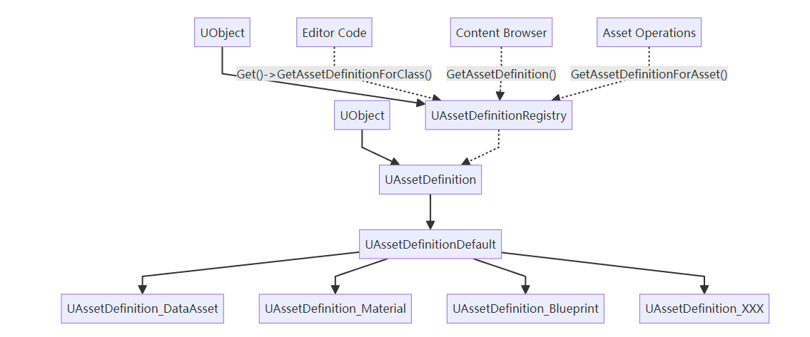

# 前言

随着虚幻引擎5的推出，资产管理系统迎来了重大更新——引入了全新的`AssetDefinition`系统，取代了旧版中的`FAssetTypeActions_Base`。这一变革不仅改进了编辑器性能，还带来了更灵活、更模块化的资产处理方式。本文将介绍这一系统的基本概念、设计理念、使用方法，以及如何通过合理实践来有效利用它。

<!-- more -->

# 基本概念

## 什么是 AssetDefinition？

`AssetDefinition`是虚幻引擎5中用于定义资产类型特性和行为的核心类。每种资产类型（如材质、纹理、蓝图等）都有一个对应的`AssetDefinition`类，它描述了：

- 资产在编辑器中的表现方式（名称、颜色、图标）
- 资产的打开和编辑行为
- 资产的比较和合并方式
- 资产的分类和过滤方式
- 资产支持的操作和上下文菜单

简而言之，`AssetDefinition`定义了"一种资产是什么"以及"如何与之交互"。

## 核心类层次结构与交互模式



- **UAssetDefinition**: 抽象基类，定义所有资产共有的基本接口
- **UAssetDefinitionDefault**: 提供常见功能的默认实现
- **具体资产定义类**: 为特定资产类型实现定制行为
- **UAssetDefinitionRegistry**: 全局注册表，管理所有资产定义实例并提供查询接口

## 资产定义注册与查找机制

资产定义系统通过`UAssetDefinitionRegistry`单例进行集中管理，这个类是系统的关键枢纽：

1. **自动注册**：所有继承自`UAssetDefinition`的类在引擎启动时会被自动发现并注册到注册表中
   
2. **查找资产定义**：引擎和插件代码通过注册表来查找特定资产类型的定义：
   
3. **缓存映射**：注册表内部维护类型到定义的映射关系，确保高效查询

## 系统交互流程

当对资产执行操作时，系统的交互流程如下：

1. **请求资产操作**：编辑器代码（如内容浏览器）需要执行资产操作（如打开、比较）

2. **查找资产定义**：通过`UAssetDefinitionRegistry`获取对应的资产定义
   
3. **执行定义的行为**：调用资产定义上的相应方法执行操作

4. **处理结果**：资产定义返回处理结果（如`EAssetCommandResult::Handled`表示操作已处理）

## 关键类和接口

每个`UAssetDefinition`提供的核心方法包括：

- **基本属性**: 
  ```cpp
  virtual FText GetAssetDisplayName() const;
  virtual FLinearColor GetAssetColor() const;
  virtual TSoftClassPtr<UObject> GetAssetClass() const;
  ```

- **资产操作**:
  ```cpp
  virtual EAssetCommandResult OpenAssets(const FAssetOpenArgs& OpenArgs) const;
  virtual EAssetCommandResult PerformAssetDiff(const FAssetDiffArgs& DiffArgs) const;
  virtual EAssetCommandResult Merge(const FAssetAutomaticMergeArgs& MergeArgs) const;
  ```

- **资产分类和过滤**:
  ```cpp
  virtual TConstArrayView<FAssetCategoryPath> GetAssetCategories() const;
  virtual EAssetSupportResponse CanLocalize(const FAssetData& InAsset) const;
  ```

## 注册表的核心功能

`UAssetDefinitionRegistry`类提供以下关键功能：

- **查询功能**：
  ```cpp
  const UAssetDefinition* GetAssetDefinitionForClass(const UClass* InClass) const;
  const UAssetDefinition* GetAssetDefinitionForAsset(const UObject* InAsset) const;
  const UAssetDefinition* GetAssetDefinitionForAssetData(const FAssetData& InAssetData) const;
  const UAssetDefinition* GetAssetDefinitionForClassNames(FStringView InClassName, FStringView InObjectPathName) const;
  ```

- **多实例处理**：允许查询多个资产的共同定义
  
  ```cpp
  const UAssetDefinition* GetCommonAssetDefinitionForAssets(TArrayView<const UObject*> InAssets) const;
  ```
  
- **迭代所有定义**：
  ```cpp
  TArray<const UAssetDefinition*> GetAllAssetDefinitions() const;
  ```

## 实际应用

```cpp
// AssetContextMenu.cpp:205
UClass* CommonClass = nullptr;
for (int32 ObjIdx = 0; ObjIdx < SelectedAssets.Num(); ++ObjIdx)
{
    if (CommonClass == nullptr)
    {
        CommonClass = UAssetRegistryHelpers::FindAssetNativeClass(SelectedAssets[ObjIdx]);
        continue;
    }

    // Update the CommonClass until we find a common shared class
    UClass* Class = UAssetRegistryHelpers::FindAssetNativeClass(SelectedAssets[ObjIdx]);
    while (Class && !Class->IsChildOf(CommonClass))
    {
        CommonClass = CommonClass->GetSuperClass();
    }
}
ContextObject->CommonClass = CommonClass;

// ...省略其他代码...

// 在找到共享类后，从AssetDefinitionRegistry获取对应的AssetDefinition
ContextObject->CommonAssetDefinition = UAssetDefinitionRegistry::Get()->GetAssetDefinitionForClass(ContextObject->CommonClass);

// 使用AssetDefinition提供的函数
if (Context->CommonAssetDefinition)
{
    Section.Label = FText::Format(NSLOCTEXT("AssetTools", "AssetSpecificOptionsMenuHeading", "{0} Actions"), Context->CommonAssetDefinition->GetAssetDisplayName());
}
```

# 设计理念

虚幻引擎5引入`AssetDefinition`系统主要基于以下设计理念：

## 1. 关注点分离

旧系统将资产的定义、操作和UI展示混合在一起，新系统将这些关注点明确分离：

- 资产本身的特性（`UAssetDefinition`）
- 资产的编辑行为（工具集）
- 资产的UI交互（菜单扩展）

## 2. 性能优化

旧系统的一个主要问题是在右键点击资产时会加载资产，即使只是查看菜单。新系统避免了这种无谓的加载，显著提高了编辑器性能。

## 3. 可扩展性增强

新系统采用了更现代的扩展机制，使得任何模块都能为任何资产类型添加功能，而无需修改原始代码。

## 4. 一致性与可维护性

统一的资产定义接口使得引擎能够以一致的方式处理所有资产类型，简化了维护工作。

# 新旧系统的对比


## 旧系统

```cpp filePath=Engine/Source/Developer/AssetTools/Public/AssetTypeActions/AssetTypeActions_DataAsset.h
// 旧系统 - 功能高度集中
class ASSETTOOLS_API FAssetTypeActions_DataAsset : public FAssetTypeActions_Base
{
public:
    // 资产识别
    virtual FText GetName() const override { return NSLOCTEXT("AssetTypeActions", "AssetTypeActions_DataAsset", "Data Asset"); }
    virtual FColor GetTypeColor() const override { return FColor(201, 29, 85); }
    virtual UClass* GetSupportedClass() const override { return UDataAsset::StaticClass(); }
    
    // 资产分类
    virtual uint32 GetCategories() override { return EAssetTypeCategories::Misc; }
    
    // 获取资产显示名称的特殊处理
    virtual FText GetDisplayNameFromAssetData(const FAssetData& AssetData) const override;
    
    // 菜单定义直接在类中
    virtual void GetActions(const TArray<UObject*>& InObjects, FToolMenuSection& Section) override
    {
        Section.AddMenuEntry(
            "DataAsset_ChangeClass",
            LOCTEXT("DataAsset_ChangeClass", "Convert to Different DataAsset Type"),
            LOCTEXT("DataAsset_ChangeClassTip", "Change the class these Data Assets are subclassed from."),
            FSlateIcon(),
            FUIAction(
                FExecuteAction::CreateSP(this, &FAssetTypeActions_DataAsset::ExecuteChangeDataAssetClass, GetTypedWeakObjectPtrs<UDataAsset>(InObjects))
            )
        );
    }
    
    // 资产比较
    virtual void PerformAssetDiff(UObject* OldAsset, UObject* NewAsset, 
                                const FRevisionInfo& OldRevision, 
                                const FRevisionInfo& NewRevision) const override;
    
private:
    // 资产操作方法
    void ExecuteChangeDataAssetClass(TArray<TWeakObjectPtr<UDataAsset>> InDataAssets);
};
```

## 新系统

```cpp filePath=Engine/Plugins/Editor/EngineAssetDefinitions/Source/Public/AssetDefinition_DataAsset.h
// 新系统 - 关注点分离
UCLASS()
class UAssetDefinition_DataAsset : public UAssetDefinitionDefault
{
    GENERATED_BODY()

public:
    UAssetDefinition_DataAsset()
    {
        // 确保包括该类在过滤器中
        IncludeClassInFilter = EIncludeClassInFilter::Always;
    }
    
    // 基本资产定义
    virtual FText GetAssetDisplayName() const override { return NSLOCTEXT("AssetDefinition", "DataAsset", "Data Asset"); }
    virtual FText GetAssetDisplayName(const FAssetData& AssetData) const override;
    virtual FLinearColor GetAssetColor() const override { return FLinearColor(FColor(201, 29, 85)); }
    virtual TSoftClassPtr<UObject> GetAssetClass() const override { return UDataAsset::StaticClass(); }
    
    // 资产比较 - 使用结构化参数
    virtual EAssetCommandResult PerformAssetDiff(const FAssetDiffArgs& DiffArgs) const override;
    
    // 资产合并支持
    virtual bool CanMerge() const override;
    virtual EAssetCommandResult Merge(const FAssetAutomaticMergeArgs& MergeArgs) const override;
    virtual EAssetCommandResult Merge(const FAssetManualMergeArgs& MergeArgs) const override;
};

// 菜单扩展在独立命名空间中
namespace MenuExtension_DataAsset
{
    // 菜单操作函数
    static void ExecuteChangeDataAssetClass(const FToolMenuContext& InContext)
    {
        const UContentBrowserAssetContextMenuContext* Context = UContentBrowserAssetContextMenuContext::FindContextWithAssets(InContext);
        if (Context)
        {
            // 只在用户点击菜单项后才加载资产
            TArray<UDataAsset*> DataAssets = Context->LoadSelectedObjects<UDataAsset>();
            if (DataAssets.Num() > 0)
            {
                // 实现资产类型转换...
            }
        }
    }
    
    // 自动注册菜单项
    static FDelayedAutoRegisterHelper DelayedAutoRegister(EDelayedRegisterRunPhase::EndOfEngineInit, []{
        UToolMenus::RegisterStartupCallback(FSimpleMulticastDelegate::FDelegate::CreateLambda([]()
        {
            FToolMenuOwnerScoped OwnerScoped(UE_MODULE_NAME);
            UToolMenu* Menu = UE::ContentBrowser::ExtendToolMenu_AssetContextMenu(UDataAsset::StaticClass());
            
            FToolMenuSection& Section = Menu->FindOrAddSection("GetAssetActions");
            Section.AddDynamicEntry(NAME_None, FNewToolMenuSectionDelegate::CreateLambda([](FToolMenuSection& InSection)
            {
                const TAttribute<FText> Label = LOCTEXT("DataAsset_ChangeClass", "Convert to Different DataAsset Type");
                const TAttribute<FText> Tooltip = LOCTEXT("DataAsset_ChangeClassTip", "Change the class these Data Assets are subclassed from.");
                
                FToolUIAction UIAction;
                UIAction.ExecuteAction = FToolMenuExecuteAction::CreateStatic(&ExecuteChangeDataAssetClass);
                InSection.AddMenuEntry("DataAsset_ChangeClass", Label, Tooltip, FSlateIcon(), UIAction);
            }));
        }));
    });
}
```

## 主要区别分析

1. **注册机制的简化**

   旧系统需要在模块启动时手动注册:
   ```cpp
   // 往往在某个模块的StartupModule()方法中
   IAssetTools::Get().RegisterAssetTypeActions(MakeShared<FAssetTypeActions_DataAsset>());
   ```

   新系统自动发现并注册UObject子类:
   ```cpp
   // 不需要手动注册代码，UAssetDefinition_DataAsset会被自动发现并注册
   ```

2. **菜单处理分离**

   旧系统在类内处理菜单:
   ```cpp
   virtual void GetActions(const TArray<UObject*>& InObjects, FToolMenuSection& Section) override;
   ```

   新系统通过独立的菜单扩展系统:
   ```cpp
   namespace MenuExtension_DataAsset
   {
       // ...菜单注册逻辑...
   }
   ```

   这种分离使得菜单功能可以独立于基本资产定义。

   

3. **延迟加载优化**

   旧系统的菜单构建要求预先加载资产:
   ```cpp
   virtual void GetActions(const TArray<UObject*>& InObjects, FToolMenuSection& Section) override;
   ```

   新系统仅在操作执行时加载:
   ```cpp
   static void ExecuteChangeDataAssetClass(const FToolMenuContext& InContext)
   {
       // 只在此时加载资产
       TArray<UDataAsset*> DataAssets = Context->LoadSelectedObjects<UDataAsset>();
   }
   ```

## 性能优化的关键点

新系统的最大改进在于避免在浏览资产时加载它们，特别是在构建上下文菜单时。这解决了UE5之前的一个主要性能瓶颈，在旧系统中简单地右键点击资产就会触发资产加载，有时还会引发级联加载其他相关资产。

通过将资产定义与操作分离，并使用`FAssetData`而不是加载的`UObject*`，新系统能够在不加载资产的情况下显示资产信息和构建上下文菜单，仅在确实需要资产数据时才加载它们。

# 基本使用方式

## 创建资产定义类

要为自定义资产类型创建资产定义，请按照以下步骤操作：

1. 创建继承自`UAssetDefinitionDefault`的类：

```cpp
UCLASS()
class UAssetDefinition_MyAsset : public UAssetDefinitionDefault
{
    GENERATED_BODY()
    
public:
    UAssetDefinition_MyAsset()
    {
        // 控制资产在过滤器中的显示方式
        IncludeClassInFilter = EIncludeClassInFilter::Always;
    }
    
    // 必须实现的基本方法
    virtual FText GetAssetDisplayName() const override { return LOCTEXT("MyAsset", "My Asset"); }
    virtual FLinearColor GetAssetColor() const override { return FLinearColor(0.2f, 0.8f, 0.4f); }
    virtual TSoftClassPtr<UObject> GetAssetClass() const override { return UMyAsset::StaticClass(); }
    
    // 可选重写方法
    virtual TConstArrayView<FAssetCategoryPath> GetAssetCategories() const override
    {
        static const TArray<FAssetCategoryPath> Categories = { 
            EAssetCategoryPaths::Basic, 
            EAssetCategoryPaths::Gameplay 
        };
        return Categories;
    }
};
```

2. 资产定义类会在引擎启动时自动注册，无需额外步骤。

## 添加自定义菜单项

要为资产类型添加自定义上下文菜单项：

```cpp
namespace MenuExtension_MyAsset
{
    // 菜单项功能实现
    void ExecuteCustomAction(const FToolMenuContext& MenuContext)
    {
        // 从上下文获取选中的资产
        if (const UContentBrowserAssetContextMenuContext* Context = UContentBrowserAssetContextMenuContext::FindContextWithAssets(MenuContext))
        {
            TArray<UMyAsset*> SelectedAssets = Context->LoadSelectedObjectsIf<UMyAsset>();
            
            // 对选中的资产执行操作
            for (UMyAsset* Asset : SelectedAssets)
            {
                // 自定义操作
            }
        }
    }
    
    // 自动注册菜单项
    static FDelayedAutoRegisterHelper DelayedAutoRegister(EDelayedRegisterRunPhase::EndOfEngineInit, []{ 
        UToolMenus::RegisterStartupCallback(FSimpleMulticastDelegate::FDelegate::CreateLambda([]()
        {
            FToolMenuOwnerScoped OwnerScoped(UE_MODULE_NAME);
            
            // 获取资产上下文菜单
            UToolMenu* Menu = UE::ContentBrowser::ExtendToolMenu_AssetContextMenu(UMyAsset::StaticClass());
            
            // 添加菜单项到适当的区域
            FToolMenuSection& Section = Menu->FindOrAddSection("AssetActions");
            Section.AddDynamicEntry(NAME_None, FNewToolMenuSectionDelegate::CreateStatic([](FToolMenuSection& InSection)
            {
                InSection.AddMenuEntry(
                    "MyAsset_CustomAction",
                    NSLOCTEXT("MyAssetActions", "CustomAction", "Custom Action"),
                    NSLOCTEXT("MyAssetActions", "CustomActionTooltip", "Performs a custom action on this asset"),
                    FSlateIcon(FAppStyle::GetAppStyleSetName(), "ClassIcon.MyAsset"),
                    FToolUIAction(FToolMenuExecuteAction::CreateStatic(&ExecuteCustomAction))
                );
            }));
        }));
    });
}
```

## 自定义资产打开行为

如果默认的资产编辑器不适合您的资产类型，可以重写`OpenAssets`方法：

```cpp
virtual EAssetCommandResult OpenAssets(const FAssetOpenArgs& OpenArgs) const override
{
    if (OpenArgs.OpenMethod == EAssetOpenMethod::Edit)
    {
        // 使用自定义编辑器打开资产
        FMyCustomAssetEditor::CreateEditor(OpenArgs.LoadObjects<UMyAsset>());
        return EAssetCommandResult::Handled;
    }
    
    // 其他打开方式使用默认处理
    return Super::OpenAssets(OpenArgs);
}
```

## 自定义差异比较

要为资产提供更专业的差异比较功能，可以重写`PerformAssetDiff`：

```cpp
virtual EAssetCommandResult PerformAssetDiff(const FAssetDiffArgs& DiffArgs) const override
{
    if (DiffArgs.OldAsset == nullptr && DiffArgs.NewAsset == nullptr)
    {
        return EAssetCommandResult::Unhandled;
    }
    
    // 创建自定义差异比较窗口
    FMyAssetDiffWindow::CreateWindow(DiffArgs.OldAsset, DiffArgs.NewAsset);
    
    return EAssetCommandResult::Handled;
}
```


# 后记

最近遇到了很多令人疲惫的事，导致这段时间基本没做啥东西了。偶然在电脑上发现了之前看资产系统拿AI整理的一点笔记，发上来冒个泡水一篇。

内容粗浅，博君一笑。

---

# 常用类和方法参考

## UAssetDefinition 关键方法

| 方法名                  | 描述                     |
| ----------------------- | ------------------------ |
| `GetAssetDisplayName()` | 获取资产的显示名称       |
| `GetAssetColor()`       | 获取资产的颜色           |
| `GetAssetClass()`       | 获取与此定义关联的资产类 |
| `GetAssetCategories()`  | 获取资产的类别           |
| `OpenAssets()`          | 处理资产的打开操作       |
| `PerformAssetDiff()`    | 执行资产对比操作         |

## UAssetDefinitionRegistry 重要方法

| 方法名                         | 描述                       |
| ------------------------------ | -------------------------- |
| `Get()`                        | 获取全局资产定义注册表     |
| `GetAssetDefinitionForAsset()` | 根据资产获取对应的资产定义 |
| `GetAssetDefinitionForClass()` | 根据类获取对应的资产定义   |
| `GetAllAssetDefinitions()`     | 获取所有已注册的资产定义   |

