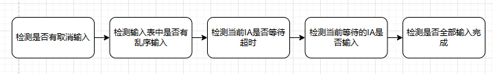
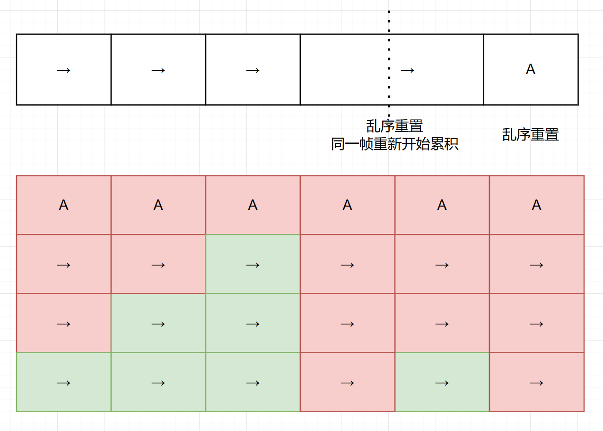
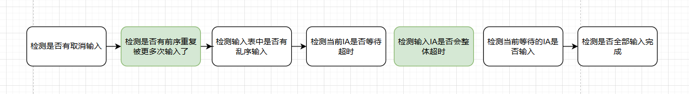
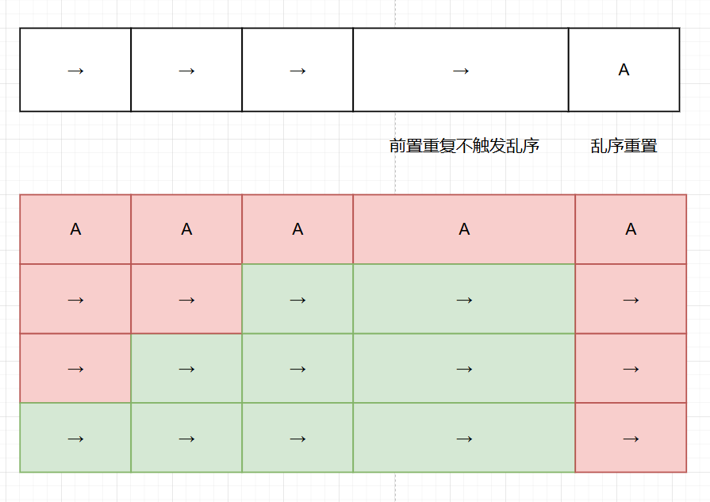
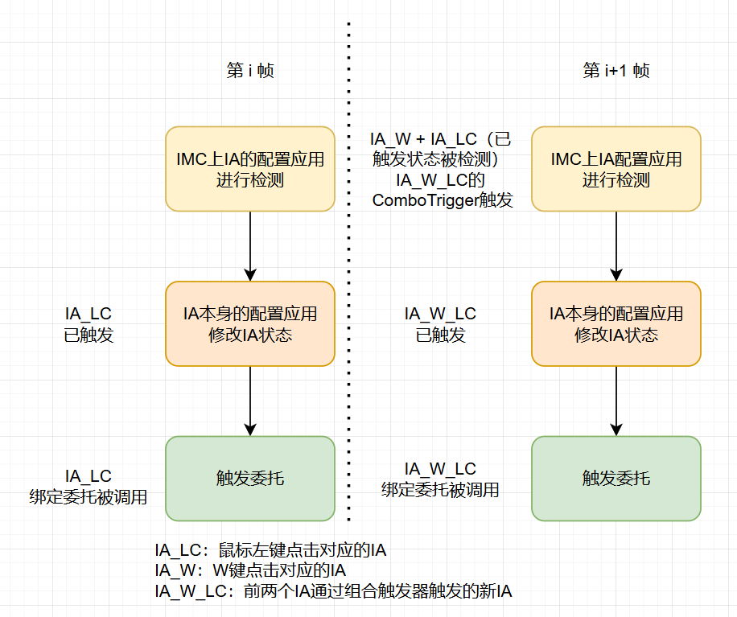
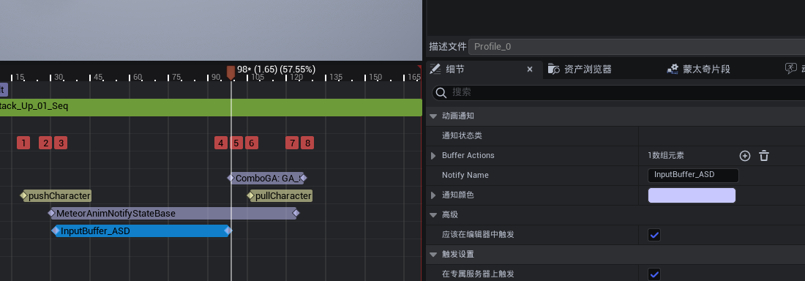
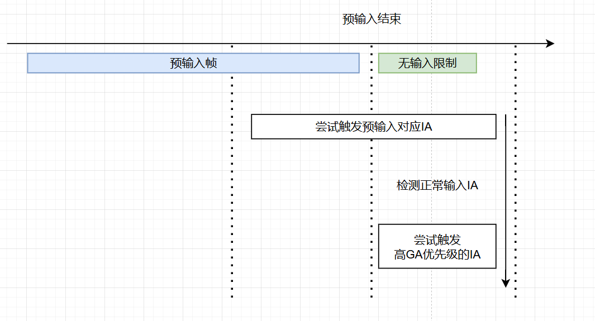

# 前言

《流星蝴蝶剑.net》和《拳皇13》是我印象深刻的游戏，搓招输入的那种独特手感让我一直念念不忘。

在我的个人DEMO中，我尝试复刻了一些搓招体验，在此整理一下我相关系统的开发设计。我在增强输入和GAS的基础上完成了搓招系统、预输入系统等功能。

主要涉及的关键词有： **增强输入系统（EnhancedInput）**、**动画通知状态（AnimNotifyState）**、游戏技能系统（**GameplayAbilitySystem**）、**搓招输入（Combo/Motion Input）**、**预输入机制（Input Buffer）**、**连招取消（Combo Cancel）**。

<!-- more -->

# 基本功能实现

搓招是一个常见于格斗游戏的操作方式，一般来说，它通过一个方向键的连续不同输入和攻击键输入来作为一种释放条件。

如 →↓↘+拳（623P）升龙拳、↓↑↑A阎罗等。

在UE的增强输入系统中，它提供了一个基本的搓招功能实现——组合触发器**ComboTrigger**，如下图：


它允许一个**InputAction**以其他几个**InputAction**的连续触发作为触发条件。如示例中一样，只有连续输入WSD和鼠标左键后，**IA_WSD**才能被触发。

这就完成了一个基本的搓招输入的配置。

只要在代码中绑定**InputAction**的函数回调后，就能够实现搓招输入调用函数实现逻辑了。

# 技能输入的自动绑定和配置化

手动绑定写死**InputAction**的技能激活必然是不可取的，一旦技能或输入条件的变化就要手动调整代码。

因此必须要将**GA**和**InputAction**的关系做成可配置化。能够在不调整代码的情况下随意组合。

## GA记录InputAction

这里首先将技能从**GameplayAbility**上集成两层（中间留一层中间层做隔离，方便后续拓展）。在**GA**中留下**InputAction**的配置皆可。

```c++
class GASLEARN_API UActionGameplayAbility : public UMeteorGameplayAbility
{
	GENERATED_BODY()

public:
	
	UPROPERTY(EditAnywhere, BlueprintReadOnly, Category = "ActionInfo", meta = (AllowPrivateAccess = "true")
	TArray<UInputAction*> BasicInputActions;

};
```

## 技能赋予时绑定

在继承的**ASC**中，重载 `UAbilitySystemComponent::OnGiveAbility` 这个接口，保证能在对应技能给予时调用角色的输入绑定接口。

```c++
void UMeteorAbilitySystemComponent::OnGiveAbility(FGameplayAbilitySpec& AbilitySpec)
{
	Super::OnGiveAbility(AbilitySpec);

	if (UActionGameplayAbility* Ability = Cast<UActionGameplayAbility>(AbilitySpec.Ability))
	{
		if(ADemoPlayerGASCharacterBase* character = Cast<ADemoPlayerGASCharacterBase>(GetAvatarActor()))
		{
			character->onAddActionGameplayAbility(Ability->GetClass(), AbilitySpec.Handle);
		}
		
	}
}
```

## 角色中绑定输入和技能

在 **GAS** 方面，主要是用于保存相关信息和进行接口调用，实际的技能触发逻辑通常是在角色类中实现。

具体来说，在使用 `EnhancedInputComponent::BindAction` 时，可以绑定一个以 **InputActionInstance** 作为参数的通用函数。通过传入的 **InputActionInstance**，可以在函数内部根据具体的输入实例来执行对应的技能触发逻辑。

为了实现这一点，可以在角色中维护一个 `InputAction` 到 `FGameplayAbilitySpecHandle` 的 **TMap**，这样就能够自动根据输入类型调用对应的技能。


```c++
// 头文件中定义需要的数据

// IA对应的技能
TMap<UInputAction *, FGameplayAbilitySpecHandle> InputActionToBasicAbilityMap;

// 技能对应的全部IA
TMap<TSubclassOf<UActionGameplayAbility>, TArray<TObjectPtr<UInputAction>>> ActionAbilityToInputActionMap;

// =======================分割符====================

// PlayerInputComponent设置时
void ADemoPlayerGASCharacterBase::SetupPlayerInputComponent(UInputComponent* PlayerInputComponent)
{
	Super::SetupPlayerInputComponent(PlayerInputComponent);

    BindEnhancedInputComponent = EnhancedInputComponent;
    // 根据赋予的技能情况绑定对应的IA
    for (TPair<TSubclassOf<UActionGameplayAbility>, TArray<TObjectPtr<UInputAction>>>& Pair : ActionAbilityToInputActionMap)
    {
        for(TObjectPtr<UInputAction> IA: Pair.Value)
        {
            BindActionInputAction(IA);
        }
    }
}

// 赋予技能时，绑定对应的IA
bool ADemoPlayerGASCharacterBase::onAddActionGameplayAbility(TSubclassOf<UActionGameplayAbility> Ability, FGameplayAbilitySpecHandle AbilitySpecHandle)
{
	if (Ability && GetLocalRole() == ROLE_Authority && AbilitySystemComponent.IsValid())
	{
	
		ActionAbilityToSpec.Add(Ability, AbilitySpecHandle);

		TArray<TObjectPtr<UInputAction>> AbilityInputActions;
		
		for(UInputAction * IA: Ability->GetDefaultObject<UActionGameplayAbility>()->BasicInputActions)
		{
            //自动尝试绑定IA
			BindActionInputAction(IA);
			
            // 检测不同GA是否绑定同一个技能
            if(!InputActionToBasicAbilityMap.Contains(IA))
			{
				InputActionToBasicAbilityMap.Add(IA, AbilitySpecHandle);
			}else
			{
				FString basicName = AbilitySystemComponent->FindAbilitySpecFromHandle(AbilitySpecHandle)->Ability.GetName();
				UE_LOG(LogInput, Warning, TEXT("InputActionToBasicAbilityMap already contains action %s, ability: %s when add ability: %s"), *IA->GetName(), *basicName, *Ability->GetName());
			}
			
			AbilityInputActions.Add(IA);
		}
        
        //如果此时EnhancedInputComponent不存在时，会将IA信息维护下来，等到PlayerInputComponent绑定时再处理
        ActionAbilityToInputActionMap.Add(Ability, AbilityInputActions);
	}

	return false;
}

// IA绑定时，避免重复绑定
void ADemoPlayerGASCharacterBase::BindActionInputAction(TObjectPtr<UInputAction> IA)
{
	if(!BindedInputActions.Contains(IA) && BindEnhancedInputComponent)
	{
		BindEnhancedInputComponent->BindAction(IA, ETriggerEvent::Completed, this, &ADemoPlayerGASCharacterBase::UseActionGameplayAbility);
		
		BindedInputActions.Add(IA);
	}
}

// 根据IA触发对应技能
void ADemoPlayerGASCharacterBase::UseActionGameplayAbility(const FInputActionInstance& InputInstance)
{
	const UInputAction* Action = InputInstance.GetSourceAction();
	if (AbilitySystemComponent.IsValid())
	{
        FGameplayAbilitySpecHandle * basicSpec = InputActionToBasicAbilityMap.Find(Action);
        if (basicSpec)
        {
            AbilitySystemComponent->TryActivateAbility(*basicSpec, true);
        }else
        {
            UE_LOG(LogInput, Warning, TEXT("InputActionToAbilityMap does not contain %s"), *Action->GetFName().ToString());
        }
    }
}

```

通过这种方式，实现了技能赋予后自动绑定IA，以及根据IA触发对应技能的逻辑。

由此可以随意配置IA和技能关系，不断尝试新的输入组合。

# 派生技能、连招取消和相同输入

在完成基础的技能之后，需要考虑一些更为复杂的内容，比如说连招机制的实现，这会是一个横跨了输入、技能和动画三个体系的内容。


在像《拳皇》这类格斗游戏中，涉及到如下的操作和逻辑，例如草薙京的荒咬→九伤→七濑的派生连招。这些操作涉及到以下几个问题：

1. **技能取消**：在一个技能使用过程中，可以使用另一个技能来取消当前技能。
2. **技能打断窗口**：必须在技能或动作的特定时间窗口内，才能允许使用特定技能进行打断。
3. **特定技能使用限制**：某些技能只能在其他技能的特定时间窗口内使用。
4. **相同输入派生技能**：一些技能（如荒咬和九伤）使用相同的输入命令（例如 `↓→ + 拳`），但可能触发不同的技能。
5. **技能输入的多样性**：某些技能既可以独立使用，也可以作为其他技能的派生，在不同情况下输入方式可能会有所不同。

虽然 **UE的GAS系统** 已经通过 **GameplayTag** 提供了一定的支持，例如技能打断和禁用机制。

但对于像格斗游戏这样时间粒度更细的需求，以单独GA为主体的GAS框架必然满足不了实际需求。

因此，需要在此基础上扩展一套更适合的框架来处理这些复杂的输入和技能链条。

## 输入类型拓展

在综合考虑后，我们将技能的触发情况分为以下三类：

1. **基础触发**：在角色处于静止或移动的基础状态下，玩家通过输入直接尝试触发技能。这种触发方式通常不依赖于其他技能或动作的上下文，而是基于当前状态的直接输入。
2. **连击触发**：在技能使用过程中，通过特定的输入触发技能的派生或连击。这种触发依赖于前一个技能的执行状态，玩家必须在特定的时间窗口内输入特定指令，以实现技能的连锁效果。
3. **始终触发**：这种触发方式无论角色当前的状态如何，只要输入满足条件，技能就可以立即触发。用于一些基本不依赖时机限制的技能如爆气或超必杀技等，减少对于时间窗口的配置。

通过这种分类，可以更好地组织和管理技能输入的逻辑，确保不同的技能在不同的情境下得到正确的触发。


首先，在**GA**中额外增加两套**IA**配置。

```c++
class GASLEARN_API UActionGameplayAbility : public UMeteorGameplayAbility
{
	GENERATED_BODY()

public:
	
	/** 技能的基础触发IA组 */
	UPROPERTY(EditAnywhere, BlueprintReadOnly, Category = "ActionInfo", meta = (AllowPrivateAccess = "true", ToolTip = "这些操作时在不在其他动作时会尝试激活技能"))
	TArray<UInputAction*> BasicInputActions;

	/** 技能的连击触发IA组 */
	UPROPERTY(EditAnywhere, BlueprintReadOnly, Category = "ActionInfo", meta = (AllowPrivateAccess = "true", ToolTip = "这些操作时在其他动作时会尝试激活技能"))
	TArray<UInputAction*> ComboInputActions;
    
    /** 技能的始终触发IA组 */
	UPROPERTY(EditAnywhere, BlueprintReadOnly, Category = "ActionInfo", meta = (AllowPrivateAccess = "true", ToolTip = "这些操作时时总是尝试激活技能"))
	TArray<UInputAction*> AlwaysInputActions;
	

};
```

其次更改角色输入绑定的流程，支持两种新增的输入触发。

```c++
// 头文件中定义需要的数据

// 输入动作对应的基础触发技能
TMap<UInputAction *, FGameplayAbilitySpecHandle> InputActionToBasicAbilityMap;

// 输入动作对应的连击触发技能
TMap<UInputAction *, FGameplayAbilitySpecHandle> InputActionToComboAbilityMap;

// 输入动作对应的始终触发技能
TMap<UInputAction *, FGameplayAbilitySpecHandle> InputActionToAlwaysAbilityMap;

// 技能对应的全部输入动作
TMap<TSubclassOf<UActionGameplayAbility>, TArray<TObjectPtr<UInputAction>>> ActionAbilityToInputActionMap;

TMap<TSubclassOf<UActionGameplayAbility>, FGameplayAbilitySpecHandle> ActionAbilityToSpec;
// =======================分割符====================

bool ADemoPlayerGASCharacterBase::onAddActionGameplayAbility(TSubclassOf<UActionGameplayAbility> Ability, FGameplayAbilitySpecHandle AbilitySpecHandle)
{
	if (Ability && GetLocalRole() == ROLE_Authority && AbilitySystemComponent.IsValid())
	{
	
		ActionAbilityToSpec.Add(Ability, AbilitySpecHandle);

		TArray<TObjectPtr<UInputAction>> AbilityInputActions;
		
        // 绑定基础触发
		for(UInputAction * IA: Ability->GetDefaultObject<UActionGameplayAbility>()->BasicInputActions)
		{
			BindActionInputAction(IA);
			
			if(!InputActionToBasicAbilityMap.Contains(IA))
			{
				InputActionToBasicAbilityMap.Add(IA, AbilitySpecHandle);
			}else
			{
				FString basicName = AbilitySystemComponent->FindAbilitySpecFromHandle(AbilitySpecHandle)->Ability.GetName();
				UE_LOG(LogInput, Warning, TEXT("InputActionToBasicAbilityMap already contains action %s, ability: %s when add ability: %s"), *IA->GetName(), *basicName, *Ability->GetName());
			}
			AbilityInputActions.Add(IA);
		}

        // 绑定连击触发
		for (UInputAction * IA: Ability->GetDefaultObject<UActionGameplayAbility>()->ComboInputActions)
		{
			BindActionInputAction(IA);
			AbilityInputActions.Add(IA);
		}

        // 绑定始终触发
		for (UInputAction * IA: Ability->GetDefaultObject<UActionGameplayAbility>()->AlwaysInputActions)
		{
			BindActionInputAction(IA);

            // 同样的，为了避免有不同技能对应相同的始终触发，在此做出检测
			if(!InputActionToAlwaysAbilityMap.Contains(IA))
			{
				InputActionToAlwaysAbilityMap.Add(IA, AbilitySpecHandle);
			}else
			{
				FString basicName = AbilitySystemComponent->FindAbilitySpecFromHandle(AbilitySpecHandle)->Ability.GetName();
				UE_LOG(LogInput, Warning, TEXT("InputActionToAlwaysAbilityMap already contains action %s, ability: %s when add ability: %s"), *IA->GetName(), *basicName, *Ability->GetName());
			}
			AbilityInputActions.Add(IA);
		}

		ActionAbilityToInputActionMap.Add(Ability, AbilityInputActions);

		return true;
	}

	return false;
}
```

## 根据时间轴配置连击触发

不同于基础触发和始终触发技能，连击触发技能是一个动态变化的关系。根据本身的技能状态和动作帧时机，输入对应的技能始终会不断变化。

对于游戏的动作技能本身，UE自身提供了一套比较完整的蒙太奇功能，因此可以通过简单的拓展来实现功能。开发时以动作蒙太奇为单位，在时间轴上编辑。


首先需要区分是否在技能蒙太奇中，由于动作游戏本身一个技能就是一段PlayMontageAndWait，这个可以直接通过**GA**的**ActivationOwnedTags**赋予一个Tag来作区分。如果后面需要有更精确的需求的话，也可以自行拓展


其次，需要确定下动作的某个时间节点使用什么样的技能，这个信息可以通过AnimNotifyState来保存并在蒙太奇中编辑，具体代码如下：

```c++
class GASLEARN_API UComboAnimNotifyState : public UMeteorAnimNotifyStateBase
{
	GENERATED_BODY()

public:
	
	virtual void NotifyBegin(USkeletalMeshComponent* MeshComp, UAnimSequenceBase* Animation, float TotalDuration, const FAnimNotifyEventReference& EventReference) override;
	virtual void NotifyEnd(USkeletalMeshComponent * MeshComp, UAnimSequenceBase * Animation, const FAnimNotifyEventReference& EventReference) override;

	FString GetNotifyName_Implementation() const override;
	
    // 这个区间允许的连击输入
	UPROPERTY(BlueprintReadOnly, EditAnywhere, Category = "Combo")
	TArray<UInputAction *> ComboInputActions;

    // 指定这个区间对应的GA
	UPROPERTY(BlueprintReadOnly, EditAnywhere, Category = "Combo")
	TSubclassOf<UActionGameplayAbility> ActionGameplayAbility;
	
};
// ====================分隔符==========================
void UComboAnimNotifyState::NotifyBegin(USkeletalMeshComponent* MeshComp, UAnimSequenceBase* Animation, float TotalDuration, const FAnimNotifyEventReference& EventReference)
{
	Super::NotifyBegin(MeshComp, Animation, TotalDuration, EventReference);

	AActor* OwnerActor = MeshComp->GetOwner();

	if(ADemoPlayerGASCharacterBase * Character = Cast<ADemoPlayerGASCharacterBase>(OwnerActor))
	{
        // 在通知开始时，构筑连击输入和GA的关系
		Character->ActiveActionGameplayAbilityComboInput(ActionGameplayAbility, ComboInputActions);
	}
}


void UComboAnimNotifyState::NotifyEnd(USkeletalMeshComponent * MeshComp, UAnimSequenceBase * Animation, const FAnimNotifyEventReference& EventReference)
{
	Super::NotifyEnd(MeshComp, Animation, EventReference);

	AActor* OwnerActor = MeshComp->GetOwner();

	if(ADemoPlayerGASCharacterBase * Character = Cast<ADemoPlayerGASCharacterBase>(OwnerActor))
	{
        // 在通知结束时，解绑连击输入和GA的关系
		Character->DeActiveActionGameplayAbilityComboInput(ActionGameplayAbility, ComboInputActions);
	}
}
```

> 值得注意的是，ANS和Montage是一一对应的，多个Actor使用同一个蒙太奇时会相互干扰，因此不能直接在ANS中缓存数据


最后即可在蒙太奇中根据时间轴配置技能的连击触发关系。

## 连击触发的实现

配置可完成后，在角色内实现最后的连击触发技能的关系维护。

这里也是用一个TMap存储**IA**和**GA**的关系，完整代码如下：

```c++
// 绑定连击触发的激活关系
void ADemoPlayerGASCharacterBase::ActiveActionGameplayAbilityComboInput(TSubclassOf<UActionGameplayAbility>Ability, TArray<UInputAction*> InputActions)
{
	if (ActionAbilityToSpec.Contains(Ability))
	{
		FGameplayAbilitySpecHandle AbilitySpecHandle = ActionAbilityToSpec[Ability];
		
		for(UInputAction * InputAction: InputActions)
		{
			if(! BindedInputActions.Contains(InputAction))
			{
				
			}
			
			if(!InputActionToComboAbilityMap.Find(InputAction))
			{
				InputActionToComboAbilityMap.Add(InputAction, AbilitySpecHandle);
			}
			else
			{
				UE_LOG(LogInput, Warning, TEXT("InputActionToBasicAbilityMap already contains action %s, ability: %s"), *InputAction->GetName(), *Ability->GetName());
			}
		}
	}else
	{
		UE_LOG(LogInput, Warning, TEXT("ActionAbilityToSpec does not contain ability %s"), *Ability->GetName());
	}
}

// 解绑连击触发的激活关系
void ADemoPlayerGASCharacterBase::DeActiveActionGameplayAbilityComboInput(TSubclassOf<UActionGameplayAbility> Ability, TArray<UInputAction*> InputActions)
{
	if (ActionAbilityToSpec.Contains(Ability))
	{
		FGameplayAbilitySpecHandle AbilitySpecHandle = ActionAbilityToSpec[Ability];
		
		for(UInputAction * InputAction: InputActions)
		{
			if(InputActionToComboAbilityMap.Find(InputAction))
			{
				if (InputActionToComboAbilityMap[InputAction] != AbilitySpecHandle)
				{
					UE_LOG(LogInput, Warning, TEXT("InputActionToBasicAbilityMap already contains action %s, ability: %s"), *InputAction->GetName(), *Ability->GetName());
				}else
				{
					InputActionToComboAbilityMap.Remove(InputAction);
				}
			}
			else
			{
				UE_LOG(LogInput, Warning, TEXT("InputActionToBasicAbilityMap not contains action %s, ability: %s"), *InputAction->GetName(), *Ability->GetName());
			}
		}
	}else
	{
		UE_LOG(LogInput, Warning, TEXT("ActionAbilityToSpec does not contain ability %s"), *Ability->GetName());
	}
}

// 在技能的激活回调中根据角色状态寻找对应的触发技能
void ADemoPlayerGASCharacterBase::UseActionGameplayAbility(const FInputActionInstance& InputInstance)
{
	const UInputAction* Action = InputInstance.GetSourceAction();
	if (AbilitySystemComponent.IsValid())
	{
        // 如果处于技能使用状态，则寻找连击触发的对应技能
		if(AbilitySystemComponent->HasMatchingGameplayTag(OnActionTag))
		{
			FGameplayAbilitySpecHandle * comboSpec = InputActionToComboAbilityMap.Find(Action);
			if (comboSpec)
			{
				AbilitySystemComponent->TryActivateAbility(*comboSpec, true);
			}
		}
        // 处于基础状态时，寻找基础触发的技能
		else
		{
			FGameplayAbilitySpecHandle * basicSpec = InputActionToBasicAbilityMap.Find(Action);
			if (basicSpec)
			{
				AbilitySystemComponent->TryActivateAbility(*basicSpec, true);
			}else
			{
				UE_LOG(LogInput, Warning, TEXT("InputActionToAbilityMap does not contain %s"), *Action->GetFName().ToString());
			}
		}

        // 对于始终触发的技能，无论角色状态都尝试触发
		if (InputActionToAlwaysAbilityMap.Contains(Action))
		{
			FGameplayAbilitySpecHandle * alwaysSpec = InputActionToAlwaysAbilityMap.Find(Action);
			if (alwaysSpec)
			{
				AbilitySystemComponent->TryActivateAbility(*alwaysSpec, true);
			}
		}
	}else
	{
		UE_LOG(LogInput, Warning, TEXT("AbilitySystemComponent is not valid"));
	}
	
}

```

目前，搓招输入框架的基础功能已完成，可以通过配置自由拓展技能的触发机制。
一些常规功能，例如基于 Tag 的技能禁用关系和蒙太奇打断的相关逻辑，在此暂不深入探讨。

# 深入ComboTrigger, 优化搓招的识别和手感优化

## 搓招的基本实现

首先在搓招输入的实现中，一般存在两种思路。

- **累计触发**：当一个符合需求的按键输入触发时，填充当前的阶段，随后等待下一个按键触发下一个阶段，直到超时重置。
- **前向检索**：维护一段时间内输入队列，当最后一个按键输入触发时，检测输入队列是否满足一个完整的触发队列。

以一个↓→+A的输入举例，两种实现方式的区别是


在UE中，EnhancedInput的ComboTrigger便是采用的累计触发式的设计思路。

## ComboTrigger触发源码

在实际使用中，一个操作上的问题逐渐显现：技能可能因多次前序输入而未能正确触发。例如，`→→→+拳` 的技能在输入 `→→→→ + 拳` 时就会有可能无法正确触发，感觉上就是被吞键了。

这是由于 UE 中 ComboTrigger 的默认设计存在一定的问题。为了解决此问题，需要对 ComboTrigger 源码进行改造，拓展响应的功能。

这里是ComboTrigger的主要顺序和源码：



~~~c++
//InputTrigger.cpp:236
ETriggerState UInputTriggerCombo::UpdateState_Implementation(const UEnhancedPlayerInput* PlayerInput, FInputActionValue ModifiedValue, float DeltaTime)
{
    
    // 获取当前的 ComboStepAction
    if (const UInputAction* CurrentAction = ComboActions[CurrentComboStepIndex].ComboStepAction)
    {
        // 遍历所有取消动作，检查它们是否已经触发，如果触发则重置
        // ...

        // 遍历所有输入动作，检查是否有错误顺序的触发动作
        for (FInputComboStepData ComboStep : ComboActions)
        {
            // 出现错误顺序的输入时，将重置进度
            if (ComboStep.ComboStepAction && ComboStep.ComboStepAction != CurrentAction)
            {
                const FInputActionInstance* CancelState = PlayerInput->FindActionInstanceData(ComboStep.ComboStepAction);
		
				if (CancelState)
                {
					CurrentComboStepIndex = 0;
					CurrentAction = ComboActions[CurrentComboStepIndex].ComboStepAction;	// 重置输入进度
					break;
				}
                
            }
        }

        // 如果一个输入后没有下一个正确输入的时间过长，则重置进度
        if (CurrentComboStepIndex > 0)
        {
            CurrentTimeBetweenComboSteps += DeltaTime;
            if (CurrentTimeBetweenComboSteps >= ComboActions[CurrentComboStepIndex].TimeToPressKey)
            {
                CurrentComboStepIndex = 0;
                CurrentAction = ComboActions[CurrentComboStepIndex].ComboStepAction; // 重置触发进度
            }
        }

        // 判断当前等待的IA是否触发
        const FInputActionInstance* CurrentState = PlayerInput->FindActionInstanceData(CurrentAction);
        // 如果当前等待的IA触发，则推进到下一个阶段
        if (CurrentState && (ComboActions[CurrentComboStepIndex].ComboStepCompletionStates & static_cast<uint8>(CurrentState->GetTriggerEvent())))
        {
            CurrentComboStepIndex++;
            CurrentTimeBetweenComboSteps = 0;
            // 检查是否已完成组合中的所有动作
            if (CurrentComboStepIndex >= ComboActions.Num())
            {
                CurrentComboStepIndex = 0;
                return ETriggerState::Triggered; // 直接触发
            }
        }

        // 如果这个ComboTrigger还存在检测队列，则返回Ongoing状态
        if (CurrentComboStepIndex > 0)
        {
            return ETriggerState::Ongoing;
        }

        // ...
    }
    return ETriggerState::None;
}
```
~~~

我们可以对照代码发现一个问题，在`→→→+拳` 的技能输入在输入 `→→→→ + 拳`操作时，就有可能因为重复的输入导致被认为乱序，从而重置输入。




这个问题尤其容易玩家紧张的多次输入重复输入后出现，一旦发生，玩家往往会觉得明明输入指令完全正确却没有反应，这对操作体验的影响非常大。

进一步分析代码，我们还可以发现 ComboTrigger 存在一些潜在问题，目前对此可以改进的几点：

- **重复输入重置**：对于重复输入会造成乱序，系统会直接重置。而为了保障玩家的操作手感，可以考虑不进行重置。
- **单键超时**：目前的机制只对单个输入设定超时时限，而没有为整个输入序列设置一个超时限制。实际上，可以考虑为整个序列增加一个全局超时阈值，从而确保玩家能够顺畅输入。
- **乱序重置**：从个人角度来看还是觉得乱序重置是一个很容易被误操作导致影响手感的点。

## 自定义 ComboTrigger，优化输入判断流程

因此，我们需要对 ComboTrigger 进行一些改进。在个人的开发需求，首先引入了整套输入序列的超时时限。

在后续调整手感的过程中，我发现了重复重置的问题，所以代码中要同时解决了这两个问题。

- **全局超时**：实现全局超时非常简单，只需要额外维护一个全局的时间信息即可。
- **乱序重置**：仔细分析后发现，乱序重置的主要问题出现在连续输入的序列。如果输入不是从头开始，或者输入并不完全连续，重复的输入可能被认为无效，但这是正常现象。因此可以对超时重置机制进行优化，使其更加符合实际需求。


因此更改ComboTrigger的主要处理流程以实现优化需求，改进后的流程和代码如下：



```c++
// SameBeginIANum:从开始时有多少个相同的一样IA，如→→→+拳
// CurrentTimeIncomboTotal:整个输入的整体时间
// TimeForComboSteps:每个输入的重复
int32 beginIndex = 0; //判断乱序时，默认从0开始

if(CurrentComboStepIndex == SameBeginIANum) //说明现在开始重复已经输入完了，在等待第一个不同的输入
{
    const FInputActionInstance* BeginAction = PlayerInput->FindActionInstanceData(BeginInputAction);
    if (BeginAction && (ComboActions[0].ComboStepCompletionStates & static_cast<uint8>(BeginAction->GetTriggerEvent())))
    {
        //如果是开始重复的IA被重复输入了，那么相当于整个输入序列后延一位，调整整体时间和乱序检查的开始位置
        beginIndex = SameBeginIANum; 
        CurrentTimeBetweenComboSteps = 0;
        CurrentTimeIncomboTotal -= TimeForComboSteps[0];
        for(int32 i = 0; i < SameBeginIANum - 1; i++)
        {
            TimeForComboSteps[i] = TimeForComboSteps[i + 1];
        }
    }
}

for (int32 i = beginIndex; i < ComboActions.Num(); i++)
{
    const FInputComboStepData& ComboStep = ComboActions[i];
    // ... 乱序检查部分，和原本一直不用管
}

// 超时检查需要额外加入检查整体超时
if (CurrentComboStepIndex > 0)
{
    CurrentTimeBetweenComboSteps += DeltaTime;
    CurrentTimeIncomboTotal += DeltaTime;
    if (CurrentTimeBetweenComboSteps >= ComboActions[CurrentComboStepIndex].TimeToPressKey || CurrentTimeIncomboTotal >= TotalTimeForUse)
    {
        CurrentComboStepIndex = 0;
        CurrentTimeIncomboTotal = 0;
        CurrentAction = ComboActions[CurrentComboStepIndex].ComboStepAction;		
    }
}

const FInputActionInstance* CurrentState = PlayerInput->FindActionInstanceData(CurrentAction);
if (CurrentState && (ComboActions[CurrentComboStepIndex].ComboStepCompletionStates & static_cast<uint8>(CurrentState->GetTriggerEvent())))
{
    // 当Combo输入推进时，记下每一个输入中间的间隔时间
    TimeForComboSteps[CurrentComboStepIndex - 1] = CurrentTimeBetweenComboSteps;

    // ... 后续内容无变化
}

```

前置重复不触发乱序的效果：



# 多个输入序列一致时如何正确的触发

在搓招输入系统中，不可避免地会遇到一个问题：

当多个技能的触发条件存在相同结尾时，如何正确判断最终触发哪个技能？

这与派生技能的连击触发是不同的问题。


例如，在八神庵的出招表中，`↓→ + 拳` 同时存在多个技能（暗拂、八稚女、暗削、焰鸥）的输入序列中。

如何避免输入相似时触发错误技能，是需要进一步解决的核心问题，我们需要深入解读EnhancedInput的相关源码，理解清楚其本身的触发机制后我们才能完善这些内容。

## UE相关源码

EnhancedInput中需要关注的代码在 `UEnhancedPlayerInput::EvaluateInputDelegates` 这个函数中，重点代码如下：

```c++
// EnhancedPlayerInput.cpp:330

void UEnhancedPlayerInput::EvaluateInputDelegates(const TArray<UInputComponent*>& InputComponentStack, const float DeltaTime, const bool bGamePaused, const TArray<TPair<FKey, FKeyState*>>& KeysWithEvents)
{
    // 1. 重置信息并计算时间相关信息，不重要
    ActionsWithEventsThisTick.Reset();
    const UWorld* World = GetWorld();
    float CurrentTime = World ? World->GetRealTimeSeconds() : LastFrameTime + (1.0f / 60.0f);
    RealTimeDeltaSeconds = CurrentTime - LastFrameTime;
    const float Dilation = GetEffectiveTimeDilation();
    const float NonDilatedDeltaTime = Dilation != 0.0f ? DeltaTime / Dilation : RealTimeDeltaSeconds;

    // 2. 遍历所有IA，根据设备上的操作信息，比如按下或者松开，处理IMC中的IA的触发器和修改器等信息
    for (FEnhancedActionKeyMapping& Mapping : EnhancedActionMappings)
    {
        if (!Mapping.Action)
        {
            continue;
        }

        FKeyState* KeyState = GetKeyState(Mapping.Key);
        FVector RawKeyValue = KeyState ? KeyState->RawValue : FVector::ZeroVector;

        bool bDownLastTick = KeyDownPrevious.FindRef(Mapping.Key);
        bool bKeyIsDown = KeyState && (KeyState->bDown || KeyState->EventCounts[IE_Pressed].Num() || KeyState->EventCounts[IE_Repeat].Num());
        bKeyIsDown |= Mapping.Key.IsAnalog() && RawKeyValue.SizeSquared() > 0;

        bool bKeyIsReleased = !bKeyIsDown && bDownLastTick;
        bool bKeyIsHeld = bKeyIsDown && bDownLastTick;

        EKeyEvent KeyEvent = bKeyIsHeld ? EKeyEvent::Held : ((bKeyIsDown || bKeyIsReleased) ? EKeyEvent::Actuated : EKeyEvent::None);

        ProcessActionMappingEvent(Mapping.Action, NonDilatedDeltaTime, bGamePaused, RawKeyValue, KeyEvent, Mapping.Modifiers, Mapping.Triggers);
    }

    // 3. 处理注入的输入，主要是调试时使用模拟IA的状态情况，不重要，略过
   	// ……

    // 4. 遍历所有的IA，处理IA本身的触发器和修改器的信息
    for (TPair<TObjectPtr<const UInputAction>, FInputActionInstance>& ActionPair : ActionInstanceData)
    {
        TObjectPtr<const UInputAction> Action = ActionPair.Key;
        FInputActionInstance& ActionData = ActionPair.Value;
        ETriggerState TriggerState = ETriggerState::None;

        if (ActionsWithEventsThisTick.Contains(Action))
        {
            FInputActionValue RawValue = ActionData.Value;
            ActionData.Value = ApplyModifiers(ActionData.Modifiers, ActionData.Value, NonDilatedDeltaTime);

            ETriggerState PrevState = ActionData.TriggerStateTracker.GetState();
            TriggerState = ActionData.TriggerStateTracker.EvaluateTriggers(this, ActionData.Triggers, ActionData.Value, NonDilatedDeltaTime);
            TriggerState = ActionData.TriggerStateTracker.GetMappingTriggerApplied() ? FMath::Min(TriggerState, PrevState) : TriggerState;

            if (bGamePaused && !Action->bTriggerWhenPaused)
            {
                TriggerState = ETriggerState::None;
            }
        }

        ActionData.TriggerEventInternal = GetTriggerStateChangeEvent(ActionData.LastTriggerState, TriggerState);
        ActionData.TriggerEvent = ConvertInternalTriggerEvent(ActionData.TriggerEventInternal);
        ActionData.LastTriggerState = TriggerState;
        ActionData.ElapsedProcessedTime += TriggerState != ETriggerState::None ? NonDilatedDeltaTime : 0.f;
        ActionData.ElapsedTriggeredTime += (ActionData.TriggerEvent == ETriggerEvent::Triggered) ? NonDilatedDeltaTime : 0.f;
        if (TriggerState == ETriggerState::Triggered)
        {
            ActionData.LastTriggeredWorldTime = CurrentTime;
        }
    }

    // 5. 遍历所有绑定的委托
    const bool bAlt = IsAltPressed(), bCtrl = IsCtrlPressed(), bShift = IsShiftPressed(), bCmd = IsCmdPressed();
    int32 StackIndex = InputComponentStack.Num() - 1;
    for (; StackIndex >= 0; --StackIndex)
    {
        UEnhancedInputComponent* IC = Cast<UEnhancedInputComponent>(InputComponentStack[StackIndex]);

        // 搜集所有需要触发的被绑定的委托
        static TArray<TUniquePtr<FEnhancedInputActionEventBinding>> TriggeredDelegates;
        // 这个委托没有做特殊处理，是按照绑定时的顺序进行委托的遍历
        for (const TUniquePtr<FEnhancedInputActionEventBinding>& Binding : IC->GetActionEventBindings())
        {
            if (const FInputActionInstance* ActionData = FindActionInstanceData(Binding->GetAction()))
            {
                const ETriggerEvent BoundTriggerEvent = Binding->GetTriggerEvent();
                if (ActionData->TriggerEvent == BoundTriggerEvent ||
                    (BoundTriggerEvent == ETriggerEvent::Started && ActionData->TriggerEventInternal == ETriggerEventInternal::StartedAndTriggered))
                {
                    // 记录触发的委托，将标记为Started放在一开始
                    if (BoundTriggerEvent == ETriggerEvent::Started)
                    {
                        TriggeredDelegates.EmplaceAt(0, Binding->Clone());
                    }
                    else
                    {
                        TriggeredDelegates.Emplace(Binding->Clone());
                    }

                    // 记录本帧触发的动作
                    if (BoundTriggerEvent == ETriggerEvent::Triggered)
                    {
                        TriggeredActionsThisTick.Add(ActionData->GetSourceAction());
                    }
                }

                // 如果委托绑定的动作需要消耗按键，则标记按键为已消耗，不重要，略过
                // ...
            }
        }

        // 遍历所有触发的委托，这里可以结合上面一步看出来，这是按照委托的绑定顺序，随后将Start类型的绑定顺序提前，而产生的委托执行顺序
        for (TUniquePtr<FEnhancedInputActionEventBinding>& Delegate : TriggeredDelegates)
        {
            TObjectPtr<const UInputAction> DelegateAction = Delegate->GetAction();
            bool bCanTrigger = true;

         	// 一些检查，不重要，略过

            if (bCanTrigger)
            {
                if (const FInputActionInstance* ActionData = FindActionInstanceData(DelegateAction))
                {
                    // 执行委托
                    Delegate->Execute(*ActionData);
                }
            }
        }
        TriggeredDelegates.Reset();
        TriggeredActionsThisTick.Reset();

        // 更新IA绑定中的信息，不重要，略过
        
	// 重置相关信息，这部分略过        
}
```

结合代码，我们可以大体上明白，EnhancedInput的触发机制是Tick模式，每帧固定时间节点会尝试收集所有需要触发的绑定委托，并按顺序触发它们。

一帧内主要按照如下顺序：

1. 处理IMC中，根据每个IA配置的触发器（**InputTrigger**）和修改器 （**InputModifier**）的信息。这里还不会修改IA本身的触发状态。
2. 处理IA本身配置的触发器和修改器，这里才会真正修改IA本身的触发状态。
3. 根据绑定顺序，顺序触发所有绑定了IA的委托。

## IA触发序列的处理



对于一个W键和鼠标左键组合而成的IA，主要触发情况就会如上图。

大体上就有两个特征：

- ComboTrigger中，最后一个需要检测的IA实际触发在ComboTrigger的IA的上一帧，如鼠标左键的IA触发就是一定在以鼠标左键的上一帧

  > 这个问题很好解决，专门为最后一个键单独做一个ComboTrigger的IA用来触发对应技能即可

- 当同一帧满足多个IA触发时，会按照委托绑定顺序调用对应的执行函数。

所以我们需要处理这两个问题，才能够实现精准的触发，我们要用技能的优先级来决定技能的触发顺序

## 优先级触发的实现

侵入式改动EnhancedPlayerInput肯定是不可取的，这种较为底层的东西不知道有多少地方依赖着（比如手柄的UI操作据我所知好像也有走EnhancedInput？）。所以改动上要尽可能的对其他部分无影响。

这种优先级排序和触发的实现其实没有什么特殊的内容，就是缓存和排序触发即可。

> 注意，在制作这方面内容时我将代码重构了一遍，和前面的实现有些不一致

首先，我们需要轻微的继承一下`EnhancedPlayerInput`，在每帧调用前后增加两个事件委托：

```c++
void UMeteorEnhancedPlayerInput::EvaluateInputDelegates(const TArray<UInputComponent*>& InputComponentStack, float DeltaTime, bool bGamePaused, const TArray<TPair<FKey, FKeyState*>>& KeysWithEvents)
{
	// Call the before delegate
	OnBeforeEvaluateInputDelegates.Broadcast();

	// Call the base class implementation
	Super::EvaluateInputDelegates(InputComponentStack, DeltaTime, bGamePaused, KeysWithEvents);

	// Call the after delegate
	OnAfterEvaluateInputDelegates.Broadcast();
}
```

其次，我们在处理委托调用时，不直接进行IA触发，而是将其存储到一个队列中：

```c++
void UMeteorAbilityInputComponent::TriggerInputAction(const FInputActionInstance& InputInstance)
{
    const UInputAction* IA = InputInstance.GetSourceAction();
    
    if(!TriggeredInputActions.Contains(IA))
    {
        TriggeredInputActions.Add(IA);
    }
}
```

最后，在一帧所有的委托结束之后，根据After委托的调用，排序所有技能后触发优先级最高的技能：

```c++
void UMeteorAbilityInputComponent::TriggerActionAbility()
{
    TArray<TObjectPtr<UActionGameplayAbility>> Abilities;
    
    // 先获取到所有触发的IA对应的技能
    for(const UInputAction* IA: TriggeredInputActions)
    {
        TArray<TObjectPtr<UActionGameplayAbility>> TriggeredAbilities = GetActionGameplayAbility(IA);
        for(TObjectPtr<UActionGameplayAbility> Ability: TriggeredAbilities)
        {
            if(!Abilities.Contains(Ability))
            {
                Abilities.Add(Ability);
            }
        }
    }

    // 根据技能配置的优先级排序
    Abilities.StableSort([](const TObjectPtr<UActionGameplayAbility>& A, const TObjectPtr<UActionGameplayAbility>& B)
    {
        return A->GetInputPriority() > B->GetInputPriority();
    });
    
    // 只触发第一个技能
    if(AbilitySystemComponent.Get() && Abilities.Num() > 0)
    {
        AbilitySystemComponent->TryActivateAbility(ActionAbilityToSpec[Abilities[0]]);
    }
    TriggeredInputActions.Empty();
}
```

这样子就可以基于技能本身的优先级配置，触发最符合需求的技能了。

# 宽容时限，预输入机制

精准输入往往是玩家的难点之一。在一些游戏设计中，有些在固定时间点的输入能达成放帧等效果，具备更高的收益。

这种相当于一个奖励机制，精准输入的高难度带来高回报，这是符合预期可以接受的。

然而，对于普通的连招操作，过于苛刻的输入判定总是容易导致断连或串招，从而影响游戏体验。

为此，需要引入 **预输入机制**，允许玩家在一定时间范围内提前输入的结果有效，这能有效优化操作手感，提升游戏体验。

## 预输入机制设计和实现

结合了之前的实现之后，很容易得出一个预输入的机制实现。

通过某些方式打开预输入的锁定开关后，不进行排序和触发，直到预输入区间结束之后时间后才可以触发。这里我还是使用**ANS**进行处理。

这个实现目前来看在DEMO中没有什么问题，主要需要注意一下几个点：

- 我的项目中，只需要检测IA触发即可，不需要根据IA上的值做任何判断和操作，所以直接缓存对应的IA对象即可。对于某些依赖输入的具体值的设计还需要更深入的思考讨论。
- 需要控制好触发委托的时序问题，技能的触发时序、动画时序、输入时序之间的关系需要理好
- 是否有可能被同时打开多个预输入区间？多个重叠时想要如何处理？直到所有的预输入区间

所以这边新增一种ANS用来在蒙太奇中打开预输入区间:

```c++
void UInputBufferAnimNotifyState::NotifyBegin(USkeletalMeshComponent* MeshComp, UAnimSequenceBase* Animation, float TotalDuration, const FAnimNotifyEventReference& EventReference)
{
	Super::NotifyBegin(MeshComp, Animation, TotalDuration, EventReference);

	AActor* OwnerActor = MeshComp->GetOwner();

	TObjectPtr<UMeteorAbilityInputComponent> AbilityInputComponent = OwnerActor->FindComponentByClass<UMeteorAbilityInputComponent>();	

	
	AbilityInputComponent->StartInputBufferLock(BufferActions);
}

void UInputBufferAnimNotifyState::NotifyEnd(USkeletalMeshComponent * MeshComp, UAnimSequenceBase * Animation, const FAnimNotifyEventReference& EventReference)
{
	Super::NotifyEnd(MeshComp, Animation, EventReference);

	AActor* OwnerActor = MeshComp->GetOwner();

	TObjectPtr<UMeteorAbilityInputComponent> AbilityInputComponent = OwnerActor->FindComponentByClass<UMeteorAbilityInputComponent>();	

	AbilityInputComponent->EndInputBufferLock(BufferActions);
}
```



预输入区间也就是打开后，只允许某些固定的输入被存储起来:

这里主要还是处理一下多个预输入区间后允许输入的IA缓存，这样子可以避免多个重复的预输入区间引用时出现问题。

```c++
void UMeteorAbilityInputComponent::StartInputBufferLock(TArray<UInputAction*> InputActions)
{
    inputLock += 1;
    for(UInputAction* IA: InputActions)
    {
        AllowBufferInputActions[IA] = AllowBufferInputActions.FindOrAdd(IA, 0) + 1;
    }
}

void UMeteorAbilityInputComponent::EndInputBufferLock(TArray<UInputAction*> InputActions)
{
    inputLock -= 1;
    for(UInputAction* IA: InputActions)
    {
        AllowBufferInputActions[IA] = AllowBufferInputActions.FindOrAdd(IA, 1) - 1;
    }
}
```

随后修改一下绑定IA的触发函数，在预输入期间只处理可用的函数。

```c++
void UMeteorAbilityInputComponent::TriggerInputAction(const FInputActionInstance& InputInstance)
{
    const UInputAction* IA = InputInstance.GetSourceAction();
    if(IsInputBufferLocked())
    {
        // If the input buffer is locked, we will only add the allowed input actions to the buffer
        if(AllowBufferInputActions.FindOrAdd(IA, 0) == 0)
        {
            return;
        }
    }
    
    if(!TriggeredInputActions.Contains(IA))
    {
        TriggeredInputActions.Add(IA);
    }
}
```

最后为了避免一下容易出现的时序问题，还是将输入的触发时序约束在 **EnhancedPlayerInput** 的这个流程里，而不是AnimNotifyState的流程中。

```c++
void UMeteorAbilityInputComponent::onBeforeEvaluateInputDelegates()
{
    if(!IsInputBufferLocked())
    {
        // This is the function that will be called when the input buffer unlock
        TriggerActionAbility(); 
    }
}

void UMeteorAbilityInputComponent::onAfterEvaluateInputDelegates()
{
    if(!IsInputBufferLocked())
    {
        TriggerActionAbility();
    }
}
```

这里会在输入流程之前尝试触发一次，这是还是出于优先处理预输入的设计考虑。

同一帧内如果既有预输入得到的IA和正常输入的IA，还是希望能先应用预输入的IA，而不是进行排序后选用高优先级的GA。

预输入依然是需要承担风险和责任的，而不是能卡个时间点覆盖掉。



## AnimNotifyState的考虑

这里主要讨论一下为什么还是要把输入的触发时序放在**EnhancedPlayerInput**这个流程中。

如果稍微研究过一下AnimNotifyState相关的内容的话，就可以知道某一帧中动画通知（Queue模式）触发的顺序是这样的：

- AN触发
- ANS End事件
- ANS Start事件
- ANS Tick事件

同时，动画系统每一帧会根据之前的时间流逝推动蒙太奇进度，但是这个时间又有可能被卡顿、跳转等其他因素影响，导致触发不是很精确。

最简单想象的一个情况是，同一帧内先触发**预输入ANS**的End事件，再触发**连招ANS**的Start事件。

如果把预输入触发的情况放在**预输入ANS**的End事件调用的接口中，就会导致此时不能根据**连招ANS**进行准确地触发。

其次，ANS分成**Queue**事件和**BranchPoint**事件，正常来说是不希望在**Queue**中产生影响蒙太奇播放的逻辑的，但是本身动作GA又严重依赖蒙太奇，而把所有ANS都改成**BranchPoint**也会产生无意义的性能消耗，所以还是进行缓存到输入流程重处罚。

> 其实应该还会和其他模块的Tick产生问题，这里就不必展开了。

# 总结

以上是个人对类格斗游戏搓招系统开发的一些研究和思考。

这如今，格斗类游戏逐渐式微，难以再成为主流，只有少数老牌公司还能做的红红火火（比如街霸6），有些公司已经卖身卖出习惯了（就你SNK）或者当惯了代工厂（ARC社），不知道有没有自己做这种游戏的那一天。
