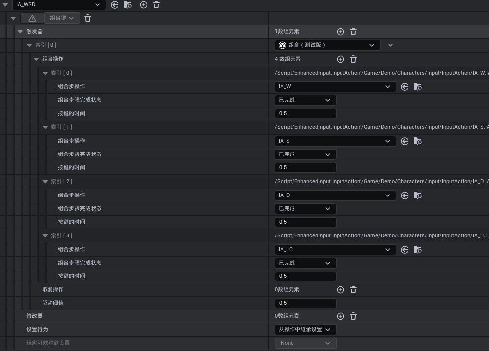

# 前言

《流星蝴蝶剑.net》和《拳皇13》是念念不忘的游戏。从年少开始，十余年过去了，我依然忘不了手指飞舞、在键盘上跃动的那种体验。

在我的个人DEMO中，我尝试复刻了一些搓招体验，在此整理一下我相关系统的开发设计。我在增强输入和GAS的基础上完成了搓招系统、预输入系统等功能。

主要涉及的关键词有： **增强输入系统（EnhancedInput）**、**动画通知状态（AnimNotifyState）**、游戏技能系统（**GameplayAbilitySystem**）、**搓招输入（Combo/Motion Input）**、**预输入机制（Input Buffer）**、**连招取消（Combo Cancel）**。

<!-- more -->

# 基本功能实现

搓招是一个常见于格斗游戏的操作方式，一般来说，它通过一个方向键的连续不同输入和攻击键输入来作为一种释放条件。

如 →↓↘+拳（623P）升龙拳、↓↑↑A阎罗等。

在UE的增强输入系统中，它提供了一个基本的搓招功能实现——组合触发器，如下图：



它允许一个**InputAction**以其他几个**InputAction**的连续触发作为触发条件。如示例中一样，只有连续输入WSD和鼠标左键后，**IA_WSD**才能被触发。

这就完成了一个基本的搓招输入的配置。

只要在代码中绑定**InputAction**的函数回调后，就能够实现搓招输入调用函数实现逻辑了。

# 技能输入的自动绑定和配置化

手动绑定写死**InputAction**的技能激活必然是不可取的，一旦技能或输入条件的变化就要手动调整代码。

因此必须要将**GA**和**InputAction**的关系做成可配置化。能够在不调整代码的情况下随意组合。

## GA记录InputAction

这里首先将技能从**GameplayAbility**上集成两层（中间留一层中间层做隔离，方便后续拓展）。在**GA**中留下**InputAction**的配置皆可。

```c++
class GASLEARN_API UActionGameplayAbility : public UMeteorGameplayAbility
{
	GENERATED_BODY()

public:
	
	UPROPERTY(EditAnywhere, BlueprintReadOnly, Category = "ActionInfo", meta = (AllowPrivateAccess = "true")
	TArray<UInputAction*> BasicInputActions;

};
```

## 技能赋予时绑定

在继承的**ASC**中，重载 `UAbilitySystemComponent::OnGiveAbility` 这个接口，保证能在对应技能给予时调用角色的输入绑定接口。

```c++
void UMeteorAbilitySystemComponent::OnGiveAbility(FGameplayAbilitySpec& AbilitySpec)
{
	Super::OnGiveAbility(AbilitySpec);

	if (UActionGameplayAbility* Ability = Cast<UActionGameplayAbility>(AbilitySpec.Ability))
	{
		if(ADemoPlayerGASCharacterBase* character = Cast<ADemoPlayerGASCharacterBase>(GetAvatarActor()))
		{
			character->onAddActionGameplayAbility(Ability->GetClass(), AbilitySpec.Handle);
		}
		
	}
}
```

## 角色中绑定输入和技能

在 **GAS** 方面，主要是用于保存相关信息和进行接口调用，实际的技能触发逻辑通常是在角色类中实现。

具体来说，在使用 `EnhancedInputComponent::BindAction` 时，可以绑定一个以 **InputActionInstance** 作为参数的通用函数。通过传入的 **InputActionInstance**，可以在函数内部根据具体的输入实例来执行对应的技能触发逻辑。

为了实现这一点，可以在角色中维护一个 `InputAction` 到 `FGameplayAbilitySpecHandle` 的 **TMap**，这样就能够自动根据输入类型调用对应的技能。


```c++
// 头文件中定义需要的数据

// IA对应的技能
TMap<UInputAction *, FGameplayAbilitySpecHandle> InputActionToBasicAbilityMap;

// 技能对应的全部IA
TMap<TSubclassOf<UActionGameplayAbility>, TArray<TObjectPtr<UInputAction>>> ActionAbilityToInputActionMap;

// =======================分割符====================

// PlayerInputComponent设置时
void ADemoPlayerGASCharacterBase::SetupPlayerInputComponent(UInputComponent* PlayerInputComponent)
{
	Super::SetupPlayerInputComponent(PlayerInputComponent);

    BindEnhancedInputComponent = EnhancedInputComponent;
    // 根据赋予的技能情况绑定对应的IA
    for (TPair<TSubclassOf<UActionGameplayAbility>, TArray<TObjectPtr<UInputAction>>>& Pair : ActionAbilityToInputActionMap)
    {
        for(TObjectPtr<UInputAction> IA: Pair.Value)
        {
            BindActionInputAction(IA);
        }
    }
}

// 赋予技能时，绑定对应的IA
bool ADemoPlayerGASCharacterBase::onAddActionGameplayAbility(TSubclassOf<UActionGameplayAbility> Ability, FGameplayAbilitySpecHandle AbilitySpecHandle)
{
	if (Ability && GetLocalRole() == ROLE_Authority && AbilitySystemComponent.IsValid())
	{
	
		ActionAbilityToSpec.Add(Ability, AbilitySpecHandle);

		TArray<TObjectPtr<UInputAction>> AbilityInputActions;
		
		for(UInputAction * IA: Ability->GetDefaultObject<UActionGameplayAbility>()->BasicInputActions)
		{
            //自动尝试绑定IA
			BindActionInputAction(IA);
			
            // 检测不同GA是否绑定同一个技能
            if(!InputActionToBasicAbilityMap.Contains(IA))
			{
				InputActionToBasicAbilityMap.Add(IA, AbilitySpecHandle);
			}else
			{
				FString basicName = AbilitySystemComponent->FindAbilitySpecFromHandle(AbilitySpecHandle)->Ability.GetName();
				UE_LOG(LogInput, Warning, TEXT("InputActionToBasicAbilityMap already contains action %s, ability: %s when add ability: %s"), *IA->GetName(), *basicName, *Ability->GetName());
			}
			
			AbilityInputActions.Add(IA);
		}
        
        //如果此时EnhancedInputComponent不存在时，会将IA信息维护下来，等到PlayerInputComponent绑定时再处理
        ActionAbilityToInputActionMap.Add(Ability, AbilityInputActions);
	}

	return false;
}

// IA绑定时，避免重复绑定
void ADemoPlayerGASCharacterBase::BindActionInputAction(TObjectPtr<UInputAction> IA)
{
	if(!BindedInputActions.Contains(IA) && BindEnhancedInputComponent)
	{
		BindEnhancedInputComponent->BindAction(IA, ETriggerEvent::Completed, this, &ADemoPlayerGASCharacterBase::UseActionGameplayAbility);
		
		BindedInputActions.Add(IA);
	}
}

// 根据IA触发对应技能
void ADemoPlayerGASCharacterBase::UseActionGameplayAbility(const FInputActionInstance& InputInstance)
{
	const UInputAction* Action = InputInstance.GetSourceAction();
	if (AbilitySystemComponent.IsValid())
	{
        FGameplayAbilitySpecHandle * basicSpec = InputActionToBasicAbilityMap.Find(Action);
        if (basicSpec)
        {
            AbilitySystemComponent->TryActivateAbility(*basicSpec, true);
        }else
        {
            UE_LOG(LogInput, Warning, TEXT("InputActionToAbilityMap does not contain %s"), *Action->GetFName().ToString());
        }
    }
}

```

通过这种方式，实现了技能赋予后自动绑定IA，以及根据IA触发对应技能的逻辑。

由此可以随意配置IA和技能关系，不断尝试新的输入组合。

# 派生技能、连招取消和相同输入

在完成基础的技能之后，需要考虑一些更为复杂的内容，比如说连招机制的实现，这会是一个横跨了输入、技能和动画三个体系的内容。

![The King of Fighters XIII 2025-01-18 21-01-40.mp4 [video-to-gif output image]](./UE_ComboInputPlus/ezgif-3-2b7b90518d.gif)

在像《拳皇》这类格斗游戏中，涉及到如下的操作和逻辑，例如草薙京的荒咬→九伤→七濑的派生连招。这些操作涉及到以下几个问题：

1. **技能取消**：在一个技能使用过程中，可以使用另一个技能来取消当前技能。
2. **技能打断窗口**：必须在技能或动作的特定时间窗口内，才能允许使用特定技能进行打断。
3. **特定技能使用限制**：某些技能只能在其他技能的特定时间窗口内使用。
4. **相同输入派生技能**：一些技能（如荒咬和九伤）使用相同的输入命令（例如 `↓→ + 拳`），但可能触发不同的技能。
5. **技能输入的多样性**：某些技能既可以独立使用，也可以作为其他技能的派生，在不同情况下输入方式可能会有所不同。

虽然 **UE的GAS系统** 已经通过 **GameplayTag** 提供了一定的支持，例如技能打断和禁用机制。

但对于像格斗游戏这样时间粒度更细的需求，以单独GA为主体的GAS框架必然满足不了实际需求。

因此，需要在此基础上扩展一套更适合的框架来处理这些复杂的输入和技能链条。

## 输入类型拓展

在综合考虑后，我们将技能的触发情况分为以下三类：

1. **基础触发**：在角色处于静止或移动的基础状态下，玩家通过输入直接尝试触发技能。这种触发方式通常不依赖于其他技能或动作的上下文，而是基于当前状态的直接输入。
2. **连击触发**：在技能使用过程中，通过特定的输入触发技能的派生或连击。这种触发依赖于前一个技能的执行状态，玩家必须在特定的时间窗口内输入特定指令，以实现技能的连锁效果。
3. **始终触发**：这种触发方式无论角色当前的状态如何，只要输入满足条件，技能就可以立即触发。用于一些基本不依赖时机限制的技能如爆气或超必杀技等，减少对于时间窗口的配置。

通过这种分类，可以更好地组织和管理技能输入的逻辑，确保不同的技能在不同的情境下得到正确的触发。


首先，在**GA**中额外增加两套**IA**配置。

```c++
class GASLEARN_API UActionGameplayAbility : public UMeteorGameplayAbility
{
	GENERATED_BODY()

public:
	
	/** 技能的基础触发IA组 */
	UPROPERTY(EditAnywhere, BlueprintReadOnly, Category = "ActionInfo", meta = (AllowPrivateAccess = "true", ToolTip = "这些操作时在不在其他动作时会尝试激活技能"))
	TArray<UInputAction*> BasicInputActions;

	/** 技能的连击触发IA组 */
	UPROPERTY(EditAnywhere, BlueprintReadOnly, Category = "ActionInfo", meta = (AllowPrivateAccess = "true", ToolTip = "这些操作时在其他动作时会尝试激活技能"))
	TArray<UInputAction*> ComboInputActions;
    
    /** 技能的始终触发IA组 */
	UPROPERTY(EditAnywhere, BlueprintReadOnly, Category = "ActionInfo", meta = (AllowPrivateAccess = "true", ToolTip = "这些操作时时总是尝试激活技能"))
	TArray<UInputAction*> AlwaysInputActions;
	

};
```

其次更改角色输入绑定的流程，支持两种新增的输入触发。

```c++
// 头文件中定义需要的数据

// 输入动作对应的基础触发技能
TMap<UInputAction *, FGameplayAbilitySpecHandle> InputActionToBasicAbilityMap;

// 输入动作对应的连击触发技能
TMap<UInputAction *, FGameplayAbilitySpecHandle> InputActionToComboAbilityMap;

// 输入动作对应的始终触发技能
TMap<UInputAction *, FGameplayAbilitySpecHandle> InputActionToAlwaysAbilityMap;

// 技能对应的全部输入动作
TMap<TSubclassOf<UActionGameplayAbility>, TArray<TObjectPtr<UInputAction>>> ActionAbilityToInputActionMap;

TMap<TSubclassOf<UActionGameplayAbility>, FGameplayAbilitySpecHandle> ActionAbilityToSpec;
// =======================分割符====================

bool ADemoPlayerGASCharacterBase::onAddActionGameplayAbility(TSubclassOf<UActionGameplayAbility> Ability, FGameplayAbilitySpecHandle AbilitySpecHandle)
{
	if (Ability && GetLocalRole() == ROLE_Authority && AbilitySystemComponent.IsValid())
	{
	
		ActionAbilityToSpec.Add(Ability, AbilitySpecHandle);

		TArray<TObjectPtr<UInputAction>> AbilityInputActions;
		
        // 绑定基础触发
		for(UInputAction * IA: Ability->GetDefaultObject<UActionGameplayAbility>()->BasicInputActions)
		{
			BindActionInputAction(IA);
			
			if(!InputActionToBasicAbilityMap.Contains(IA))
			{
				InputActionToBasicAbilityMap.Add(IA, AbilitySpecHandle);
			}else
			{
				FString basicName = AbilitySystemComponent->FindAbilitySpecFromHandle(AbilitySpecHandle)->Ability.GetName();
				UE_LOG(LogInput, Warning, TEXT("InputActionToBasicAbilityMap already contains action %s, ability: %s when add ability: %s"), *IA->GetName(), *basicName, *Ability->GetName());
			}
			AbilityInputActions.Add(IA);
		}

        // 绑定连击触发
		for (UInputAction * IA: Ability->GetDefaultObject<UActionGameplayAbility>()->ComboInputActions)
		{
			BindActionInputAction(IA);
			AbilityInputActions.Add(IA);
		}

        // 绑定始终触发
		for (UInputAction * IA: Ability->GetDefaultObject<UActionGameplayAbility>()->AlwaysInputActions)
		{
			BindActionInputAction(IA);

            // 同样的，为了避免有不同技能对应相同的始终触发，在此做出检测
			if(!InputActionToAlwaysAbilityMap.Contains(IA))
			{
				InputActionToAlwaysAbilityMap.Add(IA, AbilitySpecHandle);
			}else
			{
				FString basicName = AbilitySystemComponent->FindAbilitySpecFromHandle(AbilitySpecHandle)->Ability.GetName();
				UE_LOG(LogInput, Warning, TEXT("InputActionToAlwaysAbilityMap already contains action %s, ability: %s when add ability: %s"), *IA->GetName(), *basicName, *Ability->GetName());
			}
			AbilityInputActions.Add(IA);
		}

		ActionAbilityToInputActionMap.Add(Ability, AbilityInputActions);

		return true;
	}

	return false;
}
```

## 根据时间轴配置连击触发

不同于基础触发和始终触发技能，连击触发技能是一个动态变化的关系。根据本身的技能状态和动作帧时机，输入对应的技能始终会不断变化。

对于游戏的动作技能本身，UE自身提供了一套比较完整的蒙太奇功能，因此可以通过简单的拓展来实现功能。开发时以动作蒙太奇为单位，在时间轴上编辑。


首先需要区分是否在技能蒙太奇中，由于动作游戏本身一个技能就是一段PlayMontageAndWait，这个可以直接通过**GA**的**ActivationOwnedTags**赋予一个Tag来作区分。


其次，需要确定下动作的某个时间节点使用什么样的技能，这个信息可以通过AnimNotifyState来保存并在蒙太奇中编辑，具体代码如下：

```c++
class GASLEARN_API UComboAnimNotifyState : public UMeteorAnimNotifyStateBase
{
	GENERATED_BODY()

public:
	
	virtual void NotifyBegin(USkeletalMeshComponent* MeshComp, UAnimSequenceBase* Animation, float TotalDuration, const FAnimNotifyEventReference& EventReference) override;
	virtual void NotifyEnd(USkeletalMeshComponent * MeshComp, UAnimSequenceBase * Animation, const FAnimNotifyEventReference& EventReference) override;

	FString GetNotifyName_Implementation() const override;
	
    // 这个区间允许的连击输入
	UPROPERTY(BlueprintReadOnly, EditAnywhere, Category = "Combo")
	TArray<UInputAction *> ComboInputActions;

    // 指定这个区间对应的GA
	UPROPERTY(BlueprintReadOnly, EditAnywhere, Category = "Combo")
	TSubclassOf<UActionGameplayAbility> ActionGameplayAbility;
	
};
// ====================分隔符==========================
void UComboAnimNotifyState::NotifyBegin(USkeletalMeshComponent* MeshComp, UAnimSequenceBase* Animation, float TotalDuration, const FAnimNotifyEventReference& EventReference)
{
	Super::NotifyBegin(MeshComp, Animation, TotalDuration, EventReference);

	AActor* OwnerActor = MeshComp->GetOwner();

	if(ADemoPlayerGASCharacterBase * Character = Cast<ADemoPlayerGASCharacterBase>(OwnerActor))
	{
        // 在通知开始时，构筑连击输入和GA的关系
		Character->ActiveActionGameplayAbilityComboInput(ActionGameplayAbility, ComboInputActions);
	}
}


void UComboAnimNotifyState::NotifyEnd(USkeletalMeshComponent * MeshComp, UAnimSequenceBase * Animation, const FAnimNotifyEventReference& EventReference)
{
	Super::NotifyEnd(MeshComp, Animation, EventReference);

	AActor* OwnerActor = MeshComp->GetOwner();

	if(ADemoPlayerGASCharacterBase * Character = Cast<ADemoPlayerGASCharacterBase>(OwnerActor))
	{
        // 在通知结束时，解绑连击输入和GA的关系
		Character->DeActiveActionGameplayAbilityComboInput(ActionGameplayAbility, ComboInputActions);
	}
}
```

> 值得注意的是，ANS和Montage是一一对应的，多个Actor使用同一个蒙太奇时会相互干扰，因此不能直接在ANS中缓存数据


最后即可在蒙太奇中根据时间轴配置技能的连击触发关系。

## 连击触发的实现

配置可完成后，在角色内实现最后的连击触发技能的关系维护。

这里也是用一个TMap存储**IA**和**GA**的关系，完整代码如下：

```c++
// 绑定连击触发的激活关系
void ADemoPlayerGASCharacterBase::ActiveActionGameplayAbilityComboInput(TSubclassOf<UActionGameplayAbility>Ability, TArray<UInputAction*> InputActions)
{
	if (ActionAbilityToSpec.Contains(Ability))
	{
		FGameplayAbilitySpecHandle AbilitySpecHandle = ActionAbilityToSpec[Ability];
		
		for(UInputAction * InputAction: InputActions)
		{
			if(! BindedInputActions.Contains(InputAction))
			{
				
			}
			
			if(!InputActionToComboAbilityMap.Find(InputAction))
			{
				InputActionToComboAbilityMap.Add(InputAction, AbilitySpecHandle);
			}
			else
			{
				UE_LOG(LogInput, Warning, TEXT("InputActionToBasicAbilityMap already contains action %s, ability: %s"), *InputAction->GetName(), *Ability->GetName());
			}
		}
	}else
	{
		UE_LOG(LogInput, Warning, TEXT("ActionAbilityToSpec does not contain ability %s"), *Ability->GetName());
	}
}

// 解绑连击触发的激活关系
void ADemoPlayerGASCharacterBase::DeActiveActionGameplayAbilityComboInput(TSubclassOf<UActionGameplayAbility> Ability, TArray<UInputAction*> InputActions)
{
	if (ActionAbilityToSpec.Contains(Ability))
	{
		FGameplayAbilitySpecHandle AbilitySpecHandle = ActionAbilityToSpec[Ability];
		
		for(UInputAction * InputAction: InputActions)
		{
			if(InputActionToComboAbilityMap.Find(InputAction))
			{
				if (InputActionToComboAbilityMap[InputAction] != AbilitySpecHandle)
				{
					UE_LOG(LogInput, Warning, TEXT("InputActionToBasicAbilityMap already contains action %s, ability: %s"), *InputAction->GetName(), *Ability->GetName());
				}else
				{
					InputActionToComboAbilityMap.Remove(InputAction);
				}
			}
			else
			{
				UE_LOG(LogInput, Warning, TEXT("InputActionToBasicAbilityMap not contains action %s, ability: %s"), *InputAction->GetName(), *Ability->GetName());
			}
		}
	}else
	{
		UE_LOG(LogInput, Warning, TEXT("ActionAbilityToSpec does not contain ability %s"), *Ability->GetName());
	}
}

// 在技能的激活回调中根据角色状态寻找对应的触发技能
void ADemoPlayerGASCharacterBase::UseActionGameplayAbility(const FInputActionInstance& InputInstance)
{
	const UInputAction* Action = InputInstance.GetSourceAction();
	if (AbilitySystemComponent.IsValid())
	{
        // 如果处于技能使用状态，则寻找连击触发的对应技能
		if(AbilitySystemComponent->HasMatchingGameplayTag(OnActionTag))
		{
			FGameplayAbilitySpecHandle * comboSpec = InputActionToComboAbilityMap.Find(Action);
			if (comboSpec)
			{
				AbilitySystemComponent->TryActivateAbility(*comboSpec, true);
			}
		}
        // 处于基础状态时，寻找基础触发的技能
		else
		{
			FGameplayAbilitySpecHandle * basicSpec = InputActionToBasicAbilityMap.Find(Action);
			if (basicSpec)
			{
				AbilitySystemComponent->TryActivateAbility(*basicSpec, true);
			}else
			{
				UE_LOG(LogInput, Warning, TEXT("InputActionToAbilityMap does not contain %s"), *Action->GetFName().ToString());
			}
		}

        // 对于始终触发的技能，无论角色状态都尝试触发
		if (InputActionToAlwaysAbilityMap.Contains(Action))
		{
			FGameplayAbilitySpecHandle * alwaysSpec = InputActionToAlwaysAbilityMap.Find(Action);
			if (alwaysSpec)
			{
				AbilitySystemComponent->TryActivateAbility(*alwaysSpec, true);
			}
		}
	}else
	{
		UE_LOG(LogInput, Warning, TEXT("AbilitySystemComponent is not valid"));
	}
	
}

```

目前，搓招输入框架的基础功能已完成，可以通过配置自由拓展技能的触发机制。
一些常规功能，例如基于 Tag 的技能禁用关系和蒙太奇打断的相关逻辑，在此暂不深入探讨。

# 深入ComboTrigger, 优化搓招的识别和手感优化

在实际使用中，一个基础问题逐渐显现：

某些情况下，技能可能因多次前序输入而未能正确触发。例如，`→→+拳` 的技能在输入 `→→→→ + 拳` 时有时无法正确触发、被吞键了

这是由于 UE 中 ComboTrigger 的默认设计存在局限性。为了解决此问题，需要对 ComboTrigger 源码进行研究，拓展响应的功能。

## ComboTrigger触发源码


# 精准触发，多个技能一致时的触发结果

在搓招输入系统中，不可避免地会遇到一个问题：

当多个技能的触发条件存在相同结尾时，如何正确判断最终触发哪个技能？

这与派生技能的连击触发是不同的问题。


例如，在八神庵的出招表中，`↓→ + 拳` 同时存在多个技能（暗拂、八稚女、暗削、焰鸥）的输入序列中。

如何避免输入相似时触发错误技能，是需要进一步解决的核心问题。

# 宽容时限，预输入机制

精准输入往往是玩家的难点之一。在一些技能设计中，因固定时间点输入的收益更高而设置奖励机制，这是符合预期可以接受的。

然而，对于普通的连招操作，过于苛刻的输入判定可能导致断连或错误输入，从而影响游戏体验。

为此，需要引入 **预输入机制**，允许玩家在一定时间范围内提前输入，这能有效优化操作手感，提升游戏体验。

# 总结

以上是个人对类格斗游戏搓招系统开发的一些研究和思考。如今，格斗类游戏逐渐式微，难以再成为主流，只有少数老牌公司还在坚持相关元素游戏。

想到自己的研究最终只是一个自娱自乐的结果，难以有机会去构筑起一个新项目，多少有些惆怅吧。不过世事难料，谁知道哪颗种子是否又会萌出一些什么呢？

