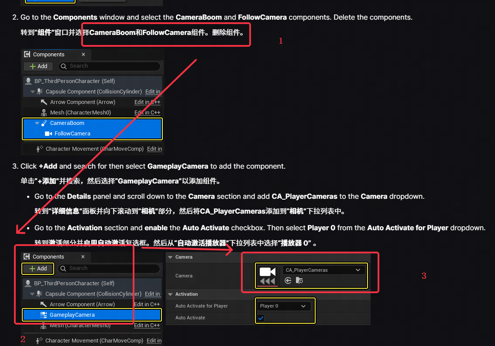
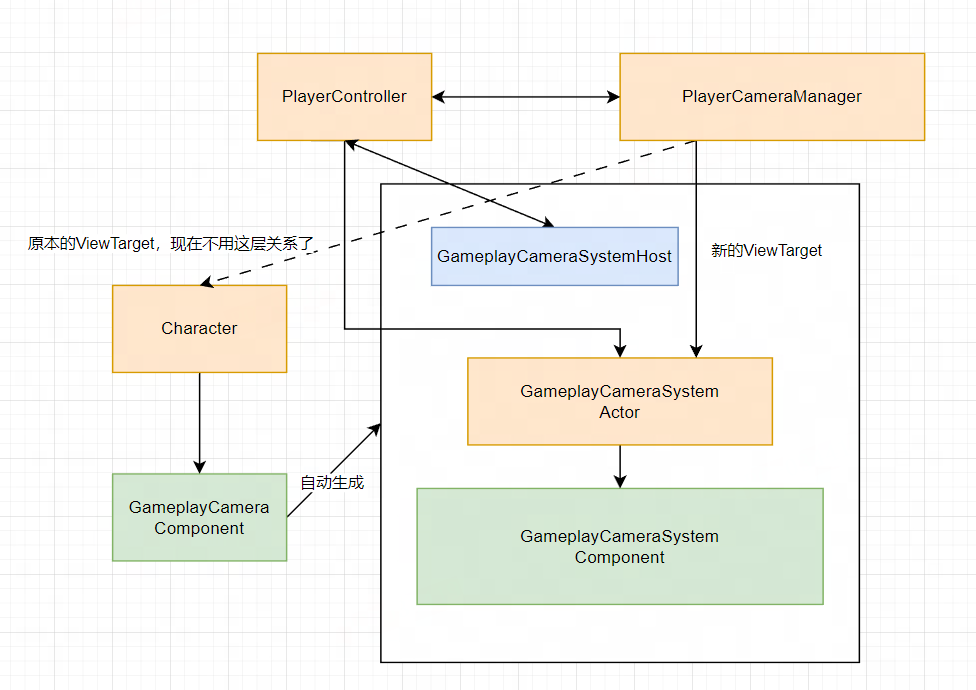
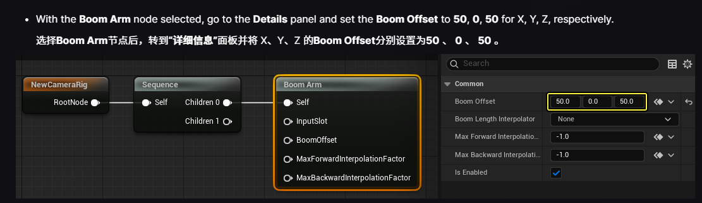
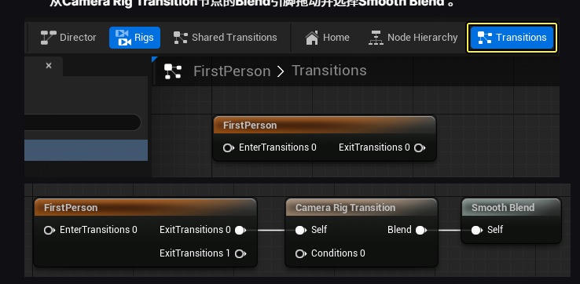
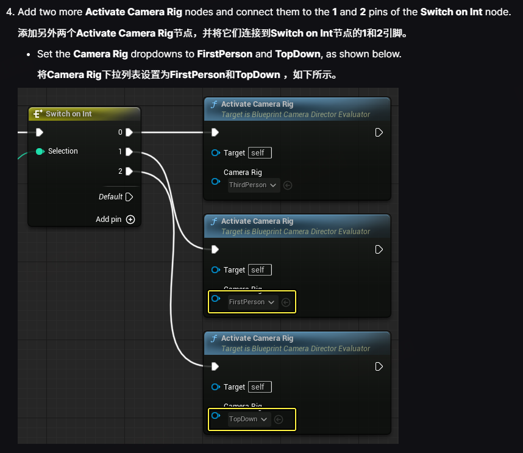
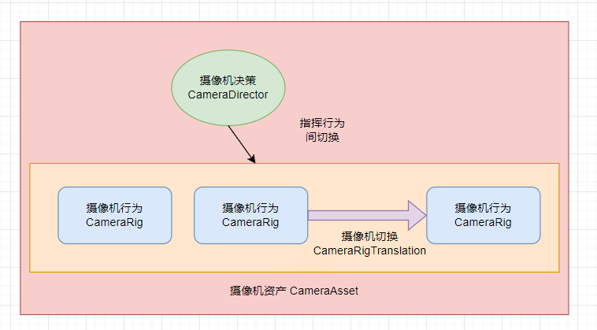

# 前言

发现了UE5.5版本中提供的新摄像机系统 **GameplayCameraSystem(GCS)**。做了一套全新的摄像机管理和开发框架。这是个人对整体框架的学习笔记。

> 所有分析基于 UE5.5.0版本，作为实验性功能，它完全有可能在后续流程中发生大型迭代和命名转换。因此文章很有可能因为版本因素变得不适用。
>

本文章将默认阅读者具备UE摄像机系统的基本概念，如PlayerCameraManager和一些摄像机开发的常识。不建议UE初学者阅读。

个人建议还是阅读[UE官方 GCS教程](https://dev.epicgames.com/documentation/zh-cn/unreal-engine/gameplay-camera-system-quick-start)后，对其基本概念有所了解后阅读本文。

<!-- more -->


# 整体介绍

## 主要改动

目前来看，**GCS**基本是在原有的CameraComponent和CameraActor这个层级做拓展。即基本不更改PlayerCameraManager和PlayerController的关系。

因此原本的更新流程和时序基本也不会有太多变化。

整体上也依然是 玩家（PlayerController）=> 摄像机管理器（PlayerCameraManager）=> 目标角色（ViewTarget）=> 最终视角（POV）的流程。

只是在**ViewTarget**这个部分，从常规的Character/CameraActor（用于以上面携带的的CameraComponent来计算POV）这里做了改动。

提取出了 **GameplayCameraSystemActor**作为一个独立Actor用作ViewTarget，负责管理摄像机行为。在这个层级进行了一个大型的拓展，能够原生的创建丰富的摄像机行为。

# 常用数据结构

这里只是一个工具书，阅读时可以先暂且了解有哪些常用类后（不用搞清楚），去看相关流程。在中途可以对照回来看这些组件扮演的角色。

## 框架

### GameplayCameraComponent

用于在角色中配置启用 **GCS** 的**配置**组件，一般只是提供一个蓝图方面的功能启用效果。并没有太多有效逻辑。

> 注意：不要将**GameplayCameraComponent（没有System）**和 **GameplayCameraSystemComponent**搞混。

### GameplayCameraSystemComponent

用于运行时实际执行摄像机相关逻辑的组件，角色上会类似于原本的**CameraComponent**，提供`GetCameraView()`用于得出一个最终的POV。

### GameplayCameraSystemActor

绑定PlayerController的一个固定Actor，主要作为承载**GameplayCameraSystemComponent**的Actor。基本上是使用流程中为了**PlayerController**而自动创建的。

### GameplayCameraActor

一个用于挂 GameplayCameraComponent 的Actor。和原本的CameraActor一样属于为了放置于场景内而产生的Actor，无太多实际作用。

### CameraSystemHost

一个用于创建CameraSystem并能够在关卡内取得的类（按照注释描述）。

姑且可以理解为信息的中间层，每个实例绑定于PlayerController，成一一对应的关系。

### ControllerGameplayCameraEvaluationComponent

用于在角色身上提供一些对摄像机资产控制接口的组件，使用地方不是很多

## 摄像机资产

### CameraAsset

一个完整的摄像机资产，也是内容浏览器中创建的资产。需要包括：

- 一个摄像机导演（CameraDiector）管理摄像机装备之前的切换。
- 多个摄像机装备（CameraRig）定义具体的摄像机行为。
- 多个摄像机转换过渡（CameraRigTransition），包括进入过渡（EnterTransitions）和离开过渡（ExitTransitions）。

### CameraDirector

这个类主要是管理多个摄像机装备的切换。都需要通过子类实现。目前的子类有：

- SingleCameraDireactor：只使用CameraAsset的第一个摄像机装备
- PriorityQueueCameraDirector：以优先队列来选择使用的摄像机装备
- StateTreeCameraDirector：用状态树来做比较复杂的摄像机装备选择逻辑
- BlueprintCameraDirectorEvaluator：支持蓝图，能够写出更复杂的摄像机装备选择逻辑

它们以一个Tick形式每一帧更新出使用的摄像机装备列表。

### CameraDirectorEvaluator

是CameraDirector的运行时表示，在实际运用的时候，CameraDirector会返回一个Evaluator。提供OnRun函数实现CameraDirector的Tick。

> 由于该插件中经常出现Evaluator方式创建运行时表示，相同行为的Evaluator后续都不会主动提到

### CameraRigAsset

摄像机装备，或者说一个具体的摄像机行为。它支持通过使用特定的蓝图节点（CameraNode）去描绘出一个指定的摄像机行为模式。

例如 BoomArm(悬臂节点)可以用来指定摄像机弹簧臂的长度。通过这样的节点，一个CameraRigAsset就能够定义出一种特定的摄像机行为。

同样的，它也可以指定自己的进入过渡和离开过渡。

### CameraRigTransition

一套维护摄像机装备转换时的行为，包括了：

- Conditions: 这个转换发生条件
- Blend: 转换发生时，怎么从一个摄像机装备的效果转换成新的摄像机装备效果。直接切还是平滑过渡
- InitialOrientation: 转换到摄像机装备转换时，新摄像机装备的朝向关系。如使用摄像机的默认配置朝向，某个特定角色的朝向，指向一个曾经的目标等待。主要为了平滑过渡时的朝向转换。


## 摄像机评估器

### CameraSystemEvaluator

摄像机评估器，和**GameplayCameraSystemComponent**可以视为一对一绑定的关系，用于实现**GCS**中，对所有摄像机资产的上帝类。

### CameraEvaluationContext

摄像机评估上下文，主要用于维护玩家（**PlayerController**），摄像机资产（**CameraAsset**）以及提供持有摄像机资产中所有摄像机装备（**CameraRig**）得出的初步结果（**FCameraNodeEvaluationResult** InitialResult）。

它会用于构造出一个树一样的结构，所以带有WeakParent和ChildrenContext节点以维护父子关系。

在使用时，往往会使用这个类型的子类特化，如：

- **FGameplayCameraComponentEvaluationContext**： 作为一个来源**GameplayCameraComponent**的上下文特化。

### CameraEvaluationContextStack

一个简单的类LRU优化的栈结构，用于存储摄像机评估上下文（FCameraEvaluationContext），支持重复添加（添加已经存在时会放到栈顶）。使用TArray和WeakPtr模拟的栈。

用于快速获得最新的 摄像机评估上下文。

### CameraRigCombination

一个摄像机装备的数组，用来表示一些需要同时使用的摄像机装备

### RootCameraNodeEvaluator/ FDefaultRootCameraNodeEvaluator

CameraSystemEvaluator中，用来评估一帧时摄像机最终结果的。

目前只提供了一个**FDefaultRootCameraNodeEvaluator** 类作为唯一子类，因此实际相关代码均基于 **FDefaultRootCameraNodeEvaluator** 进行分析。

内部对摄像机装备提供了四个层级：

- **BaseLayer**：摄像机基本的设置和变化，为相机的设置提供一个起点
- **MainLayer**：主要的逻辑相关的行为，包括玩家，瞄准目标等功能。在Tick运行的摄像机装备均是MainLayer这个层级的。

- **GlobalLayer**：全局行为，包括抖动和后处理等行为
- **VisualLayer**：视觉效果和美术相关的层级


# GameplayCameraComponent及其改动




从官网教程来说，只需要对Character删除原本的**CameraComponent**并且添加全新的**GameplayCameraComponent**即可完成新摄像机系统的使用。

但是实际上，整个新摄像机系统涉及到大量的新组件，一般来说，会在 `GameplayCameraComponent:BeginPlay`中，会根据Activation配置自动激活，创建一套对应的CameraEvalutionContext(摄像机评估上下文)。

`UGameplayCameraComponent::ActivateCameraEvaluationContext`

这里简单从初始化角度讲一下**GCS**框架和原本的摄像机框架的变动结构。

## 生成GCSA，转移ViewTarget

这里简单来说先为对应**PC**自动化建立一整套新的摄像机框架需要的GameplayCameraSystemActor，并转移**ViewTarget**到GCSA上：

`static GameplayCameraSystemActor::AutoManageActiveViewTarget`

1. 根据**PlayerController**自动创建一个**GameplayCameraSystemHost**，并归属于**PlayerController**。

   `UGameplayCameraSystemHost::FindOrCreateHost`

   

2. 通过**Host**，为**PlayerController**创建一个对应的**GameplayCameraSystemActor**，从而取得一个**GameplayCameraSystemComponent**。

   `AGameplayCameraSystemActor::GetAutoSpawnedCameraSystemActor`

   

3. **GameplayCameraSystemComponent**检测所有东西正确可用后，将自己的Owner，一个**GameplayCameraSystemActor**设置给**PlayerCameraManger**作为**ViewTarget**。

   由此对应玩家的摄像机相当于离开了Charater，在以新的**GameplayCameraSystemActor**作为管理。

   `UGameplayCameraSystemComponent::ActivateCameraSystemForPlayerController`

通过这三步，在游戏内生成了我们需要的基本组件，关系基本如下所示。



## 生成Evaluator，自动开始摄像机混合评估

**GameplayCameraSystemHost**在生成的时候会自带一个**FCameraSystemEvaluator**，也就是说，PlayerController、GameplayCameraSystemHost、FCameraSystemEvaluator均可视为一一对应的关系。

在上一步生成**GCS**所需要的对应组件后，GameplayCameraComponent会初始化一个**FGameplayCameraComponentEvaluationContext**。

这是一个摄像机评估信息上下文，用于描述一个基本的摄像机组件（GameplayCameraComponent）、 摄像机资产（CameraAsset）和玩家（PlayerController）的关系，并将这个评估上下文加入到 **FCameraSystemEvaluator** 中, 这里实际上会保存在一个 **CameraEvaluationContextStack** 的结构里。称之为**ContextStack**.

在使用的时候，总会使用到一个最新的ContextStack。

```c++
// GameplayCameraComponent.cpp:136
void UGameplayCameraComponent::ActivateCameraEvaluationContext(APlayerController* PlayerController)
{
    // ...省略
    EvaluationContext = MakeShared<FGameplayCameraComponentEvaluationContext>();

    // 传入一些信息作为参数
    FCameraEvaluationContextInitializeParams InitParams;
    InitParams.Owner = this;
    InitParams.CameraAsset = Camera;
    InitParams.PlayerController = PlayerController;
    EvaluationContext->Initialize(InitParams);

    // 通过Host获取获取一个评估器，将其加入到评估器中
    TSharedPtr<FCameraSystemEvaluator> CameraSystemEvaluator = CameraSystemHost->GetCameraSystemEvaluator();
    CameraSystemEvaluator->PushEvaluationContext(EvaluationContext.ToSharedRef());
    }
	// ...省略
}
```

### CameraComponentEvaluationContext的主要功能

```c++
// GameplayCameraComponent.cpp:332
void FGameplayCameraComponentEvaluationContext::Update(UGameplayCameraComponent* Owner)
{
    // 这个评估上下文中的TICK函数，每一帧根据GameplayCameraComponent的坐标设为CameraPose的初始坐标。
	const FTransform& OwnerTransform = Owner->GetComponentTransform();
	InitialResult.CameraPose.SetTransform(OwnerTransform);
	InitialResult.bIsCameraCut = false;
	InitialResult.bIsValid = true;
}
```


## 总结

从初始化这里，我们可以看到，GameplayCameraComponent在替代了常规的CameraComponent后，生成了哪些框架需要的组件以运行新的**GCS**系统。

# GameplayCameraSystemComponent计算POV的流程

在初始化时，会将PlayerCameraManager的ViewTarget转移到GCSA上。

每一帧的POV计算调用在经历了和原本UE系统的相似调用后，会最终调用到 `UGameplayCameraSystemComponent::GetCameraView` 上。

从这里讲一下**GCS**中最终时经历了哪些基本流程。

## UGameplayCameraSystemComponent::GetCameraView

从这个熟悉的 `GetCameraView`中可以看到，每一帧的POV最终是通过一个Evaluator进行计算的。

**FCameraSystemEvaluator**就是管理 **GCS** 系统中摄像机的最终入口。

```c++
void UGameplayCameraSystemComponent::GetCameraView(float DeltaTime, FMinimalViewInfo& DesiredView)
{
	TSharedPtr<FCameraSystemEvaluator> Evaluator = GetCameraSystemEvaluator();
	if (Evaluator.IsValid())
	{
		FCameraSystemEvaluationParams UpdateParams;
		UpdateParams.DeltaTime = DeltaTime;
		Evaluator->Update(UpdateParams);

		Evaluator->GetEvaluatedCameraView(DesiredView);
	}
}
```

## FCameraSystemEvaluator::Update

```c++
// CameraSystemEvaluator.cpp:196
void FCameraSystemEvaluator::Update(const FCameraSystemEvaluationParams& Params)
{

	// 获取到目前的摄像机评估上下文，并从中提取到摄像机导演评估器（评估上下文 -> 摄像机资产 -> 摄像机导演（运行时实例评估器））
    // 前面提过，ContextStack是一个LRU数组，ActiveContext实际上就是要提取出的最新添加的
	TSharedPtr<FCameraEvaluationContext> ActiveContext = ContextStack.GetActiveContext();
	FCameraDirectorEvaluator* ActiveDirectorEvaluator = ActiveContext->GetDirectorEvaluator();
    
	
    FCameraDirectorEvaluationParams DirectorParams;
    DirectorParams.DeltaTime = Params.DeltaTime;
    DirectorParams.OwnerContext = ActiveContext;

    FCameraDirectorEvaluationResult DirectorResult;

    // 摄像机导演决定哪些返回摄像机装备，如Single/StateTree/PriorityQueue等方式选出要用的摄像机装备
    ActiveDirectorEvaluator->Run(DirectorParams, DirectorResult);

    if (DirectorResult.ActiveCameraRigs.Num() == 1)
    {
        // 只有一个摄像机装备的话，就使用这一个摄像机装备
        const FActiveCameraRigInfo& ActiveCameraRig = DirectorResult.ActiveCameraRigs[0];

        FActivateCameraRigParams CameraRigParams;
        CameraRigParams.EvaluationContext = ActiveCameraRig.EvaluationContext;
        CameraRigParams.CameraRig = ActiveCameraRig.CameraRig;
        RootEvaluator->ActivateCameraRig(CameraRigParams);
    }
    else if (DirectorResult.ActiveCameraRigs.Num() > 1)
    {
        // 如果同时有多个需要使用的摄像机装备的话，动态创建出一个新的摄像机装备将其包括起来
        TArray<const UCameraRigAsset*> Combination;
        TSharedPtr<const FCameraEvaluationContext> CommonContext = DirectorResult.ActiveCameraRigs[0].EvaluationContext;
        for (const FActiveCameraRigInfo& ActiveCameraRig : DirectorResult.ActiveCameraRigs)
        {
            // 在使用多个摄像机装备时，他们应该有着一致的上下文。即玩家、摄像机资产等信息都需要时一样的。
            Combination.Add(ActiveCameraRig.CameraRig);
            ensureMsgf(ActiveCameraRig.EvaluationContext == CommonContext,
                    TEXT("All combined camera rigs must be activated from the same evaluation context."));
        }
        // 创建一个新的摄像机装备以包括这些，会避免重复创建
        const UCameraRigAsset* CombinedCameraRig = CameraRigCombinationRegistry->FindOrCreateCombination(Combination);

        FActivateCameraRigParams CameraRigParams;
        CameraRigParams.EvaluationContext = CommonContext;
        CameraRigParams.CameraRig = CombinedCameraRig;
        RootEvaluator->ActivateCameraRig(CameraRigParams);
    }
	// 总结，这里主要是通过上下文获得了摄像机导演，再通过导演获得了应该使用的摄像机装备，将其激活
	{
		FCameraNodeEvaluationParams NodeParams;
		NodeParams.Evaluator = this;
		NodeParams.DeltaTime = Params.DeltaTime;

		RootNodeResult.Reset();

		// 运行根评估器，将涉及到的到的摄像机装备调用
		RootEvaluator->Run(NodeParams, RootNodeResult);

		RootNodeResult.bIsValid = true;
	}

	Result.Reset(RootNodeResult);

	// End of update things...
	ContextStack.OnEndCameraSystemUpdate();
}
```

简单总结一下的话。

1. 每一帧都会先找出最新添加的摄像机资产和其上的摄像机导演
2. 由摄像机导演选出一个最终要使用的摄像机装备
3. 将摄像机装备激活，随后调用进行计算计算

> 注意，这里使用的 **RootEvaluator** 正常情况下使用的都是 **FDefaultRootCameraNodeEvaluator**。目前可以视作为唯一使用的部分。

# 摄像机框架

看了一段时间后逐渐发现，**GCS**在框架上设计是可以说比较完善的，但是实际上应该是处于未完成，导致这个框架基本没法直接使用。

这里我会结合一下摄像机系统的一点开发经验聊一下我对框架的理解，不保证和实际**GCS**的设计思路一致。

## 摄像机行为（Camera Rig/摄像机装备）

摄像机行为定义了一种特定状态下的摄像机业务逻辑。它确保在该状态下，摄像机的表现完全可用且符合游戏的业务需求。典型的摄像机行为包括：

- 标准的弹簧臂锁定在角色背后的摄像机
- 赛车游戏中俯瞰车辆的摄像机
- 锁定在两个角色中轴线上的锁定式镜头

这些行为本身是完备的一套镜头逻辑，同时内部能够需要处理周边情况，例如：

- 第三人称视角的平滑跟随和追踪
- 在赛车游戏中，摇杆向下推动时避免视角卡到地面
- 在锁定两个角色时，保持视角可见，即使角色之间的距离很远

对摄像机模块的开发往往都是这个层级，不断地开发开发新的摄像机表现以应对不同的游戏场景和需求。

> **GCS**在这个层级上虽然提供了蓝图编辑器，但是节点功能太少且依赖外部输入参数，不太好编辑正常的完整逻辑。
>
> 怀疑该系统未完成。



## 摄像机转换（Camera Rig Transition/摄像机装备转换）

在一款游戏中，通常会存在多种摄像机行为，例如使用手枪与狙击枪时的不同视角、第三人称时的自由视角和锁定视角。由于这些行为之间可能存在显著的参数差异或逻辑不同，最佳实践是将它们拆分成独立的摄像机行为。

在拆分成不同摄像机行为后，为了确保切换过程的平滑与自然，需要一个专门处理摄像机行为之间切换的机制，这就是摄像机转换的作用。

它通过插值和避障等手段，处理摄像机在不同行为之间的切换时表现的连贯性。



## 摄像机决策（Camera Director/摄像机导演）

随着摄像机行为的增多，需要一个中心化的组件来决策何时使用特定的摄像机行为。这部分逻辑被单独抽象为摄像机决策（Camera Director）。

它负责根据游戏状态和上下文，动态选择最合适的摄像机行为。



## 摄像机资产（Camera Asset/摄像机资产）

在完成上述三个部分后，一个完整的摄像机系统就已具备。

然而，在虚幻引擎（UE）中，摄像机资产的引入进一步封装了这套系统，为开发提供了便利。摄像机资产的主要作用包括：

- **组合与整合**：摄像机资产将多个摄像机行为（例如跟随、俯视、对抗视角等）和一个摄像机决策逻辑组合在一起。通过这种方式，开发者可以在一个统一的框架内管理不同的摄像机行为和它们之间的切换逻辑。
- **简化开发流程**：将摄像机行为与决策逻辑封装成一个单元，可以降低开发的复杂性。当开发者需要调整某个摄像机行为或切换逻辑时，只需修改这个资产，而不必在多个地方进行变更，从而减少出错的几率。
- **支持多种场景**：摄像机资产可以根据不同的游戏场景或需求进行配置和复用。例如，在一款射击游戏中，可以创建不同的摄像机资产以应对不同的武器或模式（如普通射击和狙击），而不需要重新编写完整决策和行为。

## 总结



整体来说，一个摄像机框架大致就是这样构成的，**GCS**目前也是按照这个思路开发的各个类层级。

> 值得注意的是，这套框架本身面向的是动态摄像机系统，主要特点在于响应玩家操作和游戏世界变化。
>
> 对于过场动画那种演出式的摄像机系统来说，它并不适用。

# 相机混合栈

## 摄像机装备分层

在每帧计算视角的  `FCameraSystemEvaluator::Update` 时，中间有一个函数 `RootEvaluator->ActivateCameraRig(CameraRigParams);`要激活使用的CameraRig。

这个激活的对应函数如下。

```c++
// DefaultRootCameraNode.cpp:82
void FDefaultRootCameraNodeEvaluator::OnActivateCameraRig(const FActivateCameraRigParams& Params)
{
	if (Params.Layer == ECameraRigLayer::Main)
	{
		FBlendStackCameraPushParams PushParams;
		PushParams.EvaluationContext = Params.EvaluationContext;
		PushParams.CameraRig = Params.CameraRig;
		MainLayer->Push(PushParams);
	}
	else
	{
		FPersistentBlendStackCameraNodeEvaluator* TargetLayer = nullptr;
		switch (Params.Layer)
		{
			case ECameraRigLayer::Base:
				TargetLayer = BaseLayer;
				break;
			case ECameraRigLayer::Global:
				TargetLayer = GlobalLayer;
				break;
			case ECameraRigLayer::Visual:
				TargetLayer = VisualLayer;
				break;
		}
		if (ensure(TargetLayer))
		{
			FBlendStackCameraInsertParams InsertParams;
			InsertParams.EvaluationContext = Params.EvaluationContext;
			InsertParams.CameraRig = Params.CameraRig;
			TargetLayer->Insert(InsertParams);
		}
	}
}
```

这里面展示出CameraRig本身会分成四个层级：

- **BaseLayer**：摄像机基本的设置和变化，为相机的设置提供一个起点
- **MainLayer**：主要的逻辑相关的行为，包括玩家，瞄准目标等功能。在Update时运行的摄像机装备均是MainLayer这个层级的。

- **GlobalLayer**：全局行为，包括抖动和后处理等行为
- **VisualLayer**：视觉效果和美术相关的层级

然而虽然分成了四个层级，但是从代码上看所有的调用中都是在**MainLayer**上的，只有接口允许往其他层添加CameraRig，但是没有调用。

因此猜测这个层级划分只是做规范作用，并不是硬性要求，完全可以自由拓展。

## 相机混合栈

在FDefaultCameraNode中可以看到四个摄像机装备层的定义：

```c++
// DefaultRootCameraNode.cpp:82
FPersistentBlendStackCameraNodeEvaluator* BaseLayer;
FTransientBlendStackCameraNodeEvaluator* MainLayer;
FPersistentBlendStackCameraNodeEvaluator* GlobalLayer;
FPersistentBlendStackCameraNodeEvaluator* VisualLayer;

// BlendStackCameraNode.h:253
class FTransientBlendStackCameraNodeEvaluator : public FBlendStackCameraNodeEvaluator
    
// BlendStackCameraNode.h:322
class FPersistentBlendStackCameraNodeEvaluator : public FBlendStackCameraNodeEvaluator
    
// BlendStackCameraNode.h:43
// 这个枚举实际上只是用来区分创建时创建 FTransientBlendStackCameraNodeEvaluator 和 FPersistentBlendStackCameraNodeEvaluator的
UENUM()
enum class ECameraBlendStackType
{
	/**
	 * Camera rigs are evaluated in isolation before being blended together, and get 
	 * automatically popped out of the stack when another rig has reached 100% blend above 
	 * them.
	 */
	IsolatedTransient,
	/**
	 * Camera rigs are evaluated in an additive way, i.e. the result of a lower camera rig
	 * becomes the input of the next ones. Also, camera rigs stay in the stack until explicitly 
	 * removed.
	 */
	AdditivePersistent
};
```

因此可以看出来，摄像机装备层的实际对应的是相机混合栈（BlendStackCameraNodeEvaluator） 的两种具体实现。

而相机混合栈功能就是用于管理多个摄像机装备共存时能够按照一定的顺序和方式应用效果，将其整合出最终效果。

在Update中，run函数也是最终驱动每个相机混合栈自行运行。

相机混合栈实际用于有两种，**隔离瞬时**和**叠加持久**

## **隔离瞬时 / IsolatedTransient / FTransientBlendStackCameraNodeEvaluator** 

- 实现在 FTransientBlendStackCameraNodeEvaluator 类中。
- 相机装备（Camera Rigs）独立评估后再混合。
- 当新的相机装备完全混合（达到100%混合）时，位于它下面的相机装备会自动从栈中移除。
- 适合快速切换或临时覆盖当前相机行为的场景。
- 使用 Push 方法添加新的相机装备。
- 支持相机装备的合并（如果允许）。
- 实现了复杂的过渡逻辑，包括查找合适的过渡效果。
- 代码中自动添加移除

代码中体现**隔离瞬时混合栈**特征的对应代码如下：

```c++
// BlendStackCameraNode.cpp:727
// 对于各个摄像机装备的结果进行混合
void FTransientBlendStackCameraNodeEvaluator::InternalUpdate(TArrayView<FResolvedEntry> ResolvedEntries, const FCameraNodeEvaluationParams& Params, FCameraNodeEvaluationResult& OutResult)
{
    for (FResolvedEntry& ResolvedEntry : ResolvedEntries)
    {
        // ...
        FCameraNodeEvaluator* RootEvaluator = Entry.RootEvaluator->GetRootEvaluator();
        if (RootEvaluator)
        {
            // 对于各个摄像机装备的进行独立运算
            RootEvaluator->Run(CurParams, CurResult);
        }
    }
}

// BlendStackCameraNode.cpp:764
void FTransientBlendStackCameraNodeEvaluator::InternalPostBlendExecute(TArrayView<FResolvedEntry> ResolvedEntries, const FCameraNodeEvaluationParams& Params, FCameraNodeEvaluationResult& OutResult)
{
    int32 PopEntriesBelow = INDEX_NONE;
    for (FResolvedEntry& ResolvedEntry : ResolvedEntries)
    {
        // ...
        FBlendCameraNodeEvaluator* EntryBlendEvaluator = Entry.RootEvaluator->GetBlendEvaluator();
        if (EntryBlendEvaluator)
        {
            // 对于各个摄像机装备的结果进行混合
            EntryBlendEvaluator->BlendResults(BlendParams, BlendResult);
            if (BlendResult.bIsBlendFull && BlendResult.bIsBlendFinished)
            {
                // 如果混合已经完成了，则将其自动退出混合栈
                PopEntriesBelow = ResolvedEntry.EntryIndex;
            }
        }
        // ...
    }
    // ...
    // 自动退出混合栈
    const UBlendStackCameraNode* BlendStackNode = GetCameraNodeAs<UBlendStackCameraNode>();
    if (BlendStackNode->BlendStackType == ECameraBlendStackType::IsolatedTransient && PopEntriesBelow != INDEX_NONE)
    {
        PopEntries(PopEntriesBelow);
    }
}
```


## **叠加持久 / AdditivePersistent / FPersistentBlendStackCameraNodeEvaluator**

- 实现在 FPersistentBlendStackCameraNodeEvaluator 类中。
- 相机装备以叠加的方式进行评估，较低层级相机装备的结果会成为较高层级相机装备的输入。
- 相机装备会一直保留在栈中，直到被明确地移除。
- 适合需要长期叠加多个相机效果的场景。
- 使用 Insert 方法添加新的相机装备，使用 Remove 方法移除相机装备。
- 不支持自动移除或合并相机装备。
- 需要业务代码手动添加移除

代码中体现**叠加持久混合栈**特征的对应代码如下：

```c++
// BlendStackCameraNode.cpp:991
void FPersistentBlendStackCameraNodeEvaluator::InternalUpdate(TArrayView<FResolvedEntry> ResolvedEntries, const FCameraNodeEvaluationParams& Params, FCameraNodeEvaluationResult& OutResult)
{
    for (FResolvedEntry& ResolvedEntry : ResolvedEntries)
    {
        FCameraRigEntry& Entry(ResolvedEntry.Entry);

        if (!Entry.bIsFrozen)
        {
            FCameraNodeEvaluationParams CurParams(Params);
            CurParams.EvaluationContext = ResolvedEntry.Context;
            CurParams.bIsFirstFrame = Entry.bIsFirstFrame;

            FCameraNodeEvaluationResult& CurResult(Entry.Result);

            // 关键点1: 开始时使用前一个条目的结果
            CurResult.CameraPose = OutResult.CameraPose;
            CurResult.VariableTable.OverrideAll(OutResult.VariableTable);
            CurResult.CameraRigJoints.OverrideAll(OutResult.CameraRigJoints);
            CurResult.PostProcessSettings.OverrideAll(OutResult.PostProcessSettings);

            // ... (其他初始化代码)

            // 运行当前相机装备的评估
            FCameraNodeEvaluator* RootEvaluator = Entry.RootEvaluator->GetRootEvaluator();
            if (RootEvaluator)
            {
                RootEvaluator->Run(CurParams, CurResult);
            }

            // 关键点2: 将当前结果混合到输出结果中
            FBlendCameraNodeEvaluator* EntryBlendEvaluator = Entry.RootEvaluator->GetBlendEvaluator();
            if (EntryBlendEvaluator)
            {
                FCameraNodeBlendParams BlendParams(CurParams, CurResult);
                FCameraNodeBlendResult BlendResult(OutResult);

                EntryBlendEvaluator->BlendResults(BlendParams, BlendResult);
            }
            else
            {
                OutResult.OverrideAll(CurResult);
            }
        }
        else
        {
            // 处理冻结的条目
            OutResult.VariableTable.Override(CurResult.VariableTable, ECameraVariableTableFilter::Input);
            OutResult.OverrideAll(CurResult);
        }
    }
}
```

## 总结

摄像机混合栈是用于在运行时，允许多个摄像机装备同时影响最终的相机行为的一个概念。

它支持了游戏运行时动态地添加、移除或混合不同的相机装备。以实现具体摄像机行为的切换和混合效果。

它和摄像机装换的区别在于 CameraRigTransition主要是用于描述这个不同转换的行为和数据、而混合栈是在实际运用时管理具体行为的。

**MainLayer**作为正统反映视角的摄像机，自然是对于多个摄像机装备成隔离瞬时，且支持切换的。

**BaseLayer、GlobalLayer、VisualLayer**三者作为一种次生的表现调整，所以才是叠加持久，需要额外主动调控的。


